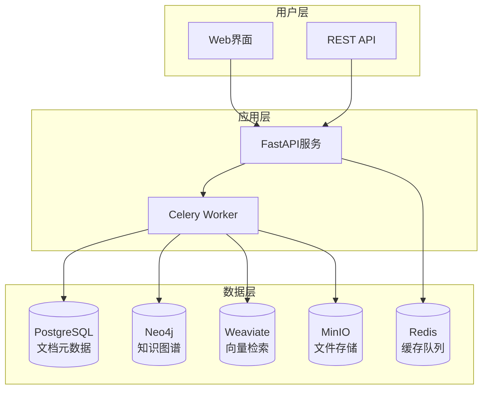

# 多学科知识库系统 (Multi-Disciplinary Knowledge Base System)

<div align="center">


[](https://opensource.org/licenses/MIT)
[](https://www.python.org/downloads/)
[](https://fastapi.tiangolo.com/)
[](https://neo4j.com/)
[](https://www.docker.com/)

**基于图数据库和向量检索的多学科知识库系统**

[快速开始](#-快速开始) • [功能特性](#-功能特性) • [系统架构](#-系统架构) • [配置文档](#-配置文档) • [使用示例](#-使用示例)

</div>

## 📖 项目概述

本项目是一个专门为多学科学术研究设计的知识库系统，支持计算机科学、物理学、数学、生物学、化学、工程学等多个学科领域。系统能够通过 HTTP 接口批量或按需导入论文、书籍、笔记等学术资源，自动从中抽取实体、关系、断言（claims）、引用与证据，并将这些知识以图数据库（Neo4j）为主、关系数据库（PostgreSQL）作文档/元数据存储 + 向量/语义检索支持的形式呈现，便于后续查询、推理、可视化与 RAG（检索增强生成）。

### 🎯 核心价值

- **多学科支持**: 原生支持多个学科领域的知识组织和管理
- **动态配置**: 通过JSON配置文件实现系统的灵活定制
- **跨学科分析**: 发现和分析不同学科间的知识关联
- **智能概念收敛**: 自动识别和合并相似概念，构建统一知识体系
- **可追溯性**: 每个关系/断言都能回溯到源文档和具体位置

### 🎯 核心价值

- **智能知识抽取**: 自动识别文档中的实体、关系和重要断言
- **多模态支持**: 处理文本、图像等多种数据类型
- **可追溯性**: 每个知识点都能追溯到原始文档位置
- **语义检索**: 基于向量嵌入的智能检索和问答
- **图谱可视化**: 直观展示知识之间的复杂关系

## ✨ 核心功能

### 📄 文档处理
- **多格式支持**: PDF、TXT、Markdown、HTML、图片（OCR）
- **智能分块**: 自动文本分割、去重与优化存储
- **批量处理**: 支持大规模文档批量导入和处理

### 🧠 知识抽取
- **实体识别**: 自动识别人物、地点、组织、概念等实体
- **关系抽取**: 发现实体间的语义关系
- **引用识别**: 自动识别和处理文档引用关系
- **断言提取**: 提取文档中的重要观点和结论

### 🔍 智能检索
- **语义搜索**: 基于向量嵌入的语义相似度检索
- **图谱查询**: 支持复杂的图结构查询
- **混合检索**: 结合关键词、语义和图结构的多维检索
- **RAG问答**: 检索增强生成的智能问答系统

### 📊 数据管理
- **多数据库架构**: PostgreSQL + Neo4j + Redis 的分层存储
- **向量存储**: 高效的向量嵌入存储和检索
- **元数据管理**: 完整的文档元数据和版本管理
- **数据同步**: 多数据源间的一致性保证

## 🏗️ 系统架构

### 技术栈

| 组件类型 | 技术选型 | 用途说明 |
|---------|---------|---------|
| **后端框架** | Python + FastAPI | RESTful API 服务 |
| **包管理器** | uv | Python 包管理和虚拟环境 |
| **任务队列** | Celery + Redis | 异步任务处理 |
| **关系数据库** | PostgreSQL | 文档元数据存储 |
| **图数据库** | Neo4j | 知识图谱存储 |
| **向量数据库** | Weaviate | 语义检索支持 |
| **对象存储** | MinIO | 文件存储管理 |
| **OCR 服务** | MinerU | 文档 OCR 识别（支持远程/本地） |
| **前端框架** | React + TypeScript | 用户界面 |
| **容器化** | Docker + Docker Compose | 基础服务统一部署 |
| **监控** | Prometheus + Grafana | 系统监控 |

### 架构图



### 数据流程

1. **文档上传** → 存储到 MinIO，元数据记录到 PostgreSQL
2. **文档解析** → 提取文本内容，进行分块处理
3. **向量化** → 生成文本嵌入，存储到 Weaviate
4. **知识抽取** → 识别实体和关系，构建知识图谱
5. **图谱存储** → 将知识图谱持久化到 Neo4j
6. **检索服务** → 提供多维度的知识检索和问答

## 🚀 快速开始

### 环境要求

- **操作系统**: Linux/macOS/Windows
- **Docker**: 20.10+ 
- **Docker Compose**: 2.0+
- **Python**: 3.9+ (开发环境)
- **uv**: 最新版本 (Python 包管理器)
- **内存**: 至少 8GB RAM
- **存储**: 至少 20GB 可用空间

> **开发重点**: 当前项目优先后端开发，基础服务通过 Docker Compose 统一部署

### 一键部署

**基础服务统一部署** - 通过 Docker Compose 一键启动所有必需的基础设施服务：

```bash
# 1. 克隆项目
git clone https://github.com/your-org/GraphRAG_NEO_IMG.git
cd GraphRAG_NEO_IMG

# 2. 配置环境变量
cp .env.example .env
# 根据需要修改 .env 文件中的配置

# 3. 启动基础服务
docker-compose up -d

# 4. 验证服务状态
./scripts/test-services.sh
```

### 服务访问地址

启动成功后，可通过以下地址访问各个服务：

- **Neo4j 图数据库**: http://localhost:7474 (neo4j/neo4j123)
- **MinIO 对象存储**: http://localhost:9001 (minioadmin/minioadmin123)
- **MinerU 文档解析**: http://localhost:8501
- **Weaviate 向量数据库**: http://localhost:8080
- **PostgreSQL**: localhost:5432 (graphrag/graphrag123)
- **Redis**: localhost:6379 (密码: redis123)

## 🏗️ 系统架构

### 技术栈
- **图数据库**: Neo4j - 存储实体关系图
- **关系数据库**: PostgreSQL - 文档元数据存储
- **向量数据库**: Weaviate - 语义检索支持
- **缓存**: Redis - 查询缓存和会话管理
- **对象存储**: MinIO - 文档和媒体文件存储
- **文档解析**: MinerU - PDF/OCR 处理
- **后端框架**: FastAPI - API 服务
- **前端**: React + TypeScript - 用户界面

### 数据流程
```
文档上传 → MinerU解析 → 文本分块 → 向量化 → 实体抽取 → 关系识别 → 图存储 → 检索查询
    ↓         ↓         ↓        ↓       ↓       ↓       ↓       ↓
  MinIO   PostgreSQL  Weaviate  Neo4j   Redis   API    前端    用户
```

## 📁 项目结构

```
GraphRAG_NEO_IMG/
├── docker-compose.yml          # Docker 服务编排
├── .env.example               # 环境变量模板
├── scripts/                   # 工具脚本
│   ├── test-services.sh      # 服务健康检查（Shell）
│   ├── test-services.py      # 服务健康检查（Python）
│   └── requirements.txt      # Python 依赖
├── docs/                     # 项目文档
│   ├── deployment/           # 部署文档
│   ├── api/                 # API 文档
│   ├── architecture/        # 架构设计
│   └── user-guide/          # 用户指南
├── src/                     # 源代码（待开发）
│   ├── backend/            # 后端服务
│   ├── frontend/           # 前端应用
│   └── shared/             # 共享组件
└── tests/                  # 测试代码
```

## 🔧 开发指南

### 本地开发环境

```bash
# 安装 Python 依赖（用于测试脚本）
pip install -r scripts/requirements.txt

# 启动开发环境
docker-compose up -d

# 运行健康检查
python scripts/test-services.py
```

### 服务管理

```bash
# 查看服务状态
docker-compose ps

# 4. 查看日志
docker-compose logs -f
```

**基础服务包含**：
- **PostgreSQL**: 文档元数据存储
- **Neo4j**: 知识图谱数据库
- **Redis**: 缓存和任务队列
- **MinIO**: 对象文件存储
- **Weaviate**: 向量数据库
- **MinerU OCR**: OCR 服务（支持远程/本地部署）
- **Prometheus + Grafana**: 监控和可视化

### 服务访问

启动成功后，可以通过以下地址访问各项服务：

| 服务 | 地址 | 说明 |
|-----|------|------|
| **API 文档** | http://localhost:8000/docs | Swagger API 文档 |
| **Neo4j 浏览器** | http://localhost:7474 | 图数据库管理界面 |
| **MinIO 控制台** | http://localhost:9000 | 对象存储管理界面 |
| **Grafana 监控** | http://localhost:3001 | 系统监控面板 |

### 基本使用

```bash
# PostgreSQL 备份
docker-compose exec postgres pg_dump -U graphrag graphrag > backup.sql

# Neo4j 备份
docker-compose exec neo4j neo4j-admin dump --database=graphrag --to=/backup/neo4j.dump
```

## 🔒 安全配置

### 生产环境建议
1. **修改默认密码**: 更新 `.env` 文件中的所有密码
2. **网络隔离**: 配置防火墙和网络访问控制
3. **SSL/TLS**: 启用 HTTPS 和数据库 SSL 连接
4. **访问控制**: 实施用户认证和权限管理

## 📚 文档导航

- **[部署指南](docs/deployment/docker-setup.md)** - 详细的 Docker 部署说明
- **[API 文档](docs/api/README.md)** - REST API 接口说明
- **[架构设计](docs/architecture/system-overview.md)** - 系统架构详解
- **[开发指南](docs/development/README.md)** - 开发环境配置
- **[故障排除](docs/troubleshooting/README.md)** - 常见问题解决

## 🚧 开发路线图

### Phase 0: 基础设施 ✅
- [x] Docker Compose 配置
- [x] 基础服务部署
- [x] 健康检查脚本
- [x] 部署文档

### Phase 1: 核心服务 🚧
- [ ] FastAPI 后端框架
- [ ] 文档上传 API
- [ ] 文本处理服务
- [ ] 数据库模型设计

### Phase 2: 知识抽取 📋
- [ ] 实体识别服务
- [ ] 关系抽取算法
- [ ] 向量化处理
- [ ] 图数据存储

### Phase 3: 检索和问答 📋
- [ ] 语义检索 API
- [ ] RAG 问答系统
- [ ] 图查询接口
- [ ] 结果排序优化

### Phase 4: 用户界面 📋
- [ ] React 前端应用
- [ ] 文档管理界面
- [ ] 知识图谱可视化
- [ ] 问答交互界面

## 🤝 贡献指南

1. Fork 项目
2. 创建功能分支 (`git checkout -b feature/AmazingFeature`)
3. 提交更改 (`git commit -m 'Add some AmazingFeature'`)
4. 推送到分支 (`git push origin feature/AmazingFeature`)
5. 开启 Pull Request

## 📄 许可证

本项目采用 MIT 许可证 - 查看 [LICENSE](LICENSE) 文件了解详情。

## 📞 支持

- **问题反馈**: [GitHub Issues](https://github.com/your-repo/issues)
- **功能建议**: [GitHub Discussions](https://github.com/your-repo/discussions)
- **文档问题**: 查看 [docs/](docs/) 目录或提交 Issue

---

**注意**: 本项目目前处于开发阶段，部分功能可能尚未完全实现。请参考开发路线图了解最新进展。