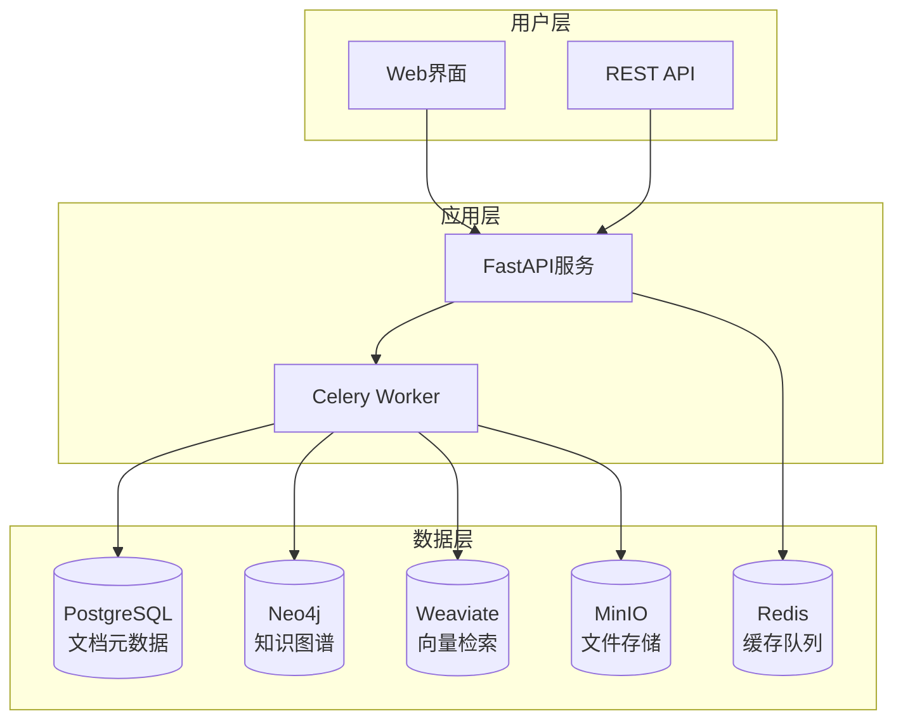

# GraphRAG 知识图谱系统

<div align="center">


[](https://opensource.org/licenses/MIT)
[](https://www.python.org/downloads/)
[](https://fastapi.tiangolo.com/)
[](https://neo4j.com/)
[](https://www.docker.com/)

**一个基于知识图谱的检索增强生成（RAG）系统**

[快速开始](#-快速开始) • [功能特性](#-功能特性) • [系统架构](#-系统架构) • [文档](#-文档) • [贡献](#-贡献)

</div>

## 📖 项目概述

GraphRAG 是一个先进的知识图谱系统，专为构建智能化的文档知识库而设计。系统能够通过 HTTP 接口批量或按需导入论文、书籍、笔记等各类文档，自动从中抽取实体、关系、断言（claims）、引用与证据，并将这些知识以图数据库（Neo4j）为核心、关系数据库（PostgreSQL）作为文档/元数据存储、向量数据库支持语义检索的形式进行组织和呈现。

### 🎯 核心价值

- **智能知识抽取**: 自动识别文档中的实体、关系和重要断言
- **多模态支持**: 处理文本、图像等多种数据类型
- **可追溯性**: 每个知识点都能追溯到原始文档位置
- **语义检索**: 基于向量嵌入的智能检索和问答
- **图谱可视化**: 直观展示知识之间的复杂关系

## ✨ 功能特性

### 📄 文档处理
- **多格式支持**: PDF、TXT、Markdown、HTML、图片（OCR）
- **智能分块**: 自动文本分割、去重与优化存储
- **批量处理**: 支持大规模文档批量导入和处理

### 🧠 知识抽取
- **实体识别**: 自动识别人物、地点、组织、概念等实体
- **关系抽取**: 发现实体间的语义关系
- **引用识别**: 自动识别和处理文档引用关系
- **断言提取**: 提取文档中的重要观点和结论

### 🔍 智能检索
- **语义搜索**: 基于向量嵌入的语义相似度检索
- **图谱查询**: 支持复杂的图结构查询
- **混合检索**: 结合关键词、语义和图结构的多维检索
- **RAG问答**: 检索增强生成的智能问答系统

### 📊 数据管理
- **多数据库架构**: PostgreSQL + Neo4j + Redis 的分层存储
- **向量存储**: 高效的向量嵌入存储和检索
- **元数据管理**: 完整的文档元数据和版本管理
- **数据同步**: 多数据源间的一致性保证

## 🏗️ 系统架构

### 技术栈

| 组件类型 | 技术选型 | 用途说明 |
|---------|---------|---------|
| **后端框架** | Python + FastAPI | RESTful API 服务 |
| **包管理器** | uv | Python 包管理和虚拟环境 |
| **任务队列** | Celery + Redis | 异步任务处理 |
| **关系数据库** | PostgreSQL | 文档元数据存储 |
| **图数据库** | Neo4j | 知识图谱存储 |
| **向量数据库** | Weaviate | 语义检索支持 |
| **对象存储** | MinIO | 文件存储管理 |
| **OCR 服务** | MinerU | 文档 OCR 识别（支持远程/本地） |
| **前端框架** | React + TypeScript | 用户界面 |
| **容器化** | Docker + Docker Compose | 基础服务统一部署 |
| **监控** | Prometheus + Grafana | 系统监控 |

### 架构图



### 数据流程

1. **文档上传** → 存储到 MinIO，元数据记录到 PostgreSQL
2. **文档解析** → 提取文本内容，进行分块处理
3. **向量化** → 生成文本嵌入，存储到 Weaviate
4. **知识抽取** → 识别实体和关系，构建知识图谱
5. **图谱存储** → 将知识图谱持久化到 Neo4j
6. **检索服务** → 提供多维度的知识检索和问答

## 🚀 快速开始

### 环境要求

- **操作系统**: Linux/macOS/Windows
- **Docker**: 20.10+ 
- **Docker Compose**: 2.0+
- **Python**: 3.9+ (开发环境)
- **uv**: 最新版本 (Python 包管理器)
- **内存**: 至少 8GB RAM
- **存储**: 至少 20GB 可用空间

> **开发重点**: 当前项目优先后端开发，基础服务通过 Docker Compose 统一部署

### 一键部署

**基础服务统一部署** - 通过 Docker Compose 一键启动所有必需的基础设施服务：

```bash
# 1. 克隆项目
git clone https://github.com/your-org/GraphRAG_NEO_IMG.git
cd GraphRAG_NEO_IMG

# 2. 启动所有基础服务（PostgreSQL、Neo4j、Redis、MinIO、Weaviate、MinerU OCR、监控服务）
docker-compose up -d

# 3. 查看服务状态
docker-compose ps

# 4. 查看日志
docker-compose logs -f
```

**基础服务包含**：
- **PostgreSQL**: 文档元数据存储
- **Neo4j**: 知识图谱数据库
- **Redis**: 缓存和任务队列
- **MinIO**: 对象文件存储
- **Weaviate**: 向量数据库
- **MinerU OCR**: OCR 服务（支持远程/本地部署）
- **Prometheus + Grafana**: 监控和可视化

### 服务访问

启动成功后，可以通过以下地址访问各项服务：

| 服务 | 地址 | 说明 |
|-----|------|------|
| **API 文档** | http://localhost:8000/docs | Swagger API 文档 |
| **Neo4j 浏览器** | http://localhost:7474 | 图数据库管理界面 |
| **MinIO 控制台** | http://localhost:9000 | 对象存储管理界面 |
| **Grafana 监控** | http://localhost:3001 | 系统监控面板 |

### 基本使用

```bash
# 上传文档（PDF/TXT/Markdown）
curl -X POST "http://localhost:8000/api/documents/upload" \
     -H "Content-Type: multipart/form-data" \
     -F "file=@your-document.pdf"

# 上传图片文档（使用 OCR）
curl -X POST "http://localhost:8000/api/documents/upload" \
     -H "Content-Type: multipart/form-data" \
     -F "file=@your-image.png" \
     -F "use_ocr=true"

# 查询知识
curl -X POST "http://localhost:8000/api/query" \
     -H "Content-Type: application/json" \
     -d '{"query": "什么是人工智能？", "limit": 5}'

# 浏览实体
curl "http://localhost:8000/api/graph/entities?limit=10"

# 检查 OCR 服务状态
curl "http://localhost:8000/api/ocr/status"
```

> **OCR 功能**: 支持 MinerU OCR 服务，可处理图片格式文档（PNG、JPG、JPEG），支持远程和本地部署模式

## 📚 文档

完整的文档体系位于 `docs/` 目录，包含：

### 📖 用户文档
- **[快速开始指南](docs/quick-start/README.md)** - 系统安装和基本使用
- **[用户指南](docs/user-guide/README.md)** - 详细功能说明和最佳实践
- **[API 文档](docs/api/README.md)** - RESTful API 接口说明

### 🔧 开发文档
- **[开发者指南](docs/development/README.md)** - 开发环境搭建和代码规范
- **[系统架构](docs/architecture/README.md)** - 架构设计和技术选型
- **[数据库设计](docs/database/README.md)** - 数据模型和存储方案

### 🚀 运维文档
- **[部署指南](docs/deployment/README.md)** - 生产环境部署配置
- **[监控指南](docs/monitoring/README.md)** - 系统监控和告警设置
- **[安全指南](docs/security/README.md)** - 安全配置和最佳实践

## 🛣️ 开发路线图

项目采用分阶段开发模式：

### 🎯 阶段 0 - 基础架构 ✅
- [x] Docker 容器化环境
- [x] 基础 API 框架
- [x] 数据库连接和配置
- [x] 基本的文档上传功能

### 🎯 阶段 1 - MVP 功能 🚧
- [x] 文档解析和分块
- [x] 实体和关系抽取
- [x] 知识图谱构建
- [ ] 基础检索和问答

### 🎯 阶段 2 - 多模态扩展 📋
- [ ] 图像 OCR 处理
- [ ] 多模态向量检索
- [ ] 图文混合问答
- [ ] 高级可视化

### 🎯 阶段 3 - 企业级部署 📋
- [ ] Kubernetes 部署
- [ ] 高可用配置
- [ ] 性能优化
- [ ] 企业级安全

## 🤝 贡献

我们欢迎社区贡献！请遵循以下指南：

### 贡献流程

1. **Fork** 项目到你的 GitHub 账户
2. **创建** 功能分支 (`git checkout -b feature/AmazingFeature`)
3. **提交** 你的更改 (`git commit -m 'Add some AmazingFeature'`)
4. **推送** 到分支 (`git push origin feature/AmazingFeature`)
5. **创建** Pull Request

### 开发规范

- **代码风格**: 遵循 PEP 8 (Python) 和 ESLint (TypeScript)
- **提交信息**: 使用 [Conventional Commits](https://www.conventionalcommits.org/) 格式
- **测试覆盖**: 新功能需要包含相应的测试用例
- **文档更新**: 重要更改需要同步更新文档

### 问题报告

如果你发现了 bug 或有功能建议，请：

1. 查看 [现有 Issues](https://github.com/your-org/GraphRAG_NEO_IMG/issues)
2. 如果没有相关问题，[创建新 Issue](https://github.com/your-org/GraphRAG_NEO_IMG/issues/new)
3. 提供详细的问题描述和复现步骤

## 📄 许可证

本项目采用 [MIT 许可证](LICENSE)。

## 🙏 致谢

感谢以下开源项目和社区的支持：

- [FastAPI](https://fastapi.tiangolo.com/) - 现代化的 Python Web 框架
- [Neo4j](https://neo4j.com/) - 领先的图数据库
- [Weaviate](https://weaviate.io/) - 向量数据库和搜索引擎
- [React](https://reactjs.org/) - 用户界面构建库

## 📞 联系我们

- **项目主页**: https://github.com/your-org/GraphRAG_NEO_IMG
- **问题反馈**: https://github.com/your-org/GraphRAG_NEO_IMG/issues
- **讨论区**: https://github.com/your-org/GraphRAG_NEO_IMG/discussions
- **邮箱**: support@graphrag.com

---

<div align="center">

**如果这个项目对你有帮助，请给我们一个 ⭐️**

Made with ❤️ by the GraphRAG Team

</div>