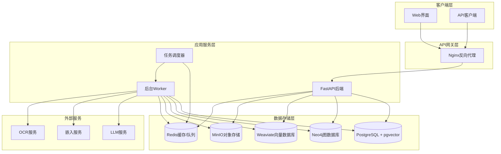
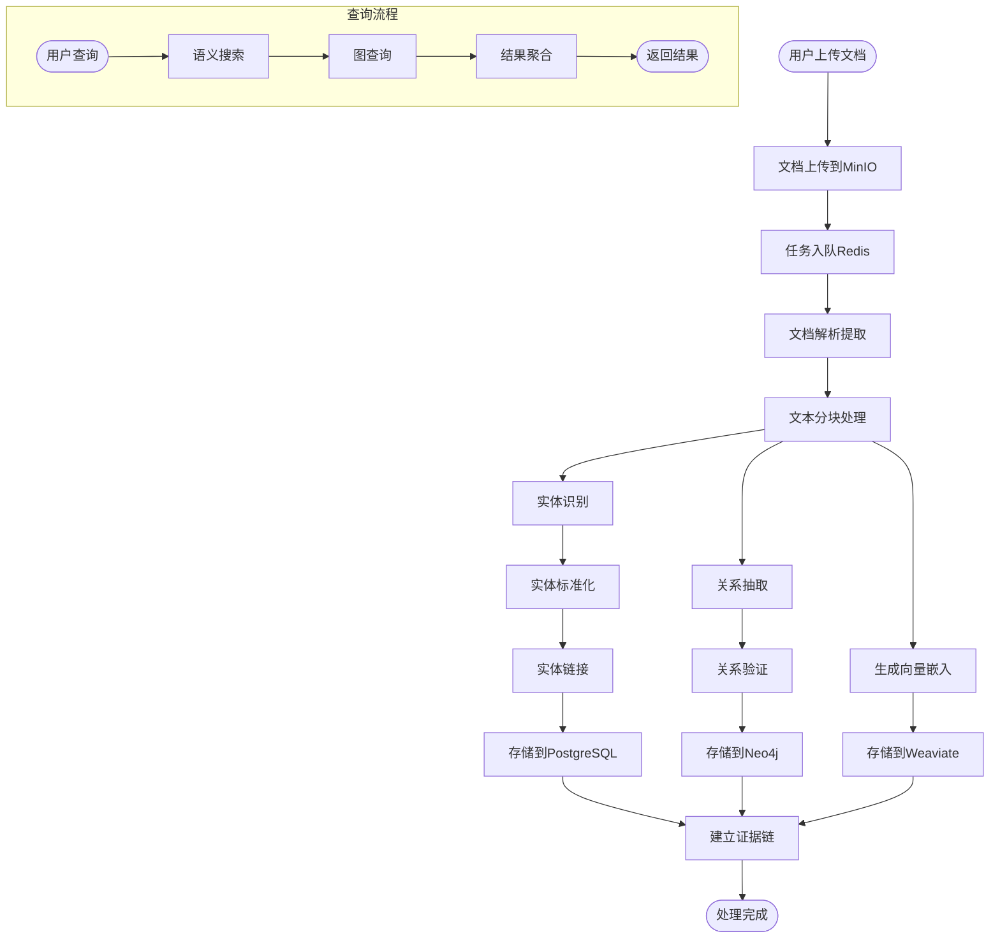

# 系统架构概览

## 整体架构

GraphRAG知识库系统采用微服务架构，通过Docker Compose编排多个服务组件，实现文档处理、知识抽取、图谱构建和检索查询的完整流程。

## 系统架构图

## 数据流架构

## 核心组件详解

### 1. FastAPI后端服务
- **职责**: 提供RESTful API接口，处理用户请求
- **主要功能**:
  - 文档上传和管理
  - 实体和关系CRUD操作
  - 查询和检索接口
  - 用户认证和权限控制

### 2. 后台Worker服务
- **职责**: 异步处理文档解析和知识抽取任务
- **主要功能**:
  - 文档格式转换和文本提取
  - 文本分块和向量化
  - 实体识别和关系抽取
  - 知识图谱构建

### 3. 数据存储层

#### PostgreSQL + pgvector
- **用途**: 结构化数据存储和向量检索
- **存储内容**:
  - 文档元数据
  - 文本块（chunks）
  - 实体信息
  - 关系数据
  - 向量嵌入（备份）

#### Neo4j图数据库
- **用途**: 知识图谱存储和图查询
- **存储内容**:
  - 实体节点
  - 关系边
  - 证据链接
  - 图结构索引

#### Weaviate向量数据库
- **用途**: 高性能向量检索
- **存储内容**:
  - 文本向量嵌入
  - 图像向量嵌入
  - 多模态检索索引

#### MinIO对象存储
- **用途**: 大文件存储
- **存储内容**:
  - 原始文档文件
  - 图片和媒体文件
  - 处理结果缓存

#### Redis
- **用途**: 缓存和任务队列
- **存储内容**:
  - 任务队列
  - 会话缓存
  - 临时数据

## 关键设计原则

### 1. 数据一致性
- 使用分布式事务保证跨数据库一致性
- 实现幂等性操作避免重复处理
- 提供数据修复和同步机制

### 2. 可扩展性
- 微服务架构支持独立扩展
- 水平扩展Worker节点处理高并发
- 数据库分片和读写分离

### 3. 可追溯性
- 每个知识点都有完整的证据链
- 记录处理版本和时间戳
- 支持历史数据回溯

### 4. 容错性
- 服务健康检查和自动重启
- 任务失败重试机制
- 数据备份和恢复策略

## 性能优化策略

### 1. 缓存策略
- Redis缓存热点数据
- 向量检索结果缓存
- API响应缓存

### 2. 索引优化
- PostgreSQL复合索引
- Neo4j图索引
- Weaviate向量索引

### 3. 并发处理
- 异步任务处理
- 连接池管理
- 批量操作优化

### 4. 资源管理
- 内存使用监控
- CPU资源调度
- 磁盘空间管理