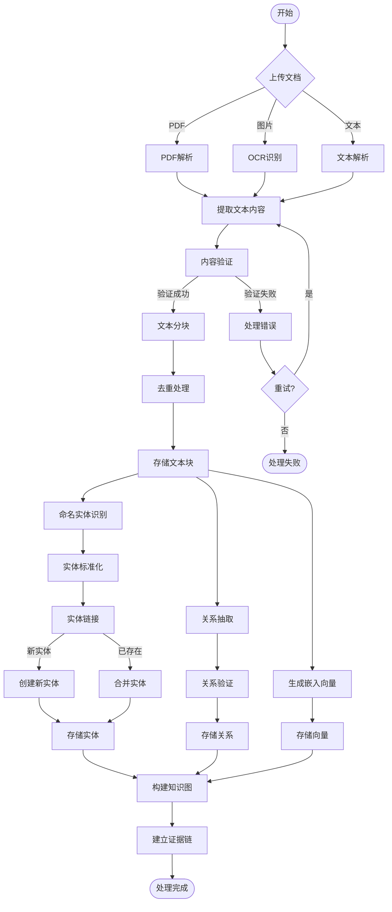
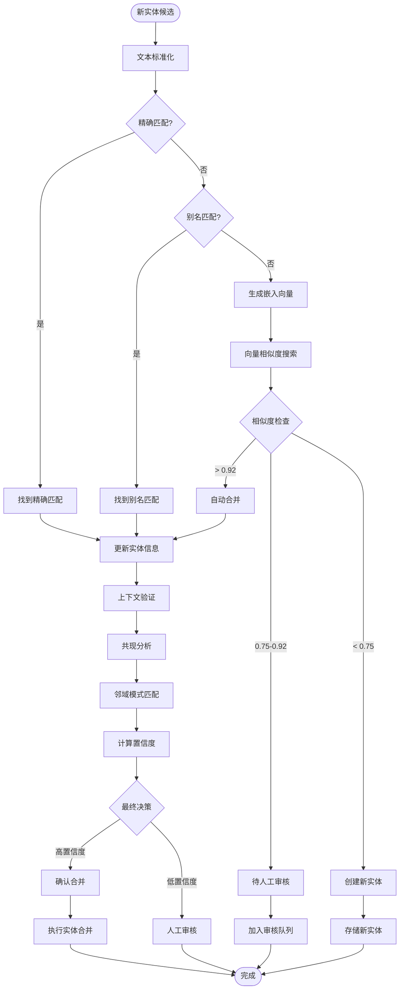
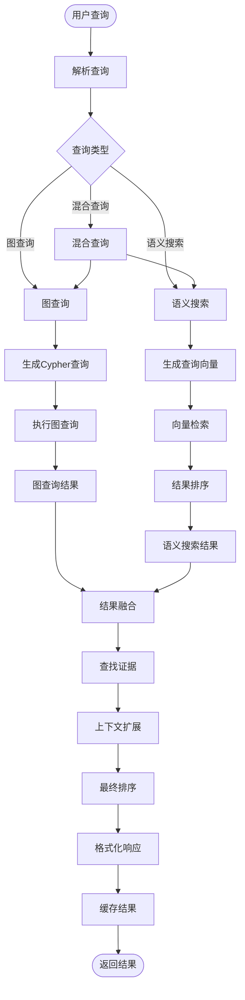
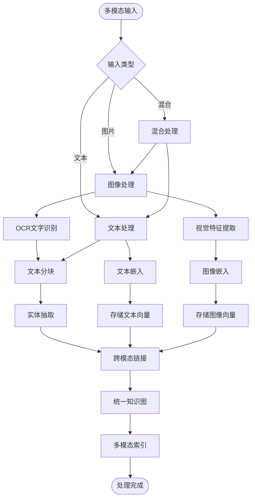
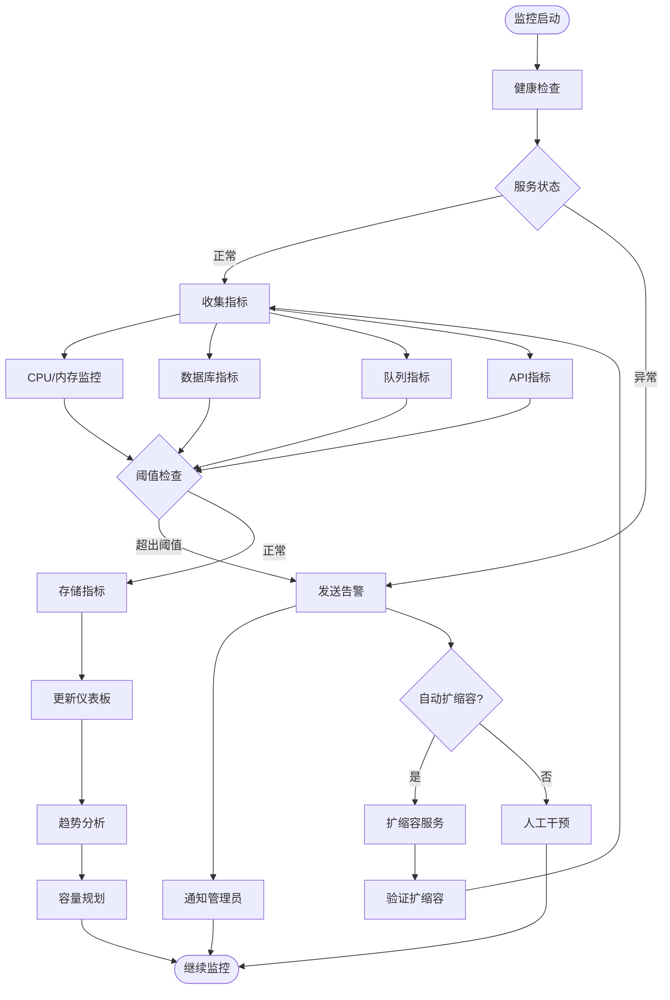
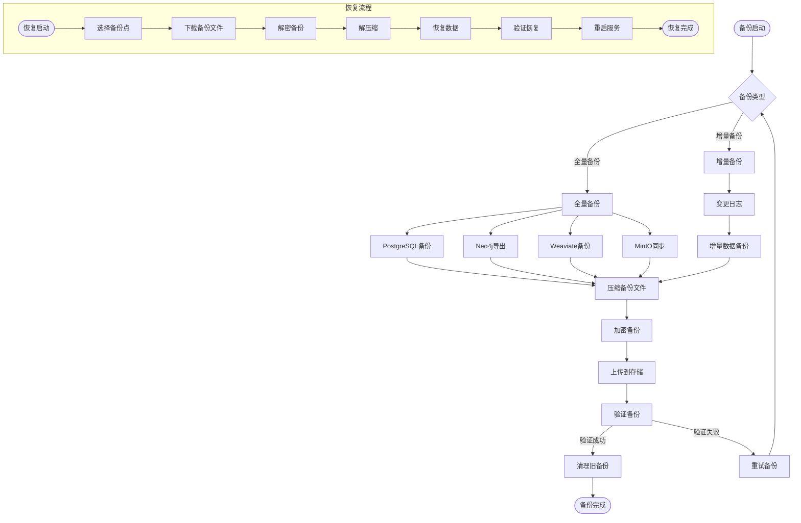

# 工作流程图

## 文档处理完整流程

```mermaid
flowchart TD
    START([开始]) --> UPLOAD{上传文档}
    UPLOAD -->|PDF| PDF_PARSE[PDF解析]
    UPLOAD -->|图片| OCR_PARSE[OCR识别]
    UPLOAD -->|文本| TEXT_PARSE[文本解析]
    
    PDF_PARSE --> EXTRACT_TEXT[提取文本内容]
    OCR_PARSE --> EXTRACT_TEXT
    TEXT_PARSE --> EXTRACT_TEXT
    
    EXTRACT_TEXT --> VALIDATE[内容验证]
    VALIDATE -->|验证失败| ERROR[处理错误]
    VALIDATE -->|验证成功| CHUNK[文本分块]
    
    CHUNK --> DEDUP[去重处理]
    DEDUP --> STORE_CHUNK[存储文本块]
    
    STORE_CHUNK --> EMBED[生成嵌入向量]
    EMBED --> STORE_VECTOR[存储向量]
    
    STORE_CHUNK --> NER[命名实体识别]
    NER --> ENTITY_NORM[实体标准化]
    ENTITY_NORM --> ENTITY_LINK[实体链接]
    
    ENTITY_LINK -->|新实体| CREATE_ENTITY[创建新实体]
    ENTITY_LINK -->|已存在| MERGE_ENTITY[合并实体]
    
    CREATE_ENTITY --> STORE_ENTITY[存储实体]
    MERGE_ENTITY --> STORE_ENTITY
    
    STORE_CHUNK --> RE[关系抽取]
    RE --> REL_VALIDATE[关系验证]
    REL_VALIDATE --> STORE_RELATION[存储关系]
    
    STORE_ENTITY --> BUILD_GRAPH[构建知识图]
    STORE_RELATION --> BUILD_GRAPH
    STORE_VECTOR --> BUILD_GRAPH
    
    BUILD_GRAPH --> PROVENANCE[建立证据链]
    PROVENANCE --> COMPLETE([处理完成])
    
    ERROR --> RETRY{重试?}
    RETRY -->|是| EXTRACT_TEXT
    RETRY -->|否| FAIL([处理失败])
```

## 实体链接详细流程

```mermaid
flowchart TD
    START([新实体候选]) --> NORMALIZE[文本标准化]
    NORMALIZE --> EXACT_MATCH{精确匹配?}
    
    EXACT_MATCH -->|是| FOUND_EXACT[找到精确匹配]
    EXACT_MATCH -->|否| ALIAS_MATCH{别名匹配?}
    
    ALIAS_MATCH -->|是| FOUND_ALIAS[找到别名匹配]
    ALIAS_MATCH -->|否| EMBEDDING[生成嵌入向量]
    
    EMBEDDING --> VECTOR_SEARCH[向量相似度搜索]
    VECTOR_SEARCH --> SIMILARITY_CHECK{相似度检查}
    
    SIMILARITY_CHECK -->|> 0.92| AUTO_MERGE[自动合并]
    SIMILARITY_CHECK -->|0.75-0.92| PENDING_REVIEW[待人工审核]
    SIMILARITY_CHECK -->|< 0.75| CREATE_NEW[创建新实体]
    
    FOUND_EXACT --> UPDATE_ENTITY[更新实体信息]
    FOUND_ALIAS --> UPDATE_ENTITY
    AUTO_MERGE --> UPDATE_ENTITY
    
    UPDATE_ENTITY --> CONTEXT_CHECK[上下文验证]
    CONTEXT_CHECK --> CO_MENTION[共现分析]
    CO_MENTION --> NEIGHBOR_PATTERN[邻域模式匹配]
    
    NEIGHBOR_PATTERN --> CONFIDENCE_SCORE[计算置信度]
    CONFIDENCE_SCORE --> FINAL_DECISION{最终决策}
    
    FINAL_DECISION -->|高置信度| CONFIRM_MERGE[确认合并]
    FINAL_DECISION -->|低置信度| MANUAL_REVIEW[人工审核]
    
    CREATE_NEW --> STORE_NEW[存储新实体]
    PENDING_REVIEW --> QUEUE_REVIEW[加入审核队列]
    CONFIRM_MERGE --> MERGE_ENTITIES[执行实体合并]
    
    STORE_NEW --> END([完成])
    QUEUE_REVIEW --> END
    MERGE_ENTITIES --> END
    MANUAL_REVIEW --> END
```

## 查询处理流程

```mermaid
flowchart TD
    QUERY_START([用户查询]) --> PARSE_QUERY[解析查询]
    PARSE_QUERY --> QUERY_TYPE{查询类型}
    
    QUERY_TYPE -->|语义搜索| SEMANTIC_SEARCH[语义搜索]
    QUERY_TYPE -->|图查询| GRAPH_QUERY[图查询]
    QUERY_TYPE -->|混合查询| HYBRID_QUERY[混合查询]
    
    SEMANTIC_SEARCH --> GENERATE_EMBED[生成查询向量]
    GENERATE_EMBED --> VECTOR_SEARCH[向量检索]
    VECTOR_SEARCH --> RANK_RESULTS[结果排序]
    
    GRAPH_QUERY --> CYPHER_GEN[生成Cypher查询]
    CYPHER_GEN --> NEO4J_EXEC[执行图查询]
    NEO4J_EXEC --> GRAPH_RESULTS[图查询结果]
    
    HYBRID_QUERY --> SEMANTIC_SEARCH
    HYBRID_QUERY --> GRAPH_QUERY
    
    RANK_RESULTS --> SEMANTIC_RESULTS[语义搜索结果]
    GRAPH_RESULTS --> RESULT_FUSION[结果融合]
    SEMANTIC_RESULTS --> RESULT_FUSION
    
    RESULT_FUSION --> PROVENANCE_LOOKUP[查找证据]
    PROVENANCE_LOOKUP --> CONTEXT_EXPAND[上下文扩展]
    CONTEXT_EXPAND --> FINAL_RANK[最终排序]
    
    FINAL_RANK --> FORMAT_RESPONSE[格式化响应]
    FORMAT_RESPONSE --> CACHE_RESULT[缓存结果]
    CACHE_RESULT --> RETURN_RESULT([返回结果])
```

## 多模态处理流程

```mermaid
flowchart TD
    MULTIMODAL_START([多模态输入]) --> INPUT_TYPE{输入类型}
    
    INPUT_TYPE -->|图片| IMAGE_PROCESS[图像处理]
    INPUT_TYPE -->|文本| TEXT_PROCESS[文本处理]
    INPUT_TYPE -->|混合| MIXED_PROCESS[混合处理]
    
    IMAGE_PROCESS --> OCR[OCR文字识别]
    IMAGE_PROCESS --> VISUAL_FEATURE[视觉特征提取]
    
    OCR --> TEXT_CHUNK[文本分块]
    VISUAL_FEATURE --> IMAGE_EMBED[图像嵌入]
    
    TEXT_PROCESS --> TEXT_EMBED[文本嵌入]
    TEXT_PROCESS --> TEXT_CHUNK
    
    MIXED_PROCESS --> IMAGE_PROCESS
    MIXED_PROCESS --> TEXT_PROCESS
    
    TEXT_CHUNK --> ENTITY_EXTRACT[实体抽取]
    TEXT_EMBED --> STORE_TEXT_VEC[存储文本向量]
    IMAGE_EMBED --> STORE_IMAGE_VEC[存储图像向量]
    
    ENTITY_EXTRACT --> CROSS_MODAL_LINK[跨模态链接]
    STORE_TEXT_VEC --> CROSS_MODAL_LINK
    STORE_IMAGE_VEC --> CROSS_MODAL_LINK
    
    CROSS_MODAL_LINK --> UNIFIED_GRAPH[统一知识图]
    UNIFIED_GRAPH --> MULTIMODAL_INDEX[多模态索引]
    MULTIMODAL_INDEX --> COMPLETE([处理完成])
```

## 系统监控和健康检查流程

```mermaid
flowchart TD
    MONITOR_START([监控启动]) --> HEALTH_CHECK[健康检查]
    HEALTH_CHECK --> SERVICE_STATUS{服务状态}
    
    SERVICE_STATUS -->|正常| COLLECT_METRICS[收集指标]
    SERVICE_STATUS -->|异常| ALERT[发送告警]
    
    COLLECT_METRICS --> CPU_MEMORY[CPU/内存监控]
    COLLECT_METRICS --> DB_METRICS[数据库指标]
    COLLECT_METRICS --> QUEUE_METRICS[队列指标]
    COLLECT_METRICS --> API_METRICS[API指标]
    
    CPU_MEMORY --> THRESHOLD_CHECK{阈值检查}
    DB_METRICS --> THRESHOLD_CHECK
    QUEUE_METRICS --> THRESHOLD_CHECK
    API_METRICS --> THRESHOLD_CHECK
    
    THRESHOLD_CHECK -->|超出阈值| ALERT
    THRESHOLD_CHECK -->|正常| STORE_METRICS[存储指标]
    
    ALERT --> NOTIFICATION[通知管理员]
    ALERT --> AUTO_SCALE{自动扩缩容?}
    
    AUTO_SCALE -->|是| SCALE_SERVICE[扩缩容服务]
    AUTO_SCALE -->|否| MANUAL_INTERVENTION[人工干预]
    
    SCALE_SERVICE --> VERIFY_SCALE[验证扩缩容]
    VERIFY_SCALE --> COLLECT_METRICS
    
    STORE_METRICS --> DASHBOARD[更新仪表板]
    DASHBOARD --> TREND_ANALYSIS[趋势分析]
    TREND_ANALYSIS --> CAPACITY_PLANNING[容量规划]
    
    CAPACITY_PLANNING --> MONITOR_CONTINUE([继续监控])
    NOTIFICATION --> MONITOR_CONTINUE
    MANUAL_INTERVENTION --> MONITOR_CONTINUE
```

## 数据备份和恢复流程

```mermaid
flowchart TD
    BACKUP_START([备份启动]) --> BACKUP_TYPE{备份类型}
    
    BACKUP_TYPE -->|全量备份| FULL_BACKUP[全量备份]
    BACKUP_TYPE -->|增量备份| INCREMENTAL_BACKUP[增量备份]
    
    FULL_BACKUP --> PG_DUMP[PostgreSQL备份]
    FULL_BACKUP --> NEO4J_EXPORT[Neo4j导出]
    FULL_BACKUP --> WEAVIATE_BACKUP[Weaviate备份]
    FULL_BACKUP --> MINIO_SYNC[MinIO同步]
    
    INCREMENTAL_BACKUP --> CHANGE_LOG[变更日志]
    CHANGE_LOG --> DELTA_BACKUP[增量数据备份]
    
    PG_DUMP --> COMPRESS[压缩备份文件]
    NEO4J_EXPORT --> COMPRESS
    WEAVIATE_BACKUP --> COMPRESS
    MINIO_SYNC --> COMPRESS
    DELTA_BACKUP --> COMPRESS
    
    COMPRESS --> ENCRYPT[加密备份]
    ENCRYPT --> UPLOAD_STORAGE[上传到存储]
    UPLOAD_STORAGE --> VERIFY_BACKUP[验证备份]
    
    VERIFY_BACKUP -->|验证成功| CLEANUP_OLD[清理旧备份]
    VERIFY_BACKUP -->|验证失败| RETRY_BACKUP[重试备份]
    
    RETRY_BACKUP --> BACKUP_TYPE
    CLEANUP_OLD --> BACKUP_COMPLETE([备份完成])
    
    subgraph "恢复流程"
        RESTORE_START([恢复启动]) --> SELECT_BACKUP[选择备份点]
        SELECT_BACKUP --> DOWNLOAD_BACKUP[下载备份文件]
        DOWNLOAD_BACKUP --> DECRYPT[解密备份]
        DECRYPT --> DECOMPRESS[解压缩]
        DECOMPRESS --> RESTORE_DATA[恢复数据]
        RESTORE_DATA --> VERIFY_RESTORE[验证恢复]
        VERIFY_RESTORE --> RESTART_SERVICES[重启服务]
        RESTART_SERVICES --> RESTORE_COMPLETE([恢复完成])
    end
```