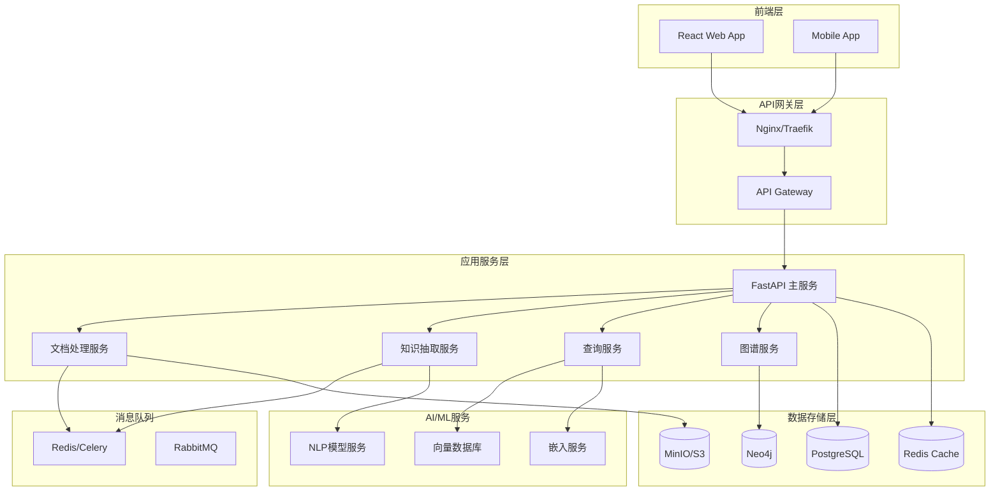
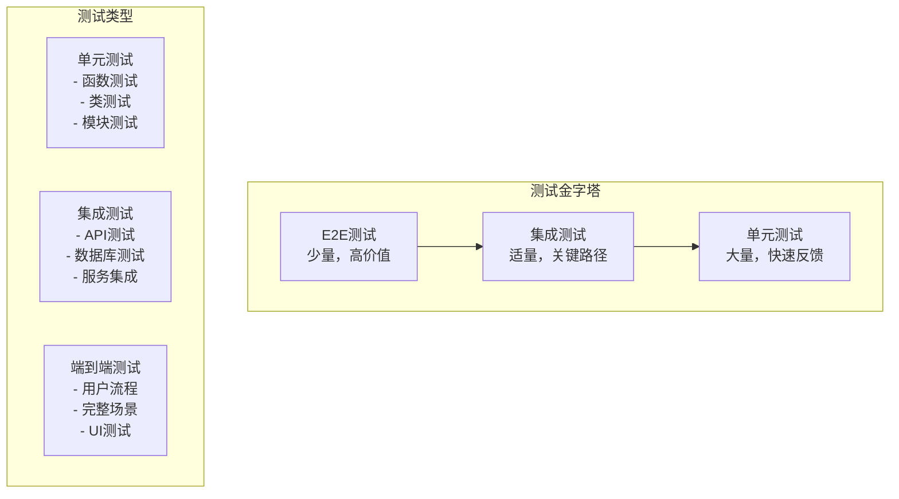
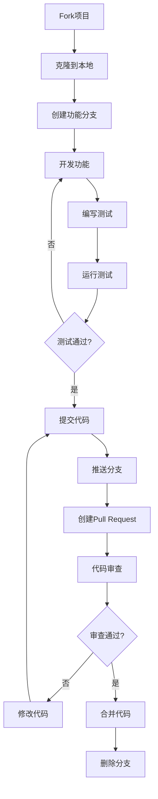

# GraphRAG 系统开发者指南

## 概述

本指南面向GraphRAG系统的开发者，提供完整的开发环境搭建、架构理解、代码开发、测试和部署流程。GraphRAG是一个基于知识图谱的检索增强生成系统，采用现代化的微服务架构和云原生技术栈。

## 目录

1. [开发环境搭建](#1-开发环境搭建)
2. [系统架构](#2-系统架构)
3. [代码结构](#3-代码结构)
4. [开发流程](#4-开发流程)
5. [API开发](#5-api开发)
6. [数据库开发](#6-数据库开发)
7. [前端开发](#7-前端开发)
8. [测试指南](#8-测试指南)
9. [部署指南](#9-部署指南)
10. [贡献指南](#10-贡献指南)

## 1. 开发环境搭建

### 1.1 系统要求

```yaml
# 最低配置
CPU: 4核心
内存: 8GB
存储: 50GB SSD
操作系统: macOS 10.15+ / Ubuntu 20.04+ / Windows 10+

# 推荐配置  
CPU: 8核心
内存: 16GB
存储: 100GB SSD
GPU: NVIDIA GTX 1060+ (可选，用于ML推理)
```

### 1.2 必需软件安装

#### 基础工具

```bash
# macOS
brew install git python@3.11 node@18 docker docker-compose
brew install postgresql@14 redis neo4j

# Ubuntu
sudo apt update
sudo apt install git python3.11 python3.11-venv nodejs npm docker.io docker-compose
sudo apt install postgresql-14 redis-server

# 安装Neo4j
wget -O - https://debian.neo4j.com/neotechnology.gpg.key | sudo apt-key add -
echo 'deb https://debian.neo4j.com stable 4.4' | sudo tee /etc/apt/sources.list.d/neo4j.list
sudo apt update && sudo apt install neo4j
```

#### Python环境

```bash
# 创建虚拟环境
python3.11 -m venv venv
source venv/bin/activate  # Linux/macOS
# 或 venv\Scripts\activate  # Windows

# 升级pip和安装基础包
pip install --upgrade pip setuptools wheel
pip install poetry  # 包管理工具
```

#### Node.js环境

```bash
# 安装yarn包管理器
npm install -g yarn

# 验证安装
node --version  # v18.x.x
yarn --version  # 1.22.x
```

### 1.3 项目克隆和初始化

```bash
# 克隆项目
git clone https://github.com/your-org/graphrag-system.git
cd graphrag-system

# 初始化开发环境
make dev-setup
# 或手动执行以下步骤：

# 1. 安装Python依赖
poetry install --with dev,test

# 2. 安装前端依赖
cd frontend && yarn install && cd ..

# 3. 复制配置文件
cp .env.example .env
cp config/development.yaml.example config/development.yaml

# 4. 启动开发服务
docker-compose -f docker-compose.dev.yml up -d
```

### 1.4 开发工具配置

#### VS Code配置

```json
// .vscode/settings.json
{
    "python.defaultInterpreterPath": "./venv/bin/python",
    "python.linting.enabled": true,
    "python.linting.pylintEnabled": true,
    "python.linting.flake8Enabled": true,
    "python.formatting.provider": "black",
    "python.sortImports.args": ["--profile", "black"],
    "editor.formatOnSave": true,
    "editor.codeActionsOnSave": {
        "source.organizeImports": true
    }
}
```

#### 推荐扩展

```json
// .vscode/extensions.json
{
    "recommendations": [
        "ms-python.python",
        "ms-python.black-formatter",
        "ms-python.isort",
        "ms-python.pylint",
        "bradlc.vscode-tailwindcss",
        "esbenp.prettier-vscode",
        "ms-vscode.vscode-typescript-next"
    ]
}
```

### 1.5 环境验证

```bash
# 验证开发环境
make verify-env

# 手动验证步骤：
# 1. 检查Python环境
python --version  # Python 3.11.x
pip list | grep fastapi

# 2. 检查数据库连接
psql -h localhost -U postgres -d graphrag_dev -c "SELECT version();"
redis-cli ping  # 应返回PONG
neo4j status

# 3. 检查API服务
curl http://localhost:8000/health

# 4. 检查前端服务
curl http://localhost:3000
```

## 2. 系统架构

### 2.1 整体架构图



### 2.2 技术栈

#### 后端技术栈

```yaml
# 核心框架
Web框架: FastAPI 0.104+
异步支持: asyncio, aiohttp
API文档: OpenAPI 3.0 + Swagger UI

# 数据库
关系数据库: PostgreSQL 14+
图数据库: Neo4j 5.0+
缓存: Redis 7.0+
对象存储: MinIO / AWS S3

# 消息队列
任务队列: Celery + Redis
消息代理: RabbitMQ (可选)

# AI/ML
NLP框架: spaCy, transformers
向量数据库: Qdrant / Weaviate
嵌入模型: sentence-transformers
```

#### 前端技术栈

```yaml
# 核心框架
UI框架: React 18+
状态管理: Redux Toolkit + RTK Query
路由: React Router v6
类型检查: TypeScript 5.0+

# UI组件
组件库: Ant Design / Material-UI
图表: D3.js + React-D3-Graph
图谱可视化: Cytoscape.js
样式: Tailwind CSS

# 构建工具
构建工具: Vite
包管理: Yarn
代码质量: ESLint + Prettier
```

#### DevOps技术栈

```yaml
# 容器化
容器: Docker + Docker Compose
编排: Kubernetes
镜像仓库: Harbor / Docker Hub

# CI/CD
版本控制: Git + GitHub/GitLab
CI/CD: GitHub Actions / GitLab CI
代码质量: SonarQube

# 监控
指标收集: Prometheus
可视化: Grafana
日志: ELK Stack / Loki
链路追踪: Jaeger
```

### 2.3 服务架构

#### 微服务划分

```python
# src/services/
"""
GraphRAG系统服务架构

每个服务都是独立的FastAPI应用，可以单独部署和扩展
"""

services = {
    "api_gateway": {
        "description": "API网关服务，处理路由、认证、限流",
        "port": 8000,
        "dependencies": ["redis", "postgresql"]
    },
    
    "document_service": {
        "description": "文档处理服务，处理文档上传、解析、存储",
        "port": 8001,
        "dependencies": ["postgresql", "minio", "redis"]
    },
    
    "extraction_service": {
        "description": "知识抽取服务，实体关系抽取、NLP处理",
        "port": 8002,
        "dependencies": ["neo4j", "postgresql", "ml_models"]
    },
    
    "query_service": {
        "description": "查询服务，自然语言查询、语义搜索",
        "port": 8003,
        "dependencies": ["postgresql", "neo4j", "vector_db"]
    },
    
    "graph_service": {
        "description": "图谱服务，图谱查询、可视化数据",
        "port": 8004,
        "dependencies": ["neo4j", "redis"]
    }
}
```

## 3. 代码结构

### 3.1 项目目录结构

```
graphrag-system/
├── README.md                    # 项目说明
├── pyproject.toml              # Python项目配置
├── docker-compose.yml          # Docker编排文件
├── Makefile                    # 构建脚本
├── .env.example               # 环境变量模板
├── .gitignore                 # Git忽略文件
├── .github/                   # GitHub Actions
│   └── workflows/
├── docs/                      # 文档目录
│   ├── api/                   # API文档
│   ├── deployment/            # 部署文档
│   ├── development/           # 开发文档
│   └── user-guide/           # 用户指南
├── config/                    # 配置文件
│   ├── development.yaml
│   ├── production.yaml
│   └── test.yaml
├── scripts/                   # 脚本文件
│   ├── setup.sh              # 环境搭建
│   ├── migrate.py            # 数据迁移
│   └── seed.py               # 测试数据
├── tests/                     # 测试文件
│   ├── unit/                 # 单元测试
│   ├── integration/          # 集成测试
│   └── e2e/                  # 端到端测试
├── src/                       # 源代码
│   ├── __init__.py
│   ├── main.py               # 应用入口
│   ├── core/                 # 核心模块
│   │   ├── __init__.py
│   │   ├── config.py         # 配置管理
│   │   ├── database.py       # 数据库连接
│   │   ├── security.py       # 安全认证
│   │   ├── logging.py        # 日志配置
│   │   └── exceptions.py     # 异常处理
│   ├── api/                  # API路由
│   │   ├── __init__.py
│   │   ├── v1/              # API版本1
│   │   │   ├── __init__.py
│   │   │   ├── documents.py  # 文档API
│   │   │   ├── query.py      # 查询API
│   │   │   ├── entities.py   # 实体API
│   │   │   ├── relations.py  # 关系API
│   │   │   └── graph.py      # 图谱API
│   │   └── dependencies.py   # API依赖
│   ├── models/               # 数据模型
│   │   ├── __init__.py
│   │   ├── database.py       # 数据库模型
│   │   ├── schemas.py        # Pydantic模型
│   │   └── graph.py          # 图模型
│   ├── services/             # 业务服务
│   │   ├── __init__.py
│   │   ├── document_service.py
│   │   ├── extraction_service.py
│   │   ├── query_service.py
│   │   └── graph_service.py
│   ├── utils/                # 工具函数
│   │   ├── __init__.py
│   │   ├── text_processing.py
│   │   ├── file_utils.py
│   │   └── graph_utils.py
│   └── workers/              # 后台任务
│       ├── __init__.py
│       ├── celery_app.py
│       └── tasks.py
├── frontend/                  # 前端代码
│   ├── package.json
│   ├── tsconfig.json
│   ├── vite.config.ts
│   ├── src/
│   │   ├── components/       # React组件
│   │   ├── pages/           # 页面组件
│   │   ├── hooks/           # 自定义Hooks
│   │   ├── store/           # Redux Store
│   │   ├── services/        # API服务
│   │   ├── types/           # TypeScript类型
│   │   └── utils/           # 工具函数
│   └── public/              # 静态资源
└── deployment/               # 部署配置
    ├── docker/              # Docker文件
    ├── kubernetes/          # K8s配置
    └── helm/               # Helm Charts
```

### 3.2 核心模块说明

#### 配置管理 (src/core/config.py)

```python
"""
配置管理模块

统一管理应用配置，支持多环境配置和环境变量覆盖
"""

from pydantic import BaseSettings, Field
from typing import Optional, List
import os

class DatabaseConfig(BaseSettings):
    """数据库配置"""
    host: str = Field(default="localhost", env="DB_HOST")
    port: int = Field(default=5432, env="DB_PORT")
    username: str = Field(default="postgres", env="DB_USERNAME")
    password: str = Field(default="password", env="DB_PASSWORD")
    database: str = Field(default="graphrag", env="DB_DATABASE")
    
    @property
    def url(self) -> str:
        return f"postgresql://{self.username}:{self.password}@{self.host}:{self.port}/{self.database}"

class Neo4jConfig(BaseSettings):
    """Neo4j配置"""
    uri: str = Field(default="bolt://localhost:7687", env="NEO4J_URI")
    username: str = Field(default="neo4j", env="NEO4J_USERNAME")
    password: str = Field(default="password", env="NEO4J_PASSWORD")
    database: str = Field(default="neo4j", env="NEO4J_DATABASE")

class RedisConfig(BaseSettings):
    """Redis配置"""
    host: str = Field(default="localhost", env="REDIS_HOST")
    port: int = Field(default=6379, env="REDIS_PORT")
    password: Optional[str] = Field(default=None, env="REDIS_PASSWORD")
    db: int = Field(default=0, env="REDIS_DB")
    
    @property
    def url(self) -> str:
        auth = f":{self.password}@" if self.password else ""
        return f"redis://{auth}{self.host}:{self.port}/{self.db}"

class AppConfig(BaseSettings):
    """应用配置"""
    # 基本配置
    app_name: str = "GraphRAG System"
    version: str = "1.0.0"
    debug: bool = Field(default=False, env="DEBUG")
    environment: str = Field(default="development", env="ENVIRONMENT")
    
    # 服务配置
    host: str = Field(default="0.0.0.0", env="HOST")
    port: int = Field(default=8000, env="PORT")
    workers: int = Field(default=1, env="WORKERS")
    
    # 安全配置
    secret_key: str = Field(env="SECRET_KEY")
    jwt_algorithm: str = "HS256"
    jwt_expire_minutes: int = 30
    
    # 文件上传配置
    max_file_size: int = 100 * 1024 * 1024  # 100MB
    allowed_extensions: List[str] = [".pdf", ".docx", ".txt", ".md"]
    upload_path: str = Field(default="./uploads", env="UPLOAD_PATH")
    
    # AI/ML配置
    model_path: str = Field(default="./models", env="MODEL_PATH")
    embedding_model: str = "sentence-transformers/all-MiniLM-L6-v2"
    max_tokens: int = 4096
    
    # 数据库配置
    database: DatabaseConfig = DatabaseConfig()
    neo4j: Neo4jConfig = Neo4jConfig()
    redis: RedisConfig = RedisConfig()
    
    class Config:
        env_file = ".env"
        env_file_encoding = "utf-8"

# 全局配置实例
settings = AppConfig()
```

#### 数据库连接 (src/core/database.py)

```python
"""
数据库连接管理模块

提供PostgreSQL、Neo4j、Redis的连接管理和会话处理
"""

from sqlalchemy import create_engine, MetaData
from sqlalchemy.ext.declarative import declarative_base
from sqlalchemy.orm import sessionmaker, Session
from neo4j import GraphDatabase, Driver
import redis.asyncio as redis
from typing import AsyncGenerator
import asyncio

from .config import settings

# PostgreSQL配置
engine = create_engine(
    settings.database.url,
    pool_pre_ping=True,
    pool_recycle=300,
    echo=settings.debug
)

SessionLocal = sessionmaker(autocommit=False, autoflush=False, bind=engine)
Base = declarative_base()

# 数据库依赖注入
async def get_db() -> AsyncGenerator[Session, None]:
    """获取数据库会话"""
    db = SessionLocal()
    try:
        yield db
    finally:
        db.close()

# Neo4j配置
class Neo4jConnection:
    """Neo4j连接管理器"""
    
    def __init__(self):
        self._driver: Optional[Driver] = None
    
    def connect(self):
        """建立Neo4j连接"""
        self._driver = GraphDatabase.driver(
            settings.neo4j.uri,
            auth=(settings.neo4j.username, settings.neo4j.password)
        )
    
    def close(self):
        """关闭Neo4j连接"""
        if self._driver:
            self._driver.close()
    
    def get_session(self):
        """获取Neo4j会话"""
        return self._driver.session(database=settings.neo4j.database)
    
    def verify_connectivity(self):
        """验证连接"""
        with self._driver.session() as session:
            return session.run("RETURN 1").single()[0] == 1

# 全局Neo4j连接实例
neo4j_conn = Neo4jConnection()

# Redis配置
class RedisConnection:
    """Redis连接管理器"""
    
    def __init__(self):
        self._redis: Optional[redis.Redis] = None
    
    async def connect(self):
        """建立Redis连接"""
        self._redis = redis.from_url(
            settings.redis.url,
            encoding="utf-8",
            decode_responses=True
        )
    
    async def close(self):
        """关闭Redis连接"""
        if self._redis:
            await self._redis.close()
    
    async def get_redis(self) -> redis.Redis:
        """获取Redis客户端"""
        if not self._redis:
            await self.connect()
        return self._redis

# 全局Redis连接实例
redis_conn = RedisConnection()

# 启动时初始化连接
async def init_databases():
    """初始化所有数据库连接"""
    # 初始化PostgreSQL表
    Base.metadata.create_all(bind=engine)
    
    # 连接Neo4j
    neo4j_conn.connect()
    
    # 连接Redis
    await redis_conn.connect()

# 关闭时清理连接
async def close_databases():
    """关闭所有数据库连接"""
    neo4j_conn.close()
    await redis_conn.close()
```

## 4. 开发流程

### 4.1 Git工作流

#### 分支策略

```mermaid
gitgraph
    commit id: "Initial"
    branch develop
    checkout develop
    commit id: "Dev setup"
    
    branch feature/document-upload
    checkout feature/document-upload
    commit id: "Add upload API"
    commit id: "Add validation"
    
    checkout develop
    merge feature/document-upload
    commit id: "Merge feature"
    
    branch release/v1.0
    checkout release/v1.0
    commit id: "Prepare release"
    
    checkout main
    merge release/v1.0
    commit id: "Release v1.0"
    tag: "v1.0.0"
    
    checkout develop
    merge main
```

#### 分支命名规范

```bash
# 功能分支
feature/功能名称
feature/document-upload
feature/entity-extraction

# 修复分支
fix/问题描述
fix/upload-validation
fix/query-performance

# 发布分支
release/版本号
release/v1.0.0
release/v1.1.0

# 热修复分支
hotfix/紧急修复
hotfix/security-patch
```

#### 提交信息规范

```bash
# 格式：<类型>(<范围>): <描述>
# 类型：feat, fix, docs, style, refactor, test, chore
# 范围：api, ui, db, config等

# 示例
feat(api): 添加文档上传接口
fix(db): 修复Neo4j连接池问题
docs(readme): 更新安装说明
style(ui): 调整按钮样式
refactor(service): 重构查询服务
test(unit): 添加实体抽取测试
chore(deps): 更新依赖版本
```

### 4.2 开发环境工作流

#### 日常开发流程

```bash
# 1. 更新代码
git checkout develop
git pull origin develop

# 2. 创建功能分支
git checkout -b feature/new-feature

# 3. 开发环境启动
make dev-start
# 或
docker-compose -f docker-compose.dev.yml up -d

# 4. 代码开发
# ... 编写代码 ...

# 5. 运行测试
make test
# 或
pytest tests/

# 6. 代码检查
make lint
# 或
black src/ && isort src/ && flake8 src/

# 7. 提交代码
git add .
git commit -m "feat(api): 添加新功能"

# 8. 推送分支
git push origin feature/new-feature

# 9. 创建Pull Request
# 在GitHub/GitLab上创建PR
```

#### 代码质量检查

```bash
# Makefile中的质量检查命令
.PHONY: lint format test

# 代码格式化
format:
	black src/ tests/
	isort src/ tests/

# 代码检查
lint:
	flake8 src/ tests/
	pylint src/
	mypy src/

# 运行测试
test:
	pytest tests/ -v --cov=src --cov-report=html

# 安全检查
security:
	bandit -r src/
	safety check

# 全面检查
check: format lint test security
```

### 4.3 代码审查流程

#### Pull Request模板

```markdown
## 变更描述
简要描述本次变更的内容和目的

## 变更类型
- [ ] 新功能 (feature)
- [ ] 修复 (fix)
- [ ] 文档 (docs)
- [ ] 样式 (style)
- [ ] 重构 (refactor)
- [ ] 测试 (test)
- [ ] 构建 (chore)

## 测试
- [ ] 单元测试通过
- [ ] 集成测试通过
- [ ] 手动测试完成

## 检查清单
- [ ] 代码符合项目规范
- [ ] 添加了必要的测试
- [ ] 更新了相关文档
- [ ] 没有破坏性变更
- [ ] 性能影响可接受

## 相关Issue
Closes #123

## 截图/演示
如果有UI变更，请提供截图或演示
```

#### 审查要点

```python
"""
代码审查检查清单

1. 功能正确性
   - 功能是否按预期工作
   - 边界条件是否处理
   - 错误处理是否完善

2. 代码质量
   - 代码是否清晰易读
   - 命名是否规范
   - 注释是否充分

3. 性能考虑
   - 是否有性能问题
   - 数据库查询是否优化
   - 内存使用是否合理

4. 安全性
   - 输入验证是否充分
   - 权限检查是否正确
   - 敏感信息是否保护

5. 测试覆盖
   - 是否有足够的测试
   - 测试是否覆盖关键路径
   - 测试是否可维护
"""
```

## 5. API开发

### 5.1 API设计原则

#### RESTful设计

```python
"""
API设计规范

1. 资源命名
   - 使用名词而非动词
   - 使用复数形式
   - 使用小写字母和连字符

2. HTTP方法
   - GET: 获取资源
   - POST: 创建资源
   - PUT: 更新整个资源
   - PATCH: 部分更新资源
   - DELETE: 删除资源

3. 状态码
   - 200: 成功
   - 201: 创建成功
   - 400: 客户端错误
   - 401: 未授权
   - 403: 禁止访问
   - 404: 资源不存在
   - 500: 服务器错误
"""

# 示例API设计
api_endpoints = {
    # 文档管理
    "GET /api/v1/documents": "获取文档列表",
    "POST /api/v1/documents": "上传文档",
    "GET /api/v1/documents/{id}": "获取文档详情",
    "PUT /api/v1/documents/{id}": "更新文档",
    "DELETE /api/v1/documents/{id}": "删除文档",
    
    # 实体管理
    "GET /api/v1/entities": "获取实体列表",
    "POST /api/v1/entities": "创建实体",
    "GET /api/v1/entities/{id}": "获取实体详情",
    "PUT /api/v1/entities/{id}": "更新实体",
    "DELETE /api/v1/entities/{id}": "删除实体",
    
    # 关系管理
    "GET /api/v1/relations": "获取关系列表",
    "POST /api/v1/relations": "创建关系",
    "GET /api/v1/relations/{id}": "获取关系详情",
    "PUT /api/v1/relations/{id}": "更新关系",
    "DELETE /api/v1/relations/{id}": "删除关系",
    
    # 查询接口
    "POST /api/v1/query/search": "文本搜索",
    "POST /api/v1/query/semantic": "语义搜索",
    "POST /api/v1/query/graph": "图查询",
    
    # 图谱接口
    "GET /api/v1/graph/nodes": "获取节点",
    "GET /api/v1/graph/edges": "获取边",
    "POST /api/v1/graph/path": "路径查询"
}
```

### 5.2 FastAPI应用结构

#### 主应用文件 (src/main.py)

```python
"""
GraphRAG系统主应用入口

提供FastAPI应用的配置、中间件、路由注册等功能
"""

from fastapi import FastAPI, Request, status
from fastapi.middleware.cors import CORSMiddleware
from fastapi.middleware.trustedhost import TrustedHostMiddleware
from fastapi.responses import JSONResponse
from fastapi.openapi.docs import get_swagger_ui_html
from fastapi.openapi.utils import get_openapi
import uvicorn
import logging
from contextlib import asynccontextmanager

from src.core.config import settings
from src.core.database import init_databases, close_databases
from src.core.logging import setup_logging
from src.core.exceptions import GraphRAGException
from src.api.v1 import api_router
from src.api.dependencies import get_current_user

# 设置日志
setup_logging()
logger = logging.getLogger(__name__)

@asynccontextmanager
async def lifespan(app: FastAPI):
    """应用生命周期管理"""
    # 启动时初始化
    logger.info("正在启动GraphRAG系统...")
    await init_databases()
    logger.info("数据库连接已建立")
    
    yield
    
    # 关闭时清理
    logger.info("正在关闭GraphRAG系统...")
    await close_databases()
    logger.info("数据库连接已关闭")

# 创建FastAPI应用
app = FastAPI(
    title=settings.app_name,
    version=settings.version,
    description="基于知识图谱的检索增强生成系统",
    openapi_url="/api/v1/openapi.json",
    docs_url="/docs" if settings.debug else None,
    redoc_url="/redoc" if settings.debug else None,
    lifespan=lifespan
)

# 添加中间件
app.add_middleware(
    CORSMiddleware,
    allow_origins=["*"] if settings.debug else ["https://yourdomain.com"],
    allow_credentials=True,
    allow_methods=["*"],
    allow_headers=["*"],
)

app.add_middleware(
    TrustedHostMiddleware,
    allowed_hosts=["*"] if settings.debug else ["yourdomain.com"]
)

# 全局异常处理
@app.exception_handler(GraphRAGException)
async def graphrag_exception_handler(request: Request, exc: GraphRAGException):
    """处理自定义异常"""
    return JSONResponse(
        status_code=exc.status_code,
        content={
            "error": exc.error_code,
            "message": exc.message,
            "details": exc.details
        }
    )

@app.exception_handler(Exception)
async def general_exception_handler(request: Request, exc: Exception):
    """处理通用异常"""
    logger.error(f"未处理的异常: {exc}", exc_info=True)
    return JSONResponse(
        status_code=status.HTTP_500_INTERNAL_SERVER_ERROR,
        content={
            "error": "INTERNAL_SERVER_ERROR",
            "message": "服务器内部错误"
        }
    )

# 注册路由
app.include_router(api_router, prefix="/api/v1")

# 健康检查
@app.get("/health")
async def health_check():
    """健康检查接口"""
    return {
        "status": "healthy",
        "version": settings.version,
        "environment": settings.environment
    }

# 自定义OpenAPI文档
def custom_openapi():
    if app.openapi_schema:
        return app.openapi_schema
    
    openapi_schema = get_openapi(
        title=settings.app_name,
        version=settings.version,
        description="GraphRAG系统API文档",
        routes=app.routes,
    )
    
    # 添加安全定义
    openapi_schema["components"]["securitySchemes"] = {
        "BearerAuth": {
            "type": "http",
            "scheme": "bearer",
            "bearerFormat": "JWT"
        }
    }
    
    app.openapi_schema = openapi_schema
    return app.openapi_schema

app.openapi = custom_openapi

if __name__ == "__main__":
    uvicorn.run(
        "src.main:app",
        host=settings.host,
        port=settings.port,
        reload=settings.debug,
        workers=1 if settings.debug else settings.workers
    )
```

### 5.3 API路由开发

#### 文档管理API (src/api/v1/documents.py)

```python
"""
文档管理API

提供文档上传、查询、更新、删除等功能
"""

from fastapi import APIRouter, Depends, HTTPException, UploadFile, File, Form
from fastapi import status, BackgroundTasks
from sqlalchemy.orm import Session
from typing import List, Optional
import uuid
import os
from datetime import datetime

from src.core.database import get_db
from src.core.security import get_current_user
from src.models.schemas import (
    DocumentCreate, DocumentUpdate, DocumentResponse,
    DocumentList, User
)
from src.services.document_service import DocumentService
from src.workers.tasks import process_document_task

router = APIRouter(prefix="/documents", tags=["文档管理"])

@router.post("/", response_model=DocumentResponse, status_code=status.HTTP_201_CREATED)
async def upload_document(
    background_tasks: BackgroundTasks,
    file: UploadFile = File(...),
    title: str = Form(...),
    description: Optional[str] = Form(None),
    tags: Optional[str] = Form(None),
    db: Session = Depends(get_db),
    current_user: User = Depends(get_current_user)
):
    """
    上传文档
    
    Args:
        file: 上传的文件
        title: 文档标题
        description: 文档描述
        tags: 文档标签（逗号分隔）
        db: 数据库会话
        current_user: 当前用户
    
    Returns:
        DocumentResponse: 创建的文档信息
    
    Raises:
        HTTPException: 文件格式不支持或上传失败
    """
    # 验证文件格式
    if not file.filename.lower().endswith(tuple(settings.allowed_extensions)):
        raise HTTPException(
            status_code=status.HTTP_400_BAD_REQUEST,
            detail=f"不支持的文件格式。支持的格式: {', '.join(settings.allowed_extensions)}"
        )
    
    # 验证文件大小
    if file.size > settings.max_file_size:
        raise HTTPException(
            status_code=status.HTTP_413_REQUEST_ENTITY_TOO_LARGE,
            detail=f"文件大小超过限制 ({settings.max_file_size / 1024 / 1024:.1f}MB)"
        )
    
    try:
        # 创建文档记录
        document_data = DocumentCreate(
            title=title,
            description=description,
            tags=tags.split(",") if tags else [],
            filename=file.filename,
            content_type=file.content_type,
            size=file.size,
            user_id=current_user.id
        )
        
        document_service = DocumentService(db)
        document = await document_service.create_document(document_data, file)
        
        # 启动后台处理任务
        background_tasks.add_task(
            process_document_task.delay,
            document.id
        )
        
        return document
        
    except Exception as e:
        logger.error(f"文档上传失败: {e}")
        raise HTTPException(
            status_code=status.HTTP_500_INTERNAL_SERVER_ERROR,
            detail="文档上传失败"
        )

@router.get("/", response_model=DocumentList)
async def get_documents(
    skip: int = 0,
    limit: int = 20,
    search: Optional[str] = None,
    tags: Optional[str] = None,
    status_filter: Optional[str] = None,
    db: Session = Depends(get_db),
    current_user: User = Depends(get_current_user)
):
    """
    获取文档列表
    
    Args:
        skip: 跳过的记录数
        limit: 返回的记录数限制
        search: 搜索关键词
        tags: 标签过滤（逗号分隔）
        status_filter: 状态过滤
        db: 数据库会话
        current_user: 当前用户
    
    Returns:
        DocumentList: 文档列表和分页信息
    """
    document_service = DocumentService(db)
    
    filters = {}
    if search:
        filters["search"] = search
    if tags:
        filters["tags"] = tags.split(",")
    if status_filter:
        filters["status"] = status_filter
    
    documents, total = await document_service.get_documents(
        user_id=current_user.id,
        skip=skip,
        limit=limit,
        filters=filters
    )
    
    return DocumentList(
        items=documents,
        total=total,
        skip=skip,
        limit=limit
    )

@router.get("/{document_id}", response_model=DocumentResponse)
async def get_document(
    document_id: uuid.UUID,
    db: Session = Depends(get_db),
    current_user: User = Depends(get_current_user)
):
    """
    获取文档详情
    
    Args:
        document_id: 文档ID
        db: 数据库会话
        current_user: 当前用户
    
    Returns:
        DocumentResponse: 文档详细信息
    
    Raises:
        HTTPException: 文档不存在或无权限访问
    """
    document_service = DocumentService(db)
    document = await document_service.get_document(document_id, current_user.id)
    
    if not document:
        raise HTTPException(
            status_code=status.HTTP_404_NOT_FOUND,
            detail="文档不存在"
        )
    
    return document

@router.put("/{document_id}", response_model=DocumentResponse)
async def update_document(
    document_id: uuid.UUID,
    document_update: DocumentUpdate,
    db: Session = Depends(get_db),
    current_user: User = Depends(get_current_user)
):
    """
    更新文档信息
    
    Args:
        document_id: 文档ID
        document_update: 更新数据
        db: 数据库会话
        current_user: 当前用户
    
    Returns:
        DocumentResponse: 更新后的文档信息
    
    Raises:
        HTTPException: 文档不存在或无权限访问
    """
    document_service = DocumentService(db)
    document = await document_service.update_document(
        document_id, document_update, current_user.id
    )
    
    if not document:
        raise HTTPException(
            status_code=status.HTTP_404_NOT_FOUND,
            detail="文档不存在"
        )
    
    return document

@router.delete("/{document_id}", status_code=status.HTTP_204_NO_CONTENT)
async def delete_document(
    document_id: uuid.UUID,
    db: Session = Depends(get_db),
    current_user: User = Depends(get_current_user)
):
    """
    删除文档
    
    Args:
        document_id: 文档ID
        db: 数据库会话
        current_user: 当前用户
    
    Raises:
        HTTPException: 文档不存在或无权限访问
    """
    document_service = DocumentService(db)
    success = await document_service.delete_document(document_id, current_user.id)
    
    if not success:
        raise HTTPException(
            status_code=status.HTTP_404_NOT_FOUND,
            detail="文档不存在"
        )

@router.post("/{document_id}/reprocess")
async def reprocess_document(
    document_id: uuid.UUID,
    background_tasks: BackgroundTasks,
    db: Session = Depends(get_db),
    current_user: User = Depends(get_current_user)
):
    """
    重新处理文档
    
    Args:
        document_id: 文档ID
        background_tasks: 后台任务
        db: 数据库会话
        current_user: 当前用户
    
    Returns:
        dict: 处理状态信息
    
    Raises:
        HTTPException: 文档不存在或无权限访问
    """
    document_service = DocumentService(db)
    document = await document_service.get_document(document_id, current_user.id)
    
    if not document:
        raise HTTPException(
            status_code=status.HTTP_404_NOT_FOUND,
            detail="文档不存在"
        )
    
    # 重置文档状态
    await document_service.reset_document_status(document_id)
    
    # 启动重新处理任务
    background_tasks.add_task(
        process_document_task.delay,
        document_id
    )
    
    return {"message": "文档重新处理已启动", "document_id": document_id}
```

## 6. 数据库开发

### 6.1 PostgreSQL模型设计

#### 数据库模型 (src/models/database.py)

```python
"""
PostgreSQL数据库模型

定义系统中所有的数据表结构和关系
"""

from sqlalchemy import Column, String, Text, Integer, DateTime, Boolean, ForeignKey
from sqlalchemy import JSON, ARRAY, Float, LargeBinary, Index
from sqlalchemy.dialects.postgresql import UUID, JSONB
from sqlalchemy.orm import relationship
from sqlalchemy.sql import func
import uuid

from src.core.database import Base

class User(Base):
    """用户表"""
    __tablename__ = "users"
    
    id = Column(UUID(as_uuid=True), primary_key=True, default=uuid.uuid4)
    username = Column(String(50), unique=True, nullable=False, index=True)
    email = Column(String(100), unique=True, nullable=False, index=True)
    hashed_password = Column(String(255), nullable=False)
    full_name = Column(String(100))
    is_active = Column(Boolean, default=True)
    is_superuser = Column(Boolean, default=False)
    created_at = Column(DateTime(timezone=True), server_default=func.now())
    updated_at = Column(DateTime(timezone=True), onupdate=func.now())
    
    # 关系
    documents = relationship("Document", back_populates="user")
    queries = relationship("Query", back_populates="user")

class Document(Base):
    """文档表"""
    __tablename__ = "documents"
    
    id = Column(UUID(as_uuid=True), primary_key=True, default=uuid.uuid4)
    title = Column(String(255), nullable=False)
    description = Column(Text)
    filename = Column(String(255), nullable=False)
    original_filename = Column(String(255), nullable=False)
    content_type = Column(String(100))
    size = Column(Integer)  # 文件大小（字节）
    file_path = Column(String(500))  # 文件存储路径
    
    # 处理状态
    status = Column(String(20), default="pending")  # pending, processing, completed, failed
    processing_progress = Column(Float, default=0.0)  # 处理进度 0-1
    error_message = Column(Text)  # 错误信息
    
    # 元数据
    tags = Column(ARRAY(String))  # 标签数组
    metadata = Column(JSONB)  # 额外元数据
    
    # 抽取结果统计
    total_chunks = Column(Integer, default=0)  # 文本块数量
    total_entities = Column(Integer, default=0)  # 实体数量
    total_relations = Column(Integer, default=0)  # 关系数量
    
    # 时间戳
    created_at = Column(DateTime(timezone=True), server_default=func.now())
    updated_at = Column(DateTime(timezone=True), onupdate=func.now())
    processed_at = Column(DateTime(timezone=True))
    
    # 外键
    user_id = Column(UUID(as_uuid=True), ForeignKey("users.id"), nullable=False)
    
    # 关系
    user = relationship("User", back_populates="documents")
    chunks = relationship("DocumentChunk", back_populates="document", cascade="all, delete-orphan")
    entities = relationship("Entity", back_populates="document")
    
    # 索引
    __table_args__ = (
        Index("idx_documents_user_status", "user_id", "status"),
        Index("idx_documents_created_at", "created_at"),
        Index("idx_documents_tags", "tags", postgresql_using="gin"),
    )

class DocumentChunk(Base):
    """文档块表"""
    __tablename__ = "document_chunks"
    
    id = Column(UUID(as_uuid=True), primary_key=True, default=uuid.uuid4)
    content = Column(Text, nullable=False)  # 文本内容
    chunk_index = Column(Integer, nullable=False)  # 块索引
    start_char = Column(Integer)  # 起始字符位置
    end_char = Column(Integer)  # 结束字符位置
    page_number = Column(Integer)  # 页码
    
    # 向量嵌入
    embedding = Column(ARRAY(Float))  # 向量嵌入
    embedding_model = Column(String(100))  # 嵌入模型名称
    
    # 元数据
    metadata = Column(JSONB)
    
    # 时间戳
    created_at = Column(DateTime(timezone=True), server_default=func.now())
    
    # 外键
    document_id = Column(UUID(as_uuid=True), ForeignKey("documents.id"), nullable=False)
    
    # 关系
    document = relationship("Document", back_populates="chunks")
    
    # 索引
    __table_args__ = (
        Index("idx_chunks_document_index", "document_id", "chunk_index"),
        Index("idx_chunks_embedding", "embedding", postgresql_using="ivfflat"),
    )

class Entity(Base):
    """实体表"""
    __tablename__ = "entities"
    
    id = Column(UUID(as_uuid=True), primary_key=True, default=uuid.uuid4)
    name = Column(String(255), nullable=False, index=True)
    entity_type = Column(String(50), nullable=False, index=True)  # PERSON, ORGANIZATION, CONCEPT等
    description = Column(Text)
    aliases = Column(ARRAY(String))  # 别名
    
    # 属性信息
    properties = Column(JSONB)  # 实体属性
    
    # 置信度和来源
    confidence = Column(Float, default=0.0)  # 抽取置信度
    extraction_method = Column(String(50))  # 抽取方法
    
    # 统计信息
    mention_count = Column(Integer, default=0)  # 提及次数
    relation_count = Column(Integer, default=0)  # 关系数量
    
    # 时间戳
    created_at = Column(DateTime(timezone=True), server_default=func.now())
    updated_at = Column(DateTime(timezone=True), onupdate=func.now())
    
    # 外键
    document_id = Column(UUID(as_uuid=True), ForeignKey("documents.id"))
    user_id = Column(UUID(as_uuid=True), ForeignKey("users.id"), nullable=False)
    
    # 关系
    document = relationship("Document", back_populates="entities")
    user = relationship("User")
    source_relations = relationship("Relation", foreign_keys="Relation.source_entity_id", back_populates="source_entity")
    target_relations = relationship("Relation", foreign_keys="Relation.target_entity_id", back_populates="target_entity")
    
    # 索引
    __table_args__ = (
        Index("idx_entities_name_type", "name", "entity_type"),
        Index("idx_entities_user_type", "user_id", "entity_type"),
        Index("idx_entities_properties", "properties", postgresql_using="gin"),
    )

class Relation(Base):
    """关系表"""
    __tablename__ = "relations"
    
    id = Column(UUID(as_uuid=True), primary_key=True, default=uuid.uuid4)
    relation_type = Column(String(100), nullable=False, index=True)  # 关系类型
    description = Column(Text)
    
    # 关系属性
    properties = Column(JSONB)  # 关系属性
    
    # 置信度和来源
    confidence = Column(Float, default=0.0)
    extraction_method = Column(String(50))
    
    # 证据信息
    evidence_text = Column(Text)  # 支持证据文本
    evidence_chunk_id = Column(UUID(as_uuid=True), ForeignKey("document_chunks.id"))
    
    # 时间戳
    created_at = Column(DateTime(timezone=True), server_default=func.now())
    updated_at = Column(DateTime(timezone=True), onupdate=func.now())
    
    # 外键
    source_entity_id = Column(UUID(as_uuid=True), ForeignKey("entities.id"), nullable=False)
    target_entity_id = Column(UUID(as_uuid=True), ForeignKey("entities.id"), nullable=False)
    document_id = Column(UUID(as_uuid=True), ForeignKey("documents.id"))
    user_id = Column(UUID(as_uuid=True), ForeignKey("users.id"), nullable=False)
    
    # 关系
    source_entity = relationship("Entity", foreign_keys=[source_entity_id], back_populates="source_relations")
    target_entity = relationship("Entity", foreign_keys=[target_entity_id], back_populates="target_relations")
    evidence_chunk = relationship("DocumentChunk")
    document = relationship("Document")
    user = relationship("User")
    
    # 索引
    __table_args__ = (
        Index("idx_relations_source_target", "source_entity_id", "target_entity_id"),
        Index("idx_relations_type", "relation_type"),
        Index("idx_relations_user", "user_id"),
    )

class Query(Base):
    """查询历史表"""
    __tablename__ = "queries"
    
    id = Column(UUID(as_uuid=True), primary_key=True, default=uuid.uuid4)
    query_text = Column(Text, nullable=False)  # 查询文本
    query_type = Column(String(20), nullable=False)  # natural, keyword, semantic
    
    # 查询参数
    parameters = Column(JSONB)  # 查询参数
    filters = Column(JSONB)  # 过滤条件
    
    # 结果信息
    result_count = Column(Integer, default=0)  # 结果数量
    response_time = Column(Float)  # 响应时间（秒）
    
    # 时间戳
    created_at = Column(DateTime(timezone=True), server_default=func.now())
    
    # 外键
    user_id = Column(UUID(as_uuid=True), ForeignKey("users.id"), nullable=False)
    
    # 关系
    user = relationship("User", back_populates="queries")
    
    # 索引
    __table_args__ = (
        Index("idx_queries_user_created", "user_id", "created_at"),
        Index("idx_queries_type", "query_type"),
    )
```

### 6.2 Neo4j图模型设计

#### 图模型定义 (src/models/graph.py)

```python
"""
Neo4j图数据库模型

定义知识图谱中的节点和关系结构
"""

from typing import Dict, List, Optional, Any
from pydantic import BaseModel, Field
from datetime import datetime
import uuid

class GraphNode(BaseModel):
    """图节点基类"""
    id: str = Field(default_factory=lambda: str(uuid.uuid4()))
    name: str
    node_type: str
    properties: Dict[str, Any] = Field(default_factory=dict)
    created_at: datetime = Field(default_factory=datetime.now)
    updated_at: Optional[datetime] = None
    
    class Config:
        json_encoders = {
            datetime: lambda v: v.isoformat()
        }

class PersonNode(GraphNode):
    """人物节点"""
    node_type: str = "PERSON"
    full_name: Optional[str] = None
    title: Optional[str] = None
    organization: Optional[str] = None
    email: Optional[str] = None
    research_areas: List[str] = Field(default_factory=list)

class OrganizationNode(GraphNode):
    """机构节点"""
    node_type: str = "ORGANIZATION"
    org_type: Optional[str] = None  # university, company, government
    location: Optional[str] = None
    website: Optional[str] = None
    founded_year: Optional[int] = None

class ConceptNode(GraphNode):
    """概念节点"""
    node_type: str = "CONCEPT"
    definition: Optional[str] = None
    category: Optional[str] = None
    synonyms: List[str] = Field(default_factory=list)
    related_fields: List[str] = Field(default_factory=list)

class DocumentNode(GraphNode):
    """文档节点"""
    node_type: str = "DOCUMENT"
    title: str
    document_type: Optional[str] = None
    publication_date: Optional[datetime] = None
    authors: List[str] = Field(default_factory=list)
    abstract: Optional[str] = None

class GraphRelation(BaseModel):
    """图关系基类"""
    id: str = Field(default_factory=lambda: str(uuid.uuid4()))
    source_id: str
    target_id: str
    relation_type: str
    properties: Dict[str, Any] = Field(default_factory=dict)
    confidence: float = Field(default=0.0, ge=0.0, le=1.0)
    evidence: Optional[str] = None
    created_at: datetime = Field(default_factory=datetime.now)
    
    class Config:
        json_encoders = {
            datetime: lambda v: v.isoformat()
        }

# 预定义关系类型
class RelationType:
    """关系类型常量"""
    # 人物关系
    WORKS_AT = "WORKS_AT"
    COLLABORATES_WITH = "COLLABORATES_WITH"
    SUPERVISES = "SUPERVISES"
    MENTORED_BY = "MENTORED_BY"
    
    # 研究关系
    RESEARCHES = "RESEARCHES"
    SPECIALIZES_IN = "SPECIALIZES_IN"
    CONTRIBUTES_TO = "CONTRIBUTES_TO"
    
    # 机构关系
    AFFILIATED_WITH = "AFFILIATED_WITH"
    PARTNERS_WITH = "PARTNERS_WITH"
    SUBSIDIARY_OF = "SUBSIDIARY_OF"
    
    # 概念关系
    IS_A = "IS_A"
    PART_OF = "PART_OF"
    RELATED_TO = "RELATED_TO"
    APPLIES_TO = "APPLIES_TO"
    
    # 文档关系
    AUTHORED_BY = "AUTHORED_BY"
    CITES = "CITES"
    MENTIONS = "MENTIONS"
    DISCUSSES = "DISCUSSES"

class Neo4jQueries:
    """Neo4j查询语句集合"""
    
    @staticmethod
    def create_node(node: GraphNode) -> str:
        """创建节点的Cypher查询"""
        return f"""
        CREATE (n:{node.node_type} {{
            id: $id,
            name: $name,
            properties: $properties,
            created_at: $created_at
        }})
        RETURN n
        """
    
    @staticmethod
    def create_relation(relation: GraphRelation) -> str:
        """创建关系的Cypher查询"""
        return f"""
        MATCH (source {{id: $source_id}})
        MATCH (target {{id: $target_id}})
        CREATE (source)-[r:{relation.relation_type} {{
            id: $id,
            properties: $properties,
            confidence: $confidence,
            evidence: $evidence,
            created_at: $created_at
        }}]->(target)
        RETURN r
        """
    
    @staticmethod
    def find_node_by_name(node_type: str) -> str:
        """根据名称查找节点"""
        return f"""
        MATCH (n:{node_type})
        WHERE n.name CONTAINS $name
        RETURN n
        LIMIT $limit
        """
    
    @staticmethod
    def find_relations_by_node(node_id: str) -> str:
        """查找节点的所有关系"""
        return """
        MATCH (n {id: $node_id})-[r]-(m)
        RETURN n, r, m
        """
    
    @staticmethod
    def find_path_between_nodes() -> str:
        """查找两个节点之间的路径"""
        return """
        MATCH path = shortestPath((start {id: $start_id})-[*..5]-(end {id: $end_id}))
        RETURN path
        """
    
    @staticmethod
    def get_node_neighbors() -> str:
        """获取节点的邻居"""
        return """
        MATCH (n {id: $node_id})-[r]-(neighbor)
        RETURN neighbor, r
        ORDER BY r.confidence DESC
        LIMIT $limit
        """
    
    @staticmethod
    def get_graph_statistics() -> str:
        """获取图谱统计信息"""
        return """
        MATCH (n)
        OPTIONAL MATCH ()-[r]->()
        RETURN 
            count(DISTINCT n) as node_count,
            count(DISTINCT r) as relation_count,
            collect(DISTINCT labels(n)) as node_types,
            collect(DISTINCT type(r)) as relation_types
        """

class GraphService:
    """图数据库服务类"""
    
    def __init__(self, driver):
        self.driver = driver
    
    async def create_node(self, node: GraphNode) -> Dict[str, Any]:
        """创建节点"""
        async with self.driver.session() as session:
            result = await session.run(
                Neo4jQueries.create_node(node),
                {
                    "id": node.id,
                    "name": node.name,
                    "properties": node.properties,
                    "created_at": node.created_at.isoformat()
                }
            )
            return result.single()["n"]
    
    async def create_relation(self, relation: GraphRelation) -> Dict[str, Any]:
        """创建关系"""
        async with self.driver.session() as session:
            result = await session.run(
                Neo4jQueries.create_relation(relation),
                {
                    "id": relation.id,
                    "source_id": relation.source_id,
                    "target_id": relation.target_id,
                    "properties": relation.properties,
                    "confidence": relation.confidence,
                    "evidence": relation.evidence,
                    "created_at": relation.created_at.isoformat()
                }
            )
            return result.single()["r"]
    
    async def find_nodes(self, node_type: str, name: str, limit: int = 10) -> List[Dict[str, Any]]:
        """查找节点"""
        async with self.driver.session() as session:
            result = await session.run(
                Neo4jQueries.find_node_by_name(node_type),
                {"name": name, "limit": limit}
            )
            return [record["n"] for record in result]
    
    async def get_node_relations(self, node_id: str) -> List[Dict[str, Any]]:
        """获取节点关系"""
        async with self.driver.session() as session:
            result = await session.run(
                Neo4jQueries.find_relations_by_node(node_id),
                {"node_id": node_id}
            )
            return [
                {
                    "source": record["n"],
                    "relation": record["r"],
                    "target": record["m"]
                }
                for record in result
            ]
```

## 7. 前端开发

### 7.1 React应用结构

#### 主应用组件 (frontend/src/App.tsx)

```typescript
/**
 * GraphRAG系统主应用组件
 * 
 * 提供应用的整体布局、路由配置和全局状态管理
 */

import React from 'react';
import { BrowserRouter as Router, Routes, Route, Navigate } from 'react-router-dom';
import { ConfigProvider, App as AntdApp } from 'antd';
import { Provider } from 'react-redux';
import zhCN from 'antd/locale/zh_CN';

import { store } from './store';
import { AuthProvider } from './contexts/AuthContext';
import { ThemeProvider } from './contexts/ThemeContext';
import Layout from './components/Layout';
import ProtectedRoute from './components/ProtectedRoute';

// 页面组件
import LoginPage from './pages/auth/LoginPage';
import DashboardPage from './pages/DashboardPage';
import DocumentsPage from './pages/documents/DocumentsPage';
import DocumentDetailPage from './pages/documents/DocumentDetailPage';
import QueryPage from './pages/query/QueryPage';
import GraphPage from './pages/graph/GraphPage';
import EntitiesPage from './pages/entities/EntitiesPage';
import RelationsPage from './pages/relations/RelationsPage';
import SettingsPage from './pages/SettingsPage';

// 样式
import './App.css';

const App: React.FC = () => {
  return (
    <Provider store={store}>
      <ConfigProvider locale={zhCN}>
        <AntdApp>
          <ThemeProvider>
            <AuthProvider>
              <Router>
                <Routes>
                  {/* 公开路由 */}
                  <Route path="/login" element={<LoginPage />} />
                  
                  {/* 受保护的路由 */}
                  <Route path="/" element={
                    <ProtectedRoute>
                      <Layout />
                    </ProtectedRoute>
                  }>
                    <Route index element={<Navigate to="/dashboard" replace />} />
                    <Route path="dashboard" element={<DashboardPage />} />
                    <Route path="documents" element={<DocumentsPage />} />
                    <Route path="documents/:id" element={<DocumentDetailPage />} />
                    <Route path="query" element={<QueryPage />} />
                    <Route path="graph" element={<GraphPage />} />
                    <Route path="entities" element={<EntitiesPage />} />
                    <Route path="relations" element={<RelationsPage />} />
                    <Route path="settings" element={<SettingsPage />} />
                  </Route>
                  
                  {/* 404页面 */}
                  <Route path="*" element={<Navigate to="/dashboard" replace />} />
                </Routes>
              </Router>
            </AuthProvider>
          </ThemeProvider>
        </AntdApp>
      </ConfigProvider>
    </Provider>
  );
};

export default App;
```

### 7.2 状态管理

#### Redux Store配置 (frontend/src/store/index.ts)

```typescript
/**
 * Redux Store配置
 * 
 * 配置应用的全局状态管理，包括API、认证、UI等状态
 */

import { configureStore } from '@reduxjs/toolkit';
import { setupListeners } from '@reduxjs/toolkit/query';

import { api } from './api';
import authSlice from './slices/authSlice';
import uiSlice from './slices/uiSlice';
import documentSlice from './slices/documentSlice';
import querySlice from './slices/querySlice';
import graphSlice from './slices/graphSlice';

export const store = configureStore({
  reducer: {
    // API
    [api.reducerPath]: api.reducer,
    
    // 业务状态
    auth: authSlice,
    ui: uiSlice,
    documents: documentSlice,
    query: querySlice,
    graph: graphSlice,
  },
  middleware: (getDefaultMiddleware) =>
    getDefaultMiddleware({
      serializableCheck: {
        ignoredActions: [
          // RTK Query actions
          'api/executeQuery/pending',
          'api/executeQuery/fulfilled',
          'api/executeQuery/rejected',
        ],
      },
    }).concat(api.middleware),
  devTools: process.env.NODE_ENV !== 'production',
});

// 启用RTK Query的重新获取和缓存行为
setupListeners(store.dispatch);

export type RootState = ReturnType<typeof store.getState>;
export type AppDispatch = typeof store.dispatch;
```

#### API服务配置 (frontend/src/store/api.ts)

```typescript
/**
 * RTK Query API配置
 * 
 * 定义所有API端点和数据获取逻辑
 */

import { createApi, fetchBaseQuery } from '@reduxjs/toolkit/query/react';
import type { RootState } from './index';

// 基础查询配置
const baseQuery = fetchBaseQuery({
  baseUrl: '/api/v1',
  prepareHeaders: (headers, { getState }) => {
    const token = (getState() as RootState).auth.token;
    if (token) {
      headers.set('authorization', `Bearer ${token}`);
    }
    return headers;
  },
});

// API定义
export const api = createApi({
  reducerPath: 'api',
  baseQuery,
  tagTypes: ['Document', 'Entity', 'Relation', 'Query', 'User'],
  endpoints: (builder) => ({
    // 认证相关
    login: builder.mutation<
      { access_token: string; user: User },
      { username: string; password: string }
    >({
      query: (credentials) => ({
        url: '/auth/login',
        method: 'POST',
        body: credentials,
      }),
    }),
    
    getCurrentUser: builder.query<User, void>({
      query: () => '/auth/me',
      providesTags: ['User'],
    }),
    
    // 文档管理
    getDocuments: builder.query<
      DocumentList,
      { skip?: number; limit?: number; search?: string; tags?: string; status?: string }
    >({
      query: (params) => ({
        url: '/documents',
        params,
      }),
      providesTags: ['Document'],
    }),
    
    uploadDocument: builder.mutation<Document, FormData>({
      query: (formData) => ({
        url: '/documents',
        method: 'POST',
        body: formData,
      }),
      invalidatesTags: ['Document'],
    }),
    
    getDocument: builder.query<Document, string>({
      query: (id) => `/documents/${id}`,
      providesTags: (result, error, id) => [{ type: 'Document', id }],
    }),
    
    updateDocument: builder.mutation<
      Document,
      { id: string; data: Partial<Document> }
    >({
      query: ({ id, data }) => ({
        url: `/documents/${id}`,
        method: 'PUT',
        body: data,
      }),
      invalidatesTags: (result, error, { id }) => [{ type: 'Document', id }],
    }),
    
    deleteDocument: builder.mutation<void, string>({
      query: (id) => ({
        url: `/documents/${id}`,
        method: 'DELETE',
      }),
      invalidatesTags: ['Document'],
    }),
    
    // 查询相关
    searchDocuments: builder.mutation<
      SearchResult[],
      { query: string; type: 'natural' | 'keyword' | 'semantic'; filters?: any }
    >({
      query: (params) => ({
        url: '/query/search',
        method: 'POST',
        body: params,
      }),
    }),
    
    semanticSearch: builder.mutation<
      SearchResult[],
      { query: string; limit?: number; threshold?: number }
    >({
      query: (params) => ({
        url: '/query/semantic',
        method: 'POST',
        body: params,
      }),
    }),
    
    // 实体管理
    getEntities: builder.query<
      EntityList,
      { skip?: number; limit?: number; type?: string; search?: string }
    >({
      query: (params) => ({
        url: '/entities',
        params,
      }),
      providesTags: ['Entity'],
    }),
    
    getEntity: builder.query<Entity, string>({
      query: (id) => `/entities/${id}`,
      providesTags: (result, error, id) => [{ type: 'Entity', id }],
    }),
    
    // 关系管理
    getRelations: builder.query<
      RelationList,
      { skip?: number; limit?: number; type?: string; entity_id?: string }
    >({
      query: (params) => ({
        url: '/relations',
        params,
      }),
      providesTags: ['Relation'],
    }),
    
    // 图谱查询
    getGraphData: builder.query<
      GraphData,
      { node_types?: string[]; relation_types?: string[]; limit?: number }
    >({
      query: (params) => ({
        url: '/graph/data',
        params,
      }),
    }),
    
    getNodeNeighbors: builder.query<
      GraphData,
      { node_id: string; depth?: number; limit?: number }
    >({
      query: (params) => ({
        url: '/graph/neighbors',
        params,
      }),
    }),
    
    findPath: builder.mutation<
      PathResult,
      { start_id: string; end_id: string; max_depth?: number }
    >({
      query: (params) => ({
        url: '/graph/path',
        method: 'POST',
        body: params,
      }),
    }),
  }),
});

// 导出hooks
export const {
  useLoginMutation,
  useGetCurrentUserQuery,
  useGetDocumentsQuery,
  useUploadDocumentMutation,
  useGetDocumentQuery,
  useUpdateDocumentMutation,
  useDeleteDocumentMutation,
  useSearchDocumentsMutation,
  useSemanticSearchMutation,
  useGetEntitiesQuery,
  useGetEntityQuery,
  useGetRelationsQuery,
  useGetGraphDataQuery,
  useGetNodeNeighborsQuery,
  useFindPathMutation,
} = api;
```

## 8. 测试指南

### 8.1 测试策略

#### 测试金字塔



### 8.2 单元测试

#### 测试配置 (tests/conftest.py)

```python
"""
测试配置文件

提供测试夹具和通用测试工具
"""

import pytest
import asyncio
from sqlalchemy import create_engine
from sqlalchemy.orm import sessionmaker
from fastapi.testclient import TestClient
import tempfile
import os

from src.main import app
from src.core.database import Base, get_db
from src.core.config import settings

# 测试数据库配置
TEST_DATABASE_URL = "sqlite:///./test.db"
engine = create_engine(TEST_DATABASE_URL, connect_args={"check_same_thread": False})
TestingSessionLocal = sessionmaker(autocommit=False, autoflush=False, bind=engine)

@pytest.fixture(scope="session")
def event_loop():
    """创建事件循环"""
    loop = asyncio.get_event_loop_policy().new_event_loop()
    yield loop
    loop.close()

@pytest.fixture(scope="function")
def db_session():
    """数据库会话夹具"""
    Base.metadata.create_all(bind=engine)
    session = TestingSessionLocal()
    try:
        yield session
    finally:
        session.close()
        Base.metadata.drop_all(bind=engine)

@pytest.fixture(scope="function")
def client(db_session):
    """测试客户端夹具"""
    def override_get_db():
        try:
            yield db_session
        finally:
            pass
    
    app.dependency_overrides[get_db] = override_get_db
    with TestClient(app) as test_client:
        yield test_client
    app.dependency_overrides.clear()

@pytest.fixture
def sample_user_data():
    """示例用户数据"""
    return {
        "username": "testuser",
        "email": "test@example.com",
        "password": "testpassword123",
        "full_name": "Test User"
    }

@pytest.fixture
def sample_document_data():
    """示例文档数据"""
    return {
        "title": "测试文档",
        "description": "这是一个测试文档",
        "tags": ["测试", "文档"],
        "content": "这是文档的内容..."
    }

@pytest.fixture
def temp_file():
    """临时文件夹具"""
    with tempfile.NamedTemporaryFile(delete=False, suffix=".txt") as tmp:
        tmp.write(b"This is a test file content.")
        tmp_path = tmp.name
    
    yield tmp_path
    
    if os.path.exists(tmp_path):
        os.unlink(tmp_path)
```

#### 服务层测试 (tests/unit/test_document_service.py)

```python
"""
文档服务单元测试

测试文档服务的核心功能
"""

import pytest
from unittest.mock import Mock, patch, AsyncMock
from sqlalchemy.orm import Session
import uuid
from datetime import datetime

from src.services.document_service import DocumentService
from src.models.database import Document, User
from src.models.schemas import DocumentCreate, DocumentUpdate
from src.core.exceptions import DocumentNotFoundError, PermissionDeniedError

class TestDocumentService:
    """文档服务测试类"""
    
    @pytest.fixture
    def mock_db(self):
        """模拟数据库会话"""
        return Mock(spec=Session)
    
    @pytest.fixture
    def document_service(self, mock_db):
        """文档服务实例"""
        return DocumentService(mock_db)
    
    @pytest.fixture
    def sample_user(self):
        """示例用户"""
        return User(
            id=uuid.uuid4(),
            username="testuser",
            email="test@example.com"
        )
    
    @pytest.fixture
    def sample_document(self, sample_user):
        """示例文档"""
        return Document(
            id=uuid.uuid4(),
            title="测试文档",
            description="测试描述",
            filename="test.pdf",
            original_filename="test.pdf",
            content_type="application/pdf",
            size=1024,
            status="completed",
            user_id=sample_user.id,
            created_at=datetime.now()
        )
    
    async def test_create_document_success(self, document_service, mock_db, sample_user):
        """测试成功创建文档"""
        # 准备测试数据
        document_data = DocumentCreate(
            title="新文档",
            description="新文档描述",
            tags=["标签1", "标签2"],
            filename="new.pdf",
            content_type="application/pdf",
            size=2048,
            user_id=sample_user.id
        )
        
        mock_file = Mock()
        mock_file.filename = "new.pdf"
        mock_file.content_type = "application/pdf"
        mock_file.size = 2048
        
        # 模拟数据库操作
        mock_db.add = Mock()
        mock_db.commit = Mock()
        mock_db.refresh = Mock()
        
        # 执行测试
        with patch('src.services.document_service.save_uploaded_file') as mock_save:
            mock_save.return_value = "/path/to/saved/file.pdf"
            result = await document_service.create_document(document_data, mock_file)
        
        # 验证结果
        assert result.title == "新文档"
        assert result.description == "新文档描述"
        assert result.tags == ["标签1", "标签2"]
        assert result.status == "pending"
        
        # 验证数据库操作
        mock_db.add.assert_called_once()
        mock_db.commit.assert_called_once()
        mock_db.refresh.assert_called_once()
    
    async def test_get_document_success(self, document_service, mock_db, sample_document, sample_user):
        """测试成功获取文档"""
        # 模拟数据库查询
        mock_db.query.return_value.filter.return_value.first.return_value = sample_document
        
        # 执行测试
        result = await document_service.get_document(sample_document.id, sample_user.id)
        
        # 验证结果
        assert result == sample_document
        mock_db.query.assert_called_once()
    
    async def test_get_document_not_found(self, document_service, mock_db, sample_user):
        """测试文档不存在"""
        # 模拟数据库查询返回None
        mock_db.query.return_value.filter.return_value.first.return_value = None
        
        # 执行测试并验证异常
        with pytest.raises(DocumentNotFoundError):
            await document_service.get_document(uuid.uuid4(), sample_user.id)
    
    async def test_update_document_success(self, document_service, mock_db, sample_document, sample_user):
        """测试成功更新文档"""
        # 准备更新数据
        update_data = DocumentUpdate(
            title="更新后的标题",
            description="更新后的描述",
            tags=["新标签"]
        )
        
        # 模拟数据库操作
        mock_db.query.return_value.filter.return_value.first.return_value = sample_document
        mock_db.commit = Mock()
        mock_db.refresh = Mock()
        
        # 执行测试
        result = await document_service.update_document(
            sample_document.id, update_data, sample_user.id
        )
        
        # 验证结果
        assert result.title == "更新后的标题"
        assert result.description == "更新后的描述"
        assert result.tags == ["新标签"]
        
        # 验证数据库操作
        mock_db.commit.assert_called_once()
        mock_db.refresh.assert_called_once()
    
    async def test_delete_document_success(self, document_service, mock_db, sample_document, sample_user):
        """测试成功删除文档"""
        # 模拟数据库操作
        mock_db.query.return_value.filter.return_value.first.return_value = sample_document
        mock_db.delete = Mock()
        mock_db.commit = Mock()
        
        # 执行测试
        result = await document_service.delete_document(sample_document.id, sample_user.id)
        
        # 验证结果
        assert result is True
        
        # 验证数据库操作
        mock_db.delete.assert_called_once_with(sample_document)
        mock_db.commit.assert_called_once()
    
    async def test_get_documents_with_filters(self, document_service, mock_db, sample_user):
        """测试带过滤条件的文档查询"""
        # 模拟查询结果
        mock_documents = [Mock(), Mock(), Mock()]
        mock_db.query.return_value.filter.return_value.offset.return_value.limit.return_value.all.return_value = mock_documents
        mock_db.query.return_value.filter.return_value.count.return_value = 3
        
        # 执行测试
        filters = {"search": "测试", "tags": ["标签1"], "status": "completed"}
        documents, total = await document_service.get_documents(
            user_id=sample_user.id,
            skip=0,
            limit=10,
            filters=filters
        )
        
        # 验证结果
        assert len(documents) == 3
        assert total == 3
        
        # 验证查询调用
        mock_db.query.assert_called()
```

### 8.3 集成测试

#### API集成测试 (tests/integration/test_document_api.py)

```python
"""
文档API集成测试

测试文档相关API的完整流程
"""

import pytest
from fastapi.testclient import TestClient
import json
import io
from unittest.mock import patch

from src.models.database import User, Document

class TestDocumentAPI:
    """文档API测试类"""
    
    @pytest.fixture
    def authenticated_client(self, client, db_session):
        """认证客户端"""
        # 创建测试用户
        user = User(
            username="testuser",
            email="test@example.com",
            hashed_password="hashed_password"
        )
        db_session.add(user)
        db_session.commit()
        
        # 模拟JWT token
        with patch('src.core.security.verify_token') as mock_verify:
            mock_verify.return_value = user
            client.headers.update({"Authorization": "Bearer test_token"})
            yield client
    
    def test_upload_document_success(self, authenticated_client):
        """测试成功上传文档"""
        # 准备测试文件
        test_file = io.BytesIO(b"This is a test PDF content")
        
        # 发送上传请求
        response = authenticated_client.post(
            "/api/v1/documents/",
            files={"file": ("test.pdf", test_file, "application/pdf")},
            data={
                "title": "测试文档",
                "description": "这是一个测试文档",
                "tags": "测试,PDF"
            }
        )
        
        # 验证响应
        assert response.status_code == 201
        data = response.json()
        assert data["title"] == "测试文档"
        assert data["description"] == "这是一个测试文档"
        assert data["tags"] == ["测试", "PDF"]
        assert data["status"] == "pending"
        assert "id" in data
    
    def test_upload_document_invalid_format(self, authenticated_client):
        """测试上传不支持的文件格式"""
        # 准备不支持的文件
        test_file = io.BytesIO(b"This is a test file")
        
        # 发送上传请求
        response = authenticated_client.post(
            "/api/v1/documents/",
            files={"file": ("test.exe", test_file, "application/octet-stream")},
            data={"title": "测试文档"}
        )
        
        # 验证响应
        assert response.status_code == 400
        assert "不支持的文件格式" in response.json()["detail"]
    
    def test_get_documents_list(self, authenticated_client, db_session):
        """测试获取文档列表"""
        # 创建测试文档
        user = db_session.query(User).first()
        documents = [
            Document(
                title=f"文档{i}",
                filename=f"doc{i}.pdf",
                original_filename=f"doc{i}.pdf",
                content_type="application/pdf",
                size=1024,
                status="completed",
                user_id=user.id
            )
            for i in range(5)
        ]
        
        for doc in documents:
            db_session.add(doc)
        db_session.commit()
        
        # 发送请求
        response = authenticated_client.get("/api/v1/documents/")
        
        # 验证响应
        assert response.status_code == 200
        data = response.json()
        assert data["total"] == 5
        assert len(data["items"]) == 5
        assert data["skip"] == 0
        assert data["limit"] == 20
    
    def test_get_documents_with_search(self, authenticated_client, db_session):
        """测试搜索文档"""
        # 创建测试文档
        user = db_session.query(User).first()
        documents = [
            Document(
                title="Python编程指南",
                filename="python.pdf",
                original_filename="python.pdf",
                content_type="application/pdf",
                size=1024,
                status="completed",
                user_id=user.id
            ),
            Document(
                title="Java开发手册",
                filename="java.pdf",
                original_filename="java.pdf",
                content_type="application/pdf",
                size=1024,
                status="completed",
                user_id=user.id
            )
        ]
        
        for doc in documents:
            db_session.add(doc)
        db_session.commit()
        
        # 搜索Python相关文档
        response = authenticated_client.get("/api/v1/documents/?search=Python")
        
        # 验证响应
        assert response.status_code == 200
        data = response.json()
        assert data["total"] == 1
        assert data["items"][0]["title"] == "Python编程指南"
    
    def test_get_document_detail(self, authenticated_client, db_session):
        """测试获取文档详情"""
        # 创建测试文档
        user = db_session.query(User).first()
        document = Document(
            title="详细文档",
            description="详细描述",
            filename="detail.pdf",
            original_filename="detail.pdf",
            content_type="application/pdf",
            size=1024,
            status="completed",
            tags=["详细", "测试"],
            user_id=user.id
        )
        db_session.add(document)
        db_session.commit()
        
        # 发送请求
        response = authenticated_client.get(f"/api/v1/documents/{document.id}")
        
        # 验证响应
        assert response.status_code == 200
        data = response.json()
        assert data["title"] == "详细文档"
        assert data["description"] == "详细描述"
        assert data["tags"] == ["详细", "测试"]
        assert data["status"] == "completed"
    
    def test_update_document(self, authenticated_client, db_session):
        """测试更新文档"""
        # 创建测试文档
        user = db_session.query(User).first()
        document = Document(
            title="原始标题",
            description="原始描述",
            filename="original.pdf",
            original_filename="original.pdf",
            content_type="application/pdf",
            size=1024,
            status="completed",
            user_id=user.id
        )
        db_session.add(document)
        db_session.commit()
        
        # 发送更新请求
        update_data = {
            "title": "更新后的标题",
            "description": "更新后的描述",
            "tags": ["更新", "测试"]
        }
        response = authenticated_client.put(
            f"/api/v1/documents/{document.id}",
            json=update_data
        )
        
        # 验证响应
        assert response.status_code == 200
        data = response.json()
        assert data["title"] == "更新后的标题"
        assert data["description"] == "更新后的描述"
        assert data["tags"] == ["更新", "测试"]
    
    def test_delete_document(self, authenticated_client, db_session):
        """测试删除文档"""
        # 创建测试文档
        user = db_session.query(User).first()
        document = Document(
            title="待删除文档",
            filename="delete.pdf",
            original_filename="delete.pdf",
            content_type="application/pdf",
            size=1024,
            status="completed",
            user_id=user.id
        )
        db_session.add(document)
        db_session.commit()
        document_id = document.id
        
        # 发送删除请求
        response = authenticated_client.delete(f"/api/v1/documents/{document_id}")
        
        # 验证响应
        assert response.status_code == 204
        
        # 验证文档已删除
        response = authenticated_client.get(f"/api/v1/documents/{document_id}")
        assert response.status_code == 404
```

## 9. 部署指南

### 9.1 Docker部署

#### 生产环境Docker Compose (docker-compose.prod.yml)

```yaml
# GraphRAG系统生产环境Docker Compose配置
version: '3.8'

services:
  # Nginx反向代理
  nginx:
    image: nginx:1.24-alpine
    container_name: graphrag-nginx
    ports:
      - "80:80"
      - "443:443"
    volumes:
      - ./deployment/nginx/nginx.conf:/etc/nginx/nginx.conf:ro
      - ./deployment/nginx/ssl:/etc/nginx/ssl:ro
      - ./logs/nginx:/var/log/nginx
    depends_on:
      - api
      - frontend
    networks:
      - graphrag-network
    restart: unless-stopped

  # 前端应用
  frontend:
    build:
      context: ./frontend
      dockerfile: Dockerfile.prod
    container_name: graphrag-frontend
    environment:
      - NODE_ENV=production
    networks:
      - graphrag-network
    restart: unless-stopped

  # API服务
  api:
    build:
      context: .
      dockerfile: Dockerfile.prod
    container_name: graphrag-api
    environment:
      - ENVIRONMENT=production
      - DB_HOST=postgres
      - DB_PASSWORD=${DB_PASSWORD}
      - REDIS_HOST=redis
      - NEO4J_URI=bolt://neo4j:7687
      - NEO4J_PASSWORD=${NEO4J_PASSWORD}
      - SECRET_KEY=${SECRET_KEY}
    volumes:
      - ./uploads:/app/uploads
      - ./logs/api:/app/logs
    depends_on:
      - postgres
      - redis
      - neo4j
    networks:
      - graphrag-network
    restart: unless-stopped
    deploy:
      replicas: 2
      resources:
        limits:
          cpus: '1.0'
          memory: 2G
        reservations:
          cpus: '0.5'
          memory: 1G

  # 后台任务处理器
  worker:
    build:
      context: .
      dockerfile: Dockerfile.prod
    container_name: graphrag-worker
    command: celery -A src.workers.celery_app worker --loglevel=info --concurrency=4
    environment:
      - ENVIRONMENT=production
      - DB_HOST=postgres
      - DB_PASSWORD=${DB_PASSWORD}
      - REDIS_HOST=redis
      - NEO4J_URI=bolt://neo4j:7687
      - NEO4J_PASSWORD=${NEO4J_PASSWORD}
    volumes:
      - ./uploads:/app/uploads
      - ./logs/worker:/app/logs
    depends_on:
      - postgres
      - redis
      - neo4j
    networks:
      - graphrag-network
    restart: unless-stopped
    deploy:
      replicas: 2
      resources:
        limits:
          cpus: '2.0'
          memory: 4G

  # PostgreSQL数据库
  postgres:
    image: postgres:14-alpine
    container_name: graphrag-postgres
    environment:
      - POSTGRES_DB=graphrag
      - POSTGRES_USER=postgres
      - POSTGRES_PASSWORD=${DB_PASSWORD}
    volumes:
      - postgres_data:/var/lib/postgresql/data
      - ./deployment/postgres/init.sql:/docker-entrypoint-initdb.d/init.sql:ro
      - ./logs/postgres:/var/log/postgresql
    networks:
      - graphrag-network
    restart: unless-stopped
    deploy:
      resources:
        limits:
          cpus: '2.0'
          memory: 4G

  # Redis缓存
  redis:
    image: redis:7-alpine
    container_name: graphrag-redis
    command: redis-server --appendonly yes --requirepass ${REDIS_PASSWORD}
    volumes:
      - redis_data:/data
      - ./deployment/redis/redis.conf:/etc/redis/redis.conf:ro
    networks:
      - graphrag-network
    restart: unless-stopped
    deploy:
      resources:
        limits:
          cpus: '0.5'
          memory: 1G

  # Neo4j图数据库
  neo4j:
    image: neo4j:5.0-community
    container_name: graphrag-neo4j
    environment:
      - NEO4J_AUTH=neo4j/${NEO4J_PASSWORD}
      - NEO4J_dbms_memory_heap_initial__size=1G
      - NEO4J_dbms_memory_heap_max__size=2G
      - NEO4J_dbms_memory_pagecache_size=1G
    volumes:
      - neo4j_data:/data
      - neo4j_logs:/logs
      - ./deployment/neo4j/plugins:/plugins
    ports:
      - "7474:7474"  # HTTP
      - "7687:7687"  # Bolt
    networks:
      - graphrag-network
    restart: unless-stopped
    deploy:
      resources:
        limits:
          cpus: '2.0'
          memory: 4G

  # 监控服务
  prometheus:
    image: prom/prometheus:latest
    container_name: graphrag-prometheus
    volumes:
      - ./deployment/monitoring/prometheus.yml:/etc/prometheus/prometheus.yml:ro
      - prometheus_data:/prometheus
    ports:
      - "9090:9090"
    networks:
      - graphrag-network
    restart: unless-stopped

  grafana:
    image: grafana/grafana:latest
    container_name: graphrag-grafana
    environment:
      - GF_SECURITY_ADMIN_PASSWORD=${GRAFANA_PASSWORD}
    volumes:
      - grafana_data:/var/lib/grafana
      - ./deployment/monitoring/grafana/dashboards:/etc/grafana/provisioning/dashboards:ro
      - ./deployment/monitoring/grafana/datasources:/etc/grafana/provisioning/datasources:ro
    ports:
      - "3001:3000"
    networks:
      - graphrag-network
    restart: unless-stopped

volumes:
  postgres_data:
  redis_data:
  neo4j_data:
  neo4j_logs:
  prometheus_data:
  grafana_data:

networks:
  graphrag-network:
    driver: bridge
```

### 9.2 Kubernetes部署

#### API服务部署 (deployment/kubernetes/api-deployment.yaml)

```yaml
# GraphRAG API服务Kubernetes部署配置
apiVersion: apps/v1
kind: Deployment
metadata:
  name: graphrag-api
  namespace: graphrag
  labels:
    app: graphrag-api
    version: v1.0.0
spec:
  replicas: 3
  selector:
    matchLabels:
      app: graphrag-api
  template:
    metadata:
      labels:
        app: graphrag-api
        version: v1.0.0
    spec:
      containers:
      - name: api
        image: graphrag/api:1.0.0
        ports:
        - containerPort: 8000
        env:
        - name: ENVIRONMENT
          value: "production"
        - name: DB_HOST
          value: "postgres-service"
        - name: DB_PASSWORD
          valueFrom:
            secretKeyRef:
              name: graphrag-secrets
              key: db-password
        - name: REDIS_HOST
          value: "redis-service"
        - name: NEO4J_URI
          value: "bolt://neo4j-service:7687"
        - name: NEO4J_PASSWORD
          valueFrom:
            secretKeyRef:
              name: graphrag-secrets
              key: neo4j-password
        - name: SECRET_KEY
          valueFrom:
            secretKeyRef:
              name: graphrag-secrets
              key: secret-key
        resources:
          requests:
            memory: "1Gi"
            cpu: "500m"
          limits:
            memory: "2Gi"
            cpu: "1000m"
        livenessProbe:
          httpGet:
            path: /health
            port: 8000
          initialDelaySeconds: 30
          periodSeconds: 10
        readinessProbe:
          httpGet:
            path: /health
            port: 8000
          initialDelaySeconds: 5
          periodSeconds: 5
        volumeMounts:
        - name: uploads
          mountPath: /app/uploads
        - name: logs
          mountPath: /app/logs
      volumes:
      - name: uploads
        persistentVolumeClaim:
          claimName: graphrag-uploads-pvc
      - name: logs
        persistentVolumeClaim:
          claimName: graphrag-logs-pvc

---
apiVersion: v1
kind: Service
metadata:
  name: graphrag-api-service
  namespace: graphrag
spec:
  selector:
    app: graphrag-api
  ports:
  - protocol: TCP
    port: 8000
    targetPort: 8000
  type: ClusterIP

---
apiVersion: autoscaling/v2
kind: HorizontalPodAutoscaler
metadata:
  name: graphrag-api-hpa
  namespace: graphrag
spec:
  scaleTargetRef:
    apiVersion: apps/v1
    kind: Deployment
    name: graphrag-api
  minReplicas: 2
  maxReplicas: 10
  metrics:
  - type: Resource
    resource:
      name: cpu
      target:
        type: Utilization
        averageUtilization: 70
  - type: Resource
    resource:
      name: memory
      target:
        type: Utilization
        averageUtilization: 80
```

## 10. 贡献指南

### 10.1 贡献流程

#### 开发贡献步骤



#### 贡献规范

```markdown
# GraphRAG系统贡献指南

## 如何贡献

1. **Fork项目**
   - 在GitHub上fork本项目
   - 克隆你的fork到本地

2. **设置开发环境**
   ```bash
   git clone https://github.com/your-username/graphrag-system.git
   cd graphrag-system
   make dev-setup
   ```

3. **创建功能分支**
   ```bash
   git checkout -b feature/your-feature-name
   ```

4. **开发和测试**
   - 编写代码
   - 添加测试
   - 运行测试确保通过
   - 更新文档

5. **提交代码**
   ```bash
   git add .
   git commit -m "feat: 添加新功能描述"
   git push origin feature/your-feature-name
   ```

6. **创建Pull Request**
   - 在GitHub上创建PR
   - 填写PR模板
   - 等待代码审查

## 代码规范

### Python代码规范
- 遵循PEP 8标准
- 使用Black进行代码格式化
- 使用isort整理导入
- 添加类型注解
- 编写docstring文档

#### Neo4j会话管理规范
**重要**: 所有Neo4j异步会话必须遵循以下规范以避免资源泄漏：

```python
# ✅ 正确的会话管理模式
async def database_operation(self):
    session = await self.connection_manager.get_session()
    try:
        # 执行数据库操作
        result = await session.run(query, parameters)
        return await result.single()
    except Exception as e:
        logger.error(f"数据库操作失败: {str(e)}")
        raise
    finally:
        # 必须在finally块中关闭会话
        await session.close()

# ❌ 错误的模式 - 不要使用async with
# async with self.connection_manager.get_session() as session:
#     # AsyncSession不是异步上下文管理器
```

**关键要求**:
1. 每个 `session = await ... get_session()` 调用都必须有对应的 `finally` 块
2. 在 `finally` 块中必须调用 `await session.close()`
3. 绝不使用 `async with` 语法处理 `AsyncSession` 对象
4. 即使发生异常，也要确保会话被正确关闭

详细指南请参考: [Neo4j会话管理指南](./neo4j-session-management.md)

### TypeScript代码规范
- 遵循ESLint配置
- 使用Prettier格式化
- 严格的类型检查
- 组件和函数注释

### 提交信息规范
```
<类型>(<范围>): <描述>

[可选的正文]

[可选的脚注]
```

类型：
- feat: 新功能
- fix: 修复bug
- docs: 文档更新
- style: 代码格式调整
- refactor: 代码重构
- test: 测试相关
- chore: 构建过程或辅助工具的变动

## 测试要求

### 必需的测试
- 新功能必须有单元测试
- API变更需要集成测试
- UI变更需要截图或演示

### 测试覆盖率
- 单元测试覆盖率 > 80%
- 关键路径覆盖率 > 95%

## 文档要求

### 代码文档
- 所有公共函数需要docstring
- 复杂逻辑需要注释说明
- API变更需要更新OpenAPI文档

### 用户文档
- 新功能需要更新用户指南
- API变更需要更新API文档
- 重大变更需要更新迁移指南

## 审查标准

### 功能性
- 功能按预期工作
- 边界条件处理正确
- 错误处理完善

### 代码质量
- 代码清晰易读
- 遵循项目规范
- 没有代码重复

### 性能
- 没有明显性能问题
- 数据库查询优化
- 内存使用合理

### 安全性
- 输入验证充分
- 权限检查正确
- 没有安全漏洞

## 问题报告

### Bug报告模板
```markdown
**Bug描述**
简要描述bug的现象

**复现步骤**
1. 进入...
2. 点击...
3. 看到错误...

**预期行为**
描述你期望发生的情况

**实际行为**
描述实际发生的情况

**环境信息**
- 操作系统: [如 macOS 12.0]
- 浏览器: [如 Chrome 95.0]
- 版本: [如 v1.0.0]

**附加信息**
添加任何其他相关信息、截图等
```

### 功能请求模板
```markdown
**功能描述**
简要描述你希望添加的功能

**使用场景**
描述这个功能的使用场景和价值

**解决方案**
描述你期望的解决方案

**替代方案**
描述你考虑过的其他解决方案

**附加信息**
添加任何其他相关信息
```

## 社区准则

### 行为准则
- 尊重所有贡献者
- 建设性的反馈
- 包容和友好的环境
- 专业的沟通方式

### 沟通渠道
- GitHub Issues: 问题报告和功能请求
- GitHub Discussions: 技术讨论和问答
- Pull Requests: 代码审查和讨论

感谢你对GraphRAG系统的贡献！
```

---

## 总结

本开发者指南涵盖了GraphRAG系统开发的各个方面：

1. **开发环境搭建** - 完整的环境配置和工具安装
2. **系统架构** - 技术栈选择和服务架构设计
3. **代码结构** - 项目组织和模块划分
4. **开发流程** - Git工作流和代码质量管理
5. **API开发** - RESTful设计和FastAPI实现
6. **数据库开发** - PostgreSQL和Neo4j模型设计
7. **前端开发** - React应用和状态管理
8. **测试指南** - 单元测试、集成测试和E2E测试
9. **部署指南** - Docker和Kubernetes部署配置
10. **贡献指南** - 开源贡献流程和规范

这份指南为开发者提供了完整的开发参考，确保团队能够高效协作，构建高质量的GraphRAG系统。