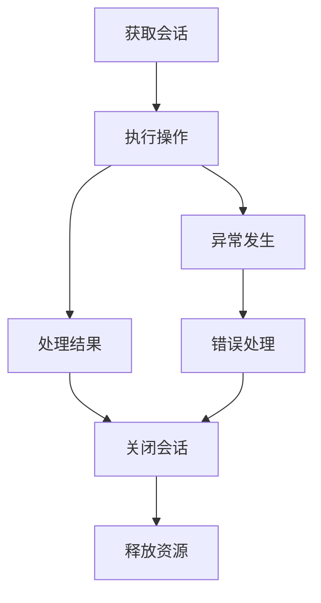

# Neo4j 会话管理指南

## 概述

本文档提供了在 GraphRAG 系统中正确管理 Neo4j 异步会话的完整指南，包括最佳实践、常见错误和故障排查方法。

## 目录

1. [会话管理基础](#1-会话管理基础)
2. [正确的会话管理模式](#2-正确的会话管理模式)
3. [常见错误和解决方案](#3-常见错误和解决方案)
4. [最佳实践](#4-最佳实践)
5. [监控和调试](#5-监控和调试)
6. [故障排查](#6-故障排查)

## 1. 会话管理基础

### 1.1 Neo4j 异步会话概述

Neo4j Python 驱动程序提供了 `AsyncSession` 对象来处理异步数据库操作。正确管理这些会话对于避免资源泄漏至关重要。

### 1.2 会话生命周期



### 1.3 资源管理原则

- **获取即释放**: 每个获取的会话都必须被显式关闭
- **异常安全**: 即使发生异常，会话也必须被正确关闭
- **及时释放**: 不要长时间持有会话对象

## 2. 正确的会话管理模式

### 2.1 标准模式

```python
async def database_operation(self):
    """标准的数据库操作模式"""
    session = await self.connection_manager.get_session()
    try:
        # 执行数据库操作
        result = await session.run(query, parameters)
        
        # 处理结果
        records = []
        async for record in result:
            records.append(record.data())
        
        return records
    except Exception as e:
        # 错误处理
        logger.error(f"数据库操作失败: {str(e)}")
        raise
    finally:
        # 确保会话关闭
        await session.close()
```

### 2.2 事务处理模式

```python
async def transaction_operation(self):
    """事务处理模式"""
    session = await self.connection_manager.get_session()
    try:
        async with session.begin_transaction() as tx:
            # 执行多个相关操作
            result1 = await tx.run(query1, parameters1)
            result2 = await tx.run(query2, parameters2)
            
            # 处理结果
            data1 = await result1.single()
            data2 = await result2.single()
            
            # 事务会自动提交
            return {"data1": data1, "data2": data2}
    except Exception as e:
        # 事务会自动回滚
        logger.error(f"事务操作失败: {str(e)}")
        raise
    finally:
        await session.close()
```

### 2.3 批量操作模式

```python
async def batch_operation(self, items: List[Dict]):
    """批量操作模式"""
    session = await self.connection_manager.get_session()
    try:
        results = []
        for item in items:
            result = await session.run(query, item)
            summary = await result.consume()
            results.append(summary.counters)
        
        return results
    except Exception as e:
        logger.error(f"批量操作失败: {str(e)}")
        raise
    finally:
        await session.close()
```

## 3. 常见错误和解决方案

### 3.1 错误模式 1: 使用 async with

❌ **错误代码**:
```python
# 这是错误的！AsyncSession 不是异步上下文管理器
async with self.connection_manager.get_session() as session:
    result = await session.run(query)
```

✅ **正确代码**:
```python
session = await self.connection_manager.get_session()
try:
    result = await session.run(query)
    return result
finally:
    await session.close()
```

### 3.2 错误模式 2: 忘记关闭会话

❌ **错误代码**:
```python
async def bad_operation(self):
    session = await self.connection_manager.get_session()
    result = await session.run(query)
    return result  # 会话未关闭！
```

✅ **正确代码**:
```python
async def good_operation(self):
    session = await self.connection_manager.get_session()
    try:
        result = await session.run(query)
        return result
    finally:
        await session.close()
```

### 3.3 错误模式 3: 条件性关闭会话

❌ **错误代码**:
```python
async def conditional_close(self):
    session = await self.connection_manager.get_session()
    try:
        result = await session.run(query)
        await session.close()  # 只在成功时关闭
        return result
    except Exception as e:
        # 异常时会话未关闭！
        raise
```

✅ **正确代码**:
```python
async def proper_close(self):
    session = await self.connection_manager.get_session()
    try:
        result = await session.run(query)
        return result
    except Exception as e:
        logger.error(f"操作失败: {str(e)}")
        raise
    finally:
        await session.close()  # 无论如何都会关闭
```

## 4. 最佳实践

### 4.1 代码模板

创建一个标准的代码模板用于所有数据库操作：

```python
async def template_operation(self, parameters: Dict[str, Any]) -> Any:
    """
    数据库操作模板
    
    Args:
        parameters: 操作参数
        
    Returns:
        操作结果
        
    Raises:
        GraphQueryError: 数据库操作失败
    """
    session = await self.connection_manager.get_session()
    try:
        # 1. 准备查询
        query = "MATCH (n) WHERE n.id = $id RETURN n"
        
        # 2. 执行查询
        result = await session.run(query, parameters)
        
        # 3. 处理结果
        record = await result.single()
        if not record:
            return None
            
        # 4. 转换数据
        return self._convert_record(record)
        
    except Exception as e:
        # 5. 错误处理
        logger.error(f"数据库操作失败: {str(e)}")
        raise GraphQueryError(f"操作失败: {str(e)}")
    finally:
        # 6. 确保资源释放
        await session.close()
```

### 4.2 错误处理策略

```python
async def robust_operation(self):
    """健壮的错误处理"""
    session = None
    try:
        session = await self.connection_manager.get_session()
        
        # 数据库操作
        result = await session.run(query, parameters)
        return await result.single()
        
    except Neo4jError as e:
        # Neo4j 特定错误
        logger.error(f"Neo4j 错误: {str(e)}")
        raise GraphQueryError(f"数据库查询失败: {str(e)}")
    except Exception as e:
        # 其他错误
        logger.error(f"未知错误: {str(e)}")
        raise
    finally:
        # 安全关闭会话
        if session:
            try:
                await session.close()
            except Exception as close_error:
                logger.warning(f"关闭会话时出错: {str(close_error)}")
```

### 4.3 性能优化

```python
async def optimized_operation(self, items: List[Dict]):
    """性能优化的批量操作"""
    session = await self.connection_manager.get_session()
    try:
        # 使用单个查询处理多个项目
        query = """
        UNWIND $items AS item
        MERGE (n:Node {id: item.id})
        SET n += item.properties
        RETURN n.id AS id
        """
        
        result = await session.run(query, {"items": items})
        
        # 收集所有结果
        ids = []
        async for record in result:
            ids.append(record["id"])
            
        return ids
    finally:
        await session.close()
```

## 5. 监控和调试

### 5.1 启用资源警告

在应用启动时启用资源警告监控：

```python
import warnings
import tracemalloc

# 在 main.py 或应用入口点添加
def setup_resource_monitoring():
    """设置资源监控"""
    # 启用内存跟踪
    tracemalloc.start()
    
    # 启用资源警告
    warnings.filterwarnings("always", category=ResourceWarning)
    
    # 设置警告处理器
    def warning_handler(message, category, filename, lineno, file=None, line=None):
        if category == ResourceWarning:
            logger.warning(f"资源警告: {message} ({filename}:{lineno})")
    
    warnings.showwarning = warning_handler
```

### 5.2 会话计数器

实现会话计数器来监控活跃会话：

```python
class SessionMonitor:
    """会话监控器"""
    
    def __init__(self):
        self._active_sessions = 0
        self._total_sessions = 0
        self._lock = asyncio.Lock()
    
    async def session_created(self):
        """记录会话创建"""
        async with self._lock:
            self._active_sessions += 1
            self._total_sessions += 1
            logger.debug(f"会话创建，当前活跃: {self._active_sessions}")
    
    async def session_closed(self):
        """记录会话关闭"""
        async with self._lock:
            self._active_sessions -= 1
            logger.debug(f"会话关闭，当前活跃: {self._active_sessions}")
    
    def get_stats(self) -> Dict[str, int]:
        """获取统计信息"""
        return {
            "active_sessions": self._active_sessions,
            "total_sessions": self._total_sessions
        }
```

### 5.3 调试工具

```python
async def debug_session_operation(self):
    """带调试信息的会话操作"""
    session_id = str(uuid4())
    logger.debug(f"[{session_id}] 获取会话")
    
    session = await self.connection_manager.get_session()
    try:
        logger.debug(f"[{session_id}] 执行查询")
        result = await session.run(query, parameters)
        
        logger.debug(f"[{session_id}] 处理结果")
        data = await result.single()
        
        logger.debug(f"[{session_id}] 操作完成")
        return data
    except Exception as e:
        logger.error(f"[{session_id}] 操作失败: {str(e)}")
        raise
    finally:
        logger.debug(f"[{session_id}] 关闭会话")
        await session.close()
```

## 6. 故障排查

### 6.1 常见问题诊断

#### ResourceWarning: Unclosed AsyncSession

**症状**: 应用日志中出现大量 `ResourceWarning: Unclosed AsyncSession` 警告

**原因**: 
- 会话未被正确关闭
- 使用了错误的 `async with` 语法
- 异常处理中遗漏了会话关闭

**解决方案**:
1. 检查所有 `session = await ... get_session()` 调用
2. 确保每个调用都有对应的 `finally` 块
3. 在 `finally` 块中添加 `await session.close()`

#### 内存泄漏

**症状**: 应用内存使用持续增长

**诊断步骤**:
```python
# 检查活跃会话数量
stats = session_monitor.get_stats()
logger.info(f"活跃会话: {stats['active_sessions']}")

# 检查连接池状态
pool_stats = await connection_manager.get_pool_stats()
logger.info(f"连接池状态: {pool_stats}")
```

#### 连接超时

**症状**: 数据库操作超时

**解决方案**:
```python
# 设置合理的超时时间
session = await self.connection_manager.get_session()
try:
    # 设置查询超时
    result = await session.run(query, parameters, timeout=30)
    return await result.single()
finally:
    await session.close()
```

### 6.2 检查清单

在代码审查时使用以下检查清单：

- [ ] 所有 `session = await ... get_session()` 调用都有对应的 `finally` 块
- [ ] `finally` 块中包含 `await session.close()` 调用
- [ ] 没有使用 `async with` 语法处理 `AsyncSession` 对象
- [ ] 异常处理不会阻止会话关闭
- [ ] 长时间运行的操作设置了合理的超时时间
- [ ] 批量操作使用了高效的查询模式
- [ ] 添加了适当的日志记录和错误处理

### 6.3 自动化检测脚本

创建脚本来自动检测会话管理问题：

```python
#!/usr/bin/env python3
"""
Neo4j 会话管理检测脚本
"""

import re
import sys
from pathlib import Path

def check_session_management(file_path: Path) -> List[str]:
    """检查文件中的会话管理问题"""
    issues = []
    
    with open(file_path, 'r', encoding='utf-8') as f:
        content = f.read()
        lines = content.split('\n')
    
    # 查找 session = await ... get_session() 调用
    session_pattern = r'session = await.*get_session\(\)'
    
    for i, line in enumerate(lines, 1):
        if re.search(session_pattern, line):
            # 检查后续行是否有 finally 块
            has_finally = False
            for j in range(i, min(i + 50, len(lines))):
                if 'finally:' in lines[j]:
                    has_finally = True
                    break
                if lines[j].strip().startswith('async def ') or lines[j].strip().startswith('def '):
                    break
            
            if not has_finally:
                issues.append(f"行 {i}: 缺少 finally 块")
    
    return issues

if __name__ == "__main__":
    # 检查指定文件或目录
    target = Path(sys.argv[1]) if len(sys.argv) > 1 else Path("app/services")
    
    if target.is_file():
        files = [target]
    else:
        files = list(target.glob("**/*.py"))
    
    total_issues = 0
    for file_path in files:
        issues = check_session_management(file_path)
        if issues:
            print(f"\n{file_path}:")
            for issue in issues:
                print(f"  - {issue}")
            total_issues += len(issues)
    
    if total_issues == 0:
        print("✅ 未发现会话管理问题")
    else:
        print(f"\n❌ 发现 {total_issues} 个会话管理问题")
        sys.exit(1)
```

## 总结

正确的 Neo4j 会话管理是确保 GraphRAG 系统稳定运行的关键。遵循本指南中的最佳实践，可以避免资源泄漏、提高系统性能，并确保数据库操作的可靠性。

记住核心原则：
1. **每个获取的会话都必须被关闭**
2. **使用 try-finally 模式确保异常安全**
3. **避免使用 async with 语法处理 AsyncSession**
4. **及时释放资源，不要长时间持有会话**