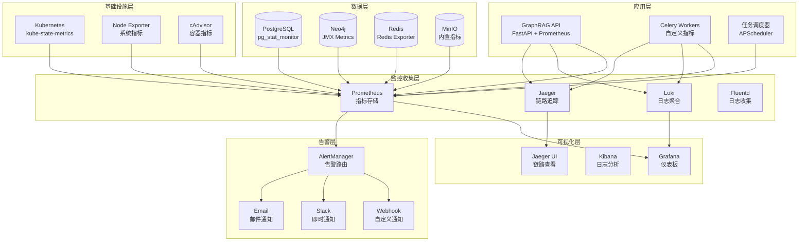

# GraphRAG 监控与可观测性指南

## 概述

本文档提供GraphRAG知识库系统的全面监控和可观测性解决方案，包括指标收集、日志聚合、链路追踪、告警配置和可视化仪表板。

## 目录

1. [监控架构概览](#1-监控架构概览)
2. [指标收集与监控](#2-指标收集与监控)
3. [日志管理](#3-日志管理)
4. [链路追踪](#4-链路追踪)
5. [告警配置](#5-告警配置)
6. [可视化仪表板](#6-可视化仪表板)
7. [性能监控](#7-性能监控)
8. [健康检查](#8-健康检查)
9. [故障排查](#9-故障排查)
10. [运维自动化](#10-运维自动化)

## 1. 监控架构概览

### 1.1 监控架构图



### 1.2 监控指标分类

#### 1.2.1 业务指标
- 文档处理数量和速度
- 知识抽取成功率
- 查询响应时间和准确率
- 用户活跃度和使用模式

#### 1.2.2 应用指标
- API请求量、响应时间、错误率
- 任务队列长度和处理时间
- 缓存命中率
- 数据库连接池状态

#### 1.2.3 基础设施指标
- CPU、内存、磁盘、网络使用率
- 容器资源消耗
- Kubernetes集群状态
- 存储系统性能

#### 1.2.4 安全指标
- 认证失败次数
- 异常访问模式
- 安全事件统计
- 权限变更记录

## 2. 指标收集与监控

### 2.1 Prometheus配置

```yaml
# monitoring/prometheus/prometheus.yml
global:
  scrape_interval: 15s
  evaluation_interval: 15s
  external_labels:
    cluster: 'graphrag-prod'
    region: 'us-west-2'

rule_files:
  - "rules/*.yml"

alerting:
  alertmanagers:
    - static_configs:
        - targets:
          - alertmanager:9093

scrape_configs:
  # GraphRAG API服务
  - job_name: 'graphrag-api'
    static_configs:
      - targets: ['graphrag-api:8000']
    metrics_path: '/metrics'
    scrape_interval: 10s
    scrape_timeout: 5s

  # Celery Workers
  - job_name: 'graphrag-workers'
    static_configs:
      - targets: ['graphrag-worker-1:9540', 'graphrag-worker-2:9540']
    metrics_path: '/metrics'
    scrape_interval: 15s

  # PostgreSQL
  - job_name: 'postgresql'
    static_configs:
      - targets: ['postgres-exporter:9187']
    scrape_interval: 30s

  # Neo4j
  - job_name: 'neo4j'
    static_configs:
      - targets: ['neo4j:2004']
    metrics_path: '/metrics'
    scrape_interval: 30s

  # Redis
  - job_name: 'redis'
    static_configs:
      - targets: ['redis-exporter:9121']
    scrape_interval: 30s

  # MinIO
  - job_name: 'minio'
    static_configs:
      - targets: ['minio:9000']
    metrics_path: '/minio/v2/metrics/cluster'
    scrape_interval: 30s

  # Kubernetes组件
  - job_name: 'kubernetes-apiservers'
    kubernetes_sd_configs:
    - role: endpoints
    scheme: https
    tls_config:
      ca_file: /var/run/secrets/kubernetes.io/serviceaccount/ca.crt
    bearer_token_file: /var/run/secrets/kubernetes.io/serviceaccount/token
    relabel_configs:
    - source_labels: [__meta_kubernetes_namespace, __meta_kubernetes_service_name, __meta_kubernetes_endpoint_port_name]
      action: keep
      regex: default;kubernetes;https

  # Node Exporter
  - job_name: 'node-exporter'
    kubernetes_sd_configs:
    - role: endpoints
    relabel_configs:
    - source_labels: [__meta_kubernetes_endpoints_name]
      action: keep
      regex: node-exporter

  # cAdvisor
  - job_name: 'cadvisor'
    kubernetes_sd_configs:
    - role: node
    relabel_configs:
    - action: labelmap
      regex: __meta_kubernetes_node_label_(.+)
    - target_label: __address__
      replacement: kubernetes.default.svc:443
    - source_labels: [__meta_kubernetes_node_name]
      regex: (.+)
      target_label: __metrics_path__
      replacement: /api/v1/nodes/${1}/proxy/metrics/cadvisor

  # kube-state-metrics
  - job_name: 'kube-state-metrics'
    static_configs:
      - targets: ['kube-state-metrics:8080']
```

### 2.2 应用指标收集

```python
# src/core/monitoring/metrics.py
"""
应用指标收集模块
提供业务指标、性能指标的收集和暴露功能
"""

from prometheus_client import Counter, Histogram, Gauge, Summary, CollectorRegistry, generate_latest
import time
import psutil
import logging
from typing import Dict, Any, Optional
from functools import wraps
import asyncio
from datetime import datetime

logger = logging.getLogger(__name__)

class MetricsCollector:
    """指标收集器"""
    
    def __init__(self):
        self.registry = CollectorRegistry()
        
        # 业务指标
        self.document_processed_total = Counter(
            'graphrag_documents_processed_total',
            'Total number of documents processed',
            ['status', 'document_type'],
            registry=self.registry
        )
        
        self.knowledge_extraction_duration = Histogram(
            'graphrag_knowledge_extraction_duration_seconds',
            'Time spent on knowledge extraction',
            ['extraction_type'],
            buckets=[0.1, 0.5, 1.0, 2.0, 5.0, 10.0, 30.0, 60.0, 120.0],
            registry=self.registry
        )
        
        self.query_requests_total = Counter(
            'graphrag_query_requests_total',
            'Total number of query requests',
            ['query_type', 'status'],
            registry=self.registry
        )
        
        self.query_duration = Histogram(
            'graphrag_query_duration_seconds',
            'Query execution time',
            ['query_type'],
            buckets=[0.01, 0.05, 0.1, 0.25, 0.5, 1.0, 2.5, 5.0, 10.0],
            registry=self.registry
        )
        
        # API指标
        self.http_requests_total = Counter(
            'graphrag_http_requests_total',
            'Total HTTP requests',
            ['method', 'endpoint', 'status_code'],
            registry=self.registry
        )
        
        self.http_request_duration = Histogram(
            'graphrag_http_request_duration_seconds',
            'HTTP request duration',
            ['method', 'endpoint'],
            buckets=[0.005, 0.01, 0.025, 0.05, 0.075, 0.1, 0.25, 0.5, 0.75, 1.0, 2.5, 5.0, 7.5, 10.0],
            registry=self.registry
        )
        
        # 系统指标
        self.active_connections = Gauge(
            'graphrag_active_connections',
            'Number of active database connections',
            ['database'],
            registry=self.registry
        )
        
        self.cache_operations_total = Counter(
            'graphrag_cache_operations_total',
            'Total cache operations',
            ['operation', 'cache_type', 'status'],
            registry=self.registry
        )
        
        self.cache_hit_ratio = Gauge(
            'graphrag_cache_hit_ratio',
            'Cache hit ratio',
            ['cache_type'],
            registry=self.registry
        )
        
        # 任务队列指标
        self.task_queue_length = Gauge(
            'graphrag_task_queue_length',
            'Number of tasks in queue',
            ['queue_name'],
            registry=self.registry
        )
        
        self.task_processing_duration = Histogram(
            'graphrag_task_processing_duration_seconds',
            'Task processing time',
            ['task_type'],
            buckets=[1.0, 5.0, 10.0, 30.0, 60.0, 300.0, 600.0, 1800.0, 3600.0],
            registry=self.registry
        )
        
        # 错误指标
        self.errors_total = Counter(
            'graphrag_errors_total',
            'Total number of errors',
            ['error_type', 'component'],
            registry=self.registry
        )
        
        # 资源使用指标
        self.memory_usage_bytes = Gauge(
            'graphrag_memory_usage_bytes',
            'Memory usage in bytes',
            ['component'],
            registry=self.registry
        )
        
        self.cpu_usage_percent = Gauge(
            'graphrag_cpu_usage_percent',
            'CPU usage percentage',
            ['component'],
            registry=self.registry
        )
    
    def record_document_processed(self, status: str, document_type: str):
        """记录文档处理"""
        self.document_processed_total.labels(
            status=status, 
            document_type=document_type
        ).inc()
    
    def record_knowledge_extraction(self, extraction_type: str, duration: float):
        """记录知识抽取"""
        self.knowledge_extraction_duration.labels(
            extraction_type=extraction_type
        ).observe(duration)
    
    def record_query_request(self, query_type: str, status: str, duration: float):
        """记录查询请求"""
        self.query_requests_total.labels(
            query_type=query_type, 
            status=status
        ).inc()
        
        self.query_duration.labels(
            query_type=query_type
        ).observe(duration)
    
    def record_http_request(self, method: str, endpoint: str, 
                          status_code: int, duration: float):
        """记录HTTP请求"""
        self.http_requests_total.labels(
            method=method,
            endpoint=endpoint,
            status_code=str(status_code)
        ).inc()
        
        self.http_request_duration.labels(
            method=method,
            endpoint=endpoint
        ).observe(duration)
    
    def update_active_connections(self, database: str, count: int):
        """更新活跃连接数"""
        self.active_connections.labels(database=database).set(count)
    
    def record_cache_operation(self, operation: str, cache_type: str, status: str):
        """记录缓存操作"""
        self.cache_operations_total.labels(
            operation=operation,
            cache_type=cache_type,
            status=status
        ).inc()
    
    def update_cache_hit_ratio(self, cache_type: str, ratio: float):
        """更新缓存命中率"""
        self.cache_hit_ratio.labels(cache_type=cache_type).set(ratio)
    
    def update_task_queue_length(self, queue_name: str, length: int):
        """更新任务队列长度"""
        self.task_queue_length.labels(queue_name=queue_name).set(length)
    
    def record_task_processing(self, task_type: str, duration: float):
        """记录任务处理时间"""
        self.task_processing_duration.labels(task_type=task_type).observe(duration)
    
    def record_error(self, error_type: str, component: str):
        """记录错误"""
        self.errors_total.labels(
            error_type=error_type,
            component=component
        ).inc()
    
    def update_resource_usage(self):
        """更新资源使用情况"""
        # CPU使用率
        cpu_percent = psutil.cpu_percent(interval=1)
        self.cpu_usage_percent.labels(component='system').set(cpu_percent)
        
        # 内存使用
        memory = psutil.virtual_memory()
        self.memory_usage_bytes.labels(component='system').set(memory.used)
        
        # 进程级别的资源使用
        process = psutil.Process()
        process_memory = process.memory_info()
        self.memory_usage_bytes.labels(component='process').set(process_memory.rss)
        
        process_cpu = process.cpu_percent()
        self.cpu_usage_percent.labels(component='process').set(process_cpu)
    
    def get_metrics(self) -> str:
        """获取所有指标"""
        # 更新资源使用情况
        self.update_resource_usage()
        
        return generate_latest(self.registry).decode('utf-8')

# 全局指标收集器实例
metrics_collector = MetricsCollector()

def monitor_execution_time(metric_name: str, labels: Optional[Dict[str, str]] = None):
    """监控函数执行时间的装饰器"""
    def decorator(func):
        @wraps(func)
        async def async_wrapper(*args, **kwargs):
            start_time = time.time()
            try:
                result = await func(*args, **kwargs)
                status = 'success'
                return result
            except Exception as e:
                status = 'error'
                logger.error(f"Function {func.__name__} failed: {e}")
                raise
            finally:
                duration = time.time() - start_time
                
                # 根据metric_name记录相应的指标
                if metric_name == 'query':
                    query_type = labels.get('query_type', 'unknown') if labels else 'unknown'
                    metrics_collector.record_query_request(query_type, status, duration)
                elif metric_name == 'knowledge_extraction':
                    extraction_type = labels.get('extraction_type', 'unknown') if labels else 'unknown'
                    metrics_collector.record_knowledge_extraction(extraction_type, duration)
                elif metric_name == 'task':
                    task_type = labels.get('task_type', 'unknown') if labels else 'unknown'
                    metrics_collector.record_task_processing(task_type, duration)
        
        @wraps(func)
        def sync_wrapper(*args, **kwargs):
            start_time = time.time()
            try:
                result = func(*args, **kwargs)
                status = 'success'
                return result
            except Exception as e:
                status = 'error'
                logger.error(f"Function {func.__name__} failed: {e}")
                raise
            finally:
                duration = time.time() - start_time
                
                # 记录指标逻辑同上
                if metric_name == 'query':
                    query_type = labels.get('query_type', 'unknown') if labels else 'unknown'
                    metrics_collector.record_query_request(query_type, status, duration)
                elif metric_name == 'knowledge_extraction':
                    extraction_type = labels.get('extraction_type', 'unknown') if labels else 'unknown'
                    metrics_collector.record_knowledge_extraction(extraction_type, duration)
                elif metric_name == 'task':
                    task_type = labels.get('task_type', 'unknown') if labels else 'unknown'
                    metrics_collector.record_task_processing(task_type, duration)
        
        return async_wrapper if asyncio.iscoroutinefunction(func) else sync_wrapper
    return decorator

def monitor_http_requests():
    """监控HTTP请求的中间件"""
    from fastapi import Request, Response
    from fastapi.middleware.base import BaseHTTPMiddleware
    import time
    
    class HTTPMetricsMiddleware(BaseHTTPMiddleware):
        async def dispatch(self, request: Request, call_next):
            start_time = time.time()
            
            response = await call_next(request)
            
            duration = time.time() - start_time
            
            # 简化endpoint路径（移除动态参数）
            endpoint = self._normalize_endpoint(request.url.path)
            
            metrics_collector.record_http_request(
                method=request.method,
                endpoint=endpoint,
                status_code=response.status_code,
                duration=duration
            )
            
            return response
        
        def _normalize_endpoint(self, path: str) -> str:
            """标准化endpoint路径"""
            # 替换UUID和数字ID为占位符
            import re
            path = re.sub(r'/[0-9a-f]{8}-[0-9a-f]{4}-[0-9a-f]{4}-[0-9a-f]{4}-[0-9a-f]{12}', '/{uuid}', path)
            path = re.sub(r'/\d+', '/{id}', path)
            return path
    
    return HTTPMetricsMiddleware

class CustomMetricsCollector:
    """自定义业务指标收集器"""
    
    def __init__(self):
        self.registry = CollectorRegistry()
        
        # 知识图谱指标
        self.entities_total = Gauge(
            'graphrag_entities_total',
            'Total number of entities in knowledge graph',
            registry=self.registry
        )
        
        self.relations_total = Gauge(
            'graphrag_relations_total',
            'Total number of relations in knowledge graph',
            registry=self.registry
        )
        
        self.documents_total = Gauge(
            'graphrag_documents_total',
            'Total number of documents',
            ['status'],
            registry=self.registry
        )
        
        # 用户活动指标
        self.active_users = Gauge(
            'graphrag_active_users',
            'Number of active users',
            ['time_window'],
            registry=self.registry
        )
        
        self.user_queries_total = Counter(
            'graphrag_user_queries_total',
            'Total user queries',
            ['user_id', 'query_type'],
            registry=self.registry
        )
    
    async def collect_knowledge_graph_stats(self, neo4j_driver):
        """收集知识图谱统计信息"""
        try:
            async with neo4j_driver.session() as session:
                # 统计实体数量
                result = await session.run("MATCH (n) RETURN count(n) as entity_count")
                record = await result.single()
                if record:
                    self.entities_total.set(record['entity_count'])
                
                # 统计关系数量
                result = await session.run("MATCH ()-[r]->() RETURN count(r) as relation_count")
                record = await result.single()
                if record:
                    self.relations_total.set(record['relation_count'])
                    
        except Exception as e:
            logger.error(f"Failed to collect knowledge graph stats: {e}")
            metrics_collector.record_error('knowledge_graph_stats', 'neo4j')
    
    async def collect_document_stats(self, db_session):
        """收集文档统计信息"""
        try:
            from sqlalchemy import func
            from src.models.document import Document
            
            # 按状态统计文档数量
            result = db_session.query(
                Document.status,
                func.count(Document.id)
            ).group_by(Document.status).all()
            
            for status, count in result:
                self.documents_total.labels(status=status).set(count)
                
        except Exception as e:
            logger.error(f"Failed to collect document stats: {e}")
            metrics_collector.record_error('document_stats', 'postgresql')
    
    def get_metrics(self) -> str:
        """获取自定义指标"""
        return generate_latest(self.registry).decode('utf-8')

# 全局自定义指标收集器
custom_metrics_collector = CustomMetricsCollector()
```

### 2.3 告警规则配置

```yaml
# monitoring/prometheus/rules/graphrag-alerts.yml
groups:
  - name: graphrag.rules
    rules:
      # API可用性告警
      - alert: GraphRAGAPIDown
        expr: up{job="graphrag-api"} == 0
        for: 1m
        labels:
          severity: critical
          service: graphrag-api
        annotations:
          summary: "GraphRAG API服务不可用"
          description: "GraphRAG API服务已经下线超过1分钟"
      
      # 高错误率告警
      - alert: GraphRAGHighErrorRate
        expr: |
          (
            rate(graphrag_http_requests_total{status_code=~"5.."}[5m]) /
            rate(graphrag_http_requests_total[5m])
          ) > 0.05
        for: 5m
        labels:
          severity: warning
          service: graphrag-api
        annotations:
          summary: "GraphRAG API错误率过高"
          description: "GraphRAG API在过去5分钟内的错误率超过5%: {{ $value | humanizePercentage }}"
      
      # 响应时间告警
      - alert: GraphRAGHighLatency
        expr: |
          histogram_quantile(0.95, 
            rate(graphrag_http_request_duration_seconds_bucket[5m])
          ) > 2.0
        for: 5m
        labels:
          severity: warning
          service: graphrag-api
        annotations:
          summary: "GraphRAG API响应时间过长"
          description: "GraphRAG API的95%分位响应时间超过2秒: {{ $value }}s"
      
      # 数据库连接告警
      - alert: GraphRAGDatabaseConnectionHigh
        expr: graphrag_active_connections > 80
        for: 2m
        labels:
          severity: warning
          service: database
        annotations:
          summary: "数据库连接数过高"
          description: "数据库活跃连接数超过80: {{ $value }}"
      
      # 任务队列积压告警
      - alert: GraphRAGTaskQueueBacklog
        expr: graphrag_task_queue_length > 100
        for: 5m
        labels:
          severity: warning
          service: task-queue
        annotations:
          summary: "任务队列积压严重"
          description: "任务队列长度超过100: {{ $value }}"
      
      # 内存使用告警
      - alert: GraphRAGHighMemoryUsage
        expr: |
          (
            graphrag_memory_usage_bytes{component="process"} /
            (1024 * 1024 * 1024)
          ) > 4.0
        for: 5m
        labels:
          severity: warning
          service: graphrag-api
        annotations:
          summary: "内存使用率过高"
          description: "GraphRAG进程内存使用超过4GB: {{ $value | humanize }}B"
      
      # CPU使用告警
      - alert: GraphRAGHighCPUUsage
        expr: graphrag_cpu_usage_percent{component="process"} > 80
        for: 10m
        labels:
          severity: warning
          service: graphrag-api
        annotations:
          summary: "CPU使用率过高"
          description: "GraphRAG进程CPU使用率超过80%: {{ $value }}%"
      
      # 磁盘空间告警
      - alert: GraphRAGDiskSpaceLow
        expr: |
          (
            node_filesystem_avail_bytes{mountpoint="/"} /
            node_filesystem_size_bytes{mountpoint="/"}
          ) < 0.1
        for: 5m
        labels:
          severity: critical
          service: system
        annotations:
          summary: "磁盘空间不足"
          description: "根分区可用空间少于10%: {{ $value | humanizePercentage }}"
      
      # 知识抽取失败率告警
      - alert: GraphRAGKnowledgeExtractionFailureRate
        expr: |
          (
            rate(graphrag_documents_processed_total{status="failed"}[10m]) /
            rate(graphrag_documents_processed_total[10m])
          ) > 0.1
        for: 5m
        labels:
          severity: warning
          service: knowledge-extraction
        annotations:
          summary: "知识抽取失败率过高"
          description: "知识抽取失败率超过10%: {{ $value | humanizePercentage }}"

  - name: infrastructure.rules
    rules:
      # PostgreSQL告警
      - alert: PostgreSQLDown
        expr: up{job="postgresql"} == 0
        for: 1m
        labels:
          severity: critical
          service: postgresql
        annotations:
          summary: "PostgreSQL数据库不可用"
          description: "PostgreSQL数据库已经下线超过1分钟"
      
      # Neo4j告警
      - alert: Neo4jDown
        expr: up{job="neo4j"} == 0
        for: 1m
        labels:
          severity: critical
          service: neo4j
        annotations:
          summary: "Neo4j数据库不可用"
          description: "Neo4j数据库已经下线超过1分钟"
      
      # Redis告警
      - alert: RedisDown
        expr: up{job="redis"} == 0
        for: 1m
        labels:
          severity: critical
          service: redis
        annotations:
          summary: "Redis缓存不可用"
          description: "Redis缓存已经下线超过1分钟"
      
      # Kubernetes节点告警
      - alert: KubernetesNodeNotReady
        expr: kube_node_status_condition{condition="Ready",status="true"} == 0
        for: 5m
        labels:
          severity: warning
          service: kubernetes
        annotations:
          summary: "Kubernetes节点未就绪"
          description: "节点 {{ $labels.node }} 未就绪超过5分钟"
      
      # Pod重启告警
      - alert: KubernetesPodCrashLooping
        expr: rate(kube_pod_container_status_restarts_total[15m]) > 0
        for: 5m
        labels:
          severity: warning
          service: kubernetes
        annotations:
          summary: "Pod频繁重启"
          description: "Pod {{ $labels.namespace }}/{{ $labels.pod }} 在过去15分钟内重启了 {{ $value }} 次"
```

## 3. 日志管理

### 3.1 日志收集配置

```yaml
# monitoring/logging/fluentd-config.yaml
apiVersion: v1
kind: ConfigMap
metadata:
  name: fluentd-config
  namespace: graphrag
data:
  fluent.conf: |
    <source>
      @type tail
      @id graphrag_api_logs
      path /var/log/containers/graphrag-api-*.log
      pos_file /var/log/fluentd-containers-graphrag-api.log.pos
      tag kubernetes.graphrag.api
      format json
      time_format %Y-%m-%dT%H:%M:%S.%NZ
    </source>
    
    <source>
      @type tail
      @id graphrag_worker_logs
      path /var/log/containers/graphrag-worker-*.log
      pos_file /var/log/fluentd-containers-graphrag-worker.log.pos
      tag kubernetes.graphrag.worker
      format json
      time_format %Y-%m-%dT%H:%M:%S.%NZ
    </source>
    
    <filter kubernetes.**>
      @type kubernetes_metadata
      @id filter_kube_metadata
      kubernetes_url "#{ENV['FLUENT_FILTER_KUBERNETES_URL'] || 'https://' + ENV['KUBERNETES_SERVICE_HOST'] + ':' + ENV['KUBERNETES_SERVICE_PORT'] + '/api'}"
      verify_ssl "#{ENV['KUBERNETES_VERIFY_SSL'] || true}"
      ca_file "#{ENV['KUBERNETES_CA_FILE']}"
      skip_labels false
      skip_container_metadata false
      skip_master_url false
      skip_namespace_metadata false
    </filter>
    
    <filter kubernetes.graphrag.**>
      @type parser
      key_name log
      reserve_data true
      remove_key_name_field true
      <parse>
        @type json
        time_key timestamp
        time_format %Y-%m-%dT%H:%M:%S.%fZ
      </parse>
    </filter>
    
    <match kubernetes.graphrag.**>
      @type loki
      @id out_loki
      url "#{ENV['LOKI_URL'] || 'http://loki:3100'}"
      username "#{ENV['LOKI_USERNAME'] || ''}"
      password "#{ENV['LOKI_PASSWORD'] || ''}"
      extra_labels {"cluster":"graphrag-prod"}
      <label>
        app
        container
        namespace
        pod
        host
      </label>
      <buffer>
        @type file
        path /var/log/fluentd-buffers/loki.buffer
        flush_thread_count 2
        flush_interval 5s
        chunk_limit_size 2M
        queue_limit_length 32
        retry_max_interval 30
        retry_forever true
      </buffer>
    </match>
    
    <match **>
      @type stdout
    </match>

---
apiVersion: apps/v1
kind: DaemonSet
metadata:
  name: fluentd
  namespace: graphrag
spec:
  selector:
    matchLabels:
      name: fluentd
  template:
    metadata:
      labels:
        name: fluentd
    spec:
      serviceAccount: fluentd
      containers:
      - name: fluentd
        image: fluent/fluentd-kubernetes-daemonset:v1.14-debian-loki-1
        env:
        - name: LOKI_URL
          value: "http://loki:3100"
        - name: FLUENT_CONF
          value: "fluent.conf"
        resources:
          limits:
            memory: 512Mi
            cpu: 200m
          requests:
            memory: 256Mi
            cpu: 100m
        volumeMounts:
        - name: fluentd-config
          mountPath: /fluentd/etc
        - name: varlog
          mountPath: /var/log
        - name: varlibdockercontainers
          mountPath: /var/lib/docker/containers
          readOnly: true
      volumes:
      - name: fluentd-config
        configMap:
          name: fluentd-config
      - name: varlog
        hostPath:
          path: /var/log
      - name: varlibdockercontainers
        hostPath:
          path: /var/lib/docker/containers
```

### 3.2 结构化日志配置

```python
# src/core/logging/structured_logger.py
"""
结构化日志配置
提供统一的日志格式和上下文信息
"""

import logging
import json
import sys
from datetime import datetime
from typing import Dict, Any, Optional
import traceback
from contextvars import ContextVar
import uuid

# 请求上下文变量
request_id_var: ContextVar[str] = ContextVar('request_id', default='')
user_id_var: ContextVar[str] = ContextVar('user_id', default='')
session_id_var: ContextVar[str] = ContextVar('session_id', default='')

class StructuredFormatter(logging.Formatter):
    """结构化日志格式化器"""
    
    def format(self, record: logging.LogRecord) -> str:
        """格式化日志记录"""
        
        # 基础日志信息
        log_entry = {
            "timestamp": datetime.utcnow().isoformat() + "Z",
            "level": record.levelname,
            "logger": record.name,
            "message": record.getMessage(),
            "module": record.module,
            "function": record.funcName,
            "line": record.lineno,
            "thread": record.thread,
            "process": record.process,
        }
        
        # 添加请求上下文
        request_id = request_id_var.get()
        if request_id:
            log_entry["request_id"] = request_id
        
        user_id = user_id_var.get()
        if user_id:
            log_entry["user_id"] = user_id
        
        session_id = session_id_var.get()
        if session_id:
            log_entry["session_id"] = session_id
        
        # 添加异常信息
        if record.exc_info:
            log_entry["exception"] = {
                "type": record.exc_info[0].__name__,
                "message": str(record.exc_info[1]),
                "traceback": traceback.format_exception(*record.exc_info)
            }
        
        # 添加额外字段
        if hasattr(record, 'extra_fields'):
            log_entry.update(record.extra_fields)
        
        # 添加性能指标
        if hasattr(record, 'duration'):
            log_entry["duration_ms"] = record.duration * 1000
        
        if hasattr(record, 'status_code'):
            log_entry["status_code"] = record.status_code
        
        if hasattr(record, 'endpoint'):
            log_entry["endpoint"] = record.endpoint
        
        if hasattr(record, 'method'):
            log_entry["method"] = record.method
        
        return json.dumps(log_entry, ensure_ascii=False)

class ContextualLogger:
    """上下文日志记录器"""
    
    def __init__(self, name: str):
        self.logger = logging.getLogger(name)
    
    def _log_with_context(self, level: int, message: str, 
                         extra_fields: Optional[Dict[str, Any]] = None,
                         **kwargs):
        """带上下文的日志记录"""
        extra = {}
        if extra_fields:
            extra['extra_fields'] = extra_fields
        
        # 添加性能相关字段
        for key in ['duration', 'status_code', 'endpoint', 'method']:
            if key in kwargs:
                extra[key] = kwargs[key]
        
        self.logger.log(level, message, extra=extra)
    
    def debug(self, message: str, **kwargs):
        self._log_with_context(logging.DEBUG, message, **kwargs)
    
    def info(self, message: str, **kwargs):
        self._log_with_context(logging.INFO, message, **kwargs)
    
    def warning(self, message: str, **kwargs):
        self._log_with_context(logging.WARNING, message, **kwargs)
    
    def error(self, message: str, **kwargs):
        self._log_with_context(logging.ERROR, message, **kwargs)
    
    def critical(self, message: str, **kwargs):
        self._log_with_context(logging.CRITICAL, message, **kwargs)
    
    def log_api_request(self, method: str, endpoint: str, 
                       status_code: int, duration: float,
                       user_id: Optional[str] = None,
                       extra_fields: Optional[Dict[str, Any]] = None):
        """记录API请求日志"""
        message = f"{method} {endpoint} - {status_code}"
        
        fields = {
            "event_type": "api_request",
            "method": method,
            "endpoint": endpoint,
            "status_code": status_code,
            "duration_ms": duration * 1000,
        }
        
        if user_id:
            fields["user_id"] = user_id
        
        if extra_fields:
            fields.update(extra_fields)
        
        self.info(message, extra_fields=fields)
    
    def log_business_event(self, event_type: str, event_data: Dict[str, Any],
                          message: Optional[str] = None):
        """记录业务事件日志"""
        if not message:
            message = f"Business event: {event_type}"
        
        fields = {
            "event_type": event_type,
            "event_data": event_data,
        }
        
        self.info(message, extra_fields=fields)
    
    def log_error_with_context(self, error: Exception, context: Dict[str, Any],
                              message: Optional[str] = None):
        """记录带上下文的错误日志"""
        if not message:
            message = f"Error occurred: {str(error)}"
        
        fields = {
            "event_type": "error",
            "error_type": type(error).__name__,
            "error_message": str(error),
            "context": context,
        }
        
        self.error(message, extra_fields=fields, exc_info=True)

def setup_logging(log_level: str = "INFO", 
                 log_format: str = "structured",
                 log_file: Optional[str] = None):
    """设置日志配置"""
    
    # 设置日志级别
    level = getattr(logging, log_level.upper())
    
    # 创建根日志记录器
    root_logger = logging.getLogger()
    root_logger.setLevel(level)
    
    # 清除现有处理器
    for handler in root_logger.handlers[:]:
        root_logger.removeHandler(handler)
    
    # 创建控制台处理器
    console_handler = logging.StreamHandler(sys.stdout)
    console_handler.setLevel(level)
    
    # 设置格式化器
    if log_format == "structured":
        formatter = StructuredFormatter()
    else:
        formatter = logging.Formatter(
            '%(asctime)s - %(name)s - %(levelname)s - %(message)s'
        )
    
    console_handler.setFormatter(formatter)
    root_logger.addHandler(console_handler)
    
    # 文件处理器（如果指定）
    if log_file:
        file_handler = logging.FileHandler(log_file)
        file_handler.setLevel(level)
        file_handler.setFormatter(formatter)
        root_logger.addHandler(file_handler)
    
    # 设置第三方库日志级别
    logging.getLogger("urllib3").setLevel(logging.WARNING)
    logging.getLogger("requests").setLevel(logging.WARNING)
    logging.getLogger("neo4j").setLevel(logging.WARNING)
    logging.getLogger("sqlalchemy").setLevel(logging.WARNING)

def get_logger(name: str) -> ContextualLogger:
    """获取上下文日志记录器"""
    return ContextualLogger(name)

# 日志中间件
class LoggingMiddleware:
    """FastAPI日志中间件"""
    
    def __init__(self, app):
        self.app = app
        self.logger = get_logger("api.middleware")
    
    async def __call__(self, scope, receive, send):
        if scope["type"] != "http":
            await self.app(scope, receive, send)
            return
        
        # 生成请求ID
        request_id = str(uuid.uuid4())
        request_id_var.set(request_id)
        
        # 记录请求开始
        start_time = datetime.utcnow()
        method = scope["method"]
        path = scope["path"]
        
        self.logger.info(
            f"Request started: {method} {path}",
            extra_fields={
                "event_type": "request_start",
                "method": method,
                "path": path,
                "request_id": request_id,
            }
        )
        
        # 包装send函数以捕获响应
        status_code = 500
        
        async def send_wrapper(message):
            nonlocal status_code
            if message["type"] == "http.response.start":
                status_code = message["status"]
            await send(message)
        
        try:
            await self.app(scope, receive, send_wrapper)
        except Exception as e:
            self.logger.log_error_with_context(
                e, 
                {
                    "method": method,
                    "path": path,
                    "request_id": request_id,
                }
            )
            raise
        finally:
            # 记录请求完成
            duration = (datetime.utcnow() - start_time).total_seconds()
            
            self.logger.log_api_request(
                method=method,
                endpoint=path,
                status_code=status_code,
                duration=duration,
                extra_fields={
                    "event_type": "request_end",
                    "request_id": request_id,
                }
            )

# 全局日志记录器实例
logger = get_logger("graphrag")
```

继续编写监控文档的其他部分...

## 4. 链路追踪

### 4.1 Jaeger配置

```yaml
# monitoring/tracing/jaeger-deployment.yaml
apiVersion: apps/v1
kind: Deployment
metadata:
  name: jaeger
  namespace: graphrag
spec:
  replicas: 1
  selector:
    matchLabels:
      app: jaeger
  template:
    metadata:
      labels:
        app: jaeger
    spec:
      containers:
      - name: jaeger
        image: jaegertracing/all-in-one:1.35
        ports:
        - containerPort: 16686
          name: ui
        - containerPort: 14268
          name: collector
        - containerPort: 6831
          name: agent-udp
        - containerPort: 6832
          name: agent-binary
        env:
        - name: COLLECTOR_ZIPKIN_HOST_PORT
          value: ":9411"
        - name: SPAN_STORAGE_TYPE
          value: "elasticsearch"
        - name: ES_SERVER_URLS
          value: "http://elasticsearch:9200"
        - name: ES_USERNAME
          value: "elastic"
        - name: ES_PASSWORD
          valueFrom:
            secretKeyRef:
              name: elasticsearch-credentials
              key: password
        resources:
          limits:
            memory: 1Gi
            cpu: 500m
          requests:
            memory: 512Mi
            cpu: 200m

---
apiVersion: v1
kind: Service
metadata:
  name: jaeger
  namespace: graphrag
spec:
  selector:
    app: jaeger
  ports:
  - name: ui
    port: 16686
    targetPort: 16686
  - name: collector
    port: 14268
    targetPort: 14268
  - name: agent-udp
    port: 6831
    targetPort: 6831
    protocol: UDP
  - name: agent-binary
    port: 6832
    targetPort: 6832
```

### 4.2 应用链路追踪

```python
# src/core/tracing/tracer.py
"""
分布式链路追踪模块
集成OpenTelemetry和Jaeger
"""

from opentelemetry import trace
from opentelemetry.exporter.jaeger.thrift import JaegerExporter
from opentelemetry.sdk.trace import TracerProvider
from opentelemetry.sdk.trace.export import BatchSpanProcessor
from opentelemetry.instrumentation.fastapi import FastAPIInstrumentor
from opentelemetry.instrumentation.sqlalchemy import SQLAlchemyInstrumentor
from opentelemetry.instrumentation.redis import RedisInstrumentor
from opentelemetry.instrumentation.requests import RequestsInstrumentor
from opentelemetry.instrumentation.celery import CeleryInstrumentor
from opentelemetry.sdk.resources import Resource
from opentelemetry.semconv.resource import ResourceAttributes
import os
from typing import Dict, Any, Optional
from functools import wraps
import logging

logger = logging.getLogger(__name__)

class TracingConfig:
    """链路追踪配置"""
    SERVICE_NAME = os.getenv("SERVICE_NAME", "graphrag-api")
    SERVICE_VERSION = os.getenv("SERVICE_VERSION", "1.0.0")
    JAEGER_ENDPOINT = os.getenv("JAEGER_ENDPOINT", "http://jaeger:14268/api/traces")
    ENVIRONMENT = os.getenv("ENVIRONMENT", "development")
    
    # 采样率配置
    TRACE_SAMPLE_RATE = float(os.getenv("TRACE_SAMPLE_RATE", "1.0"))

def setup_tracing():
    """设置链路追踪"""
    
    # 创建资源
    resource = Resource.create({
        ResourceAttributes.SERVICE_NAME: TracingConfig.SERVICE_NAME,
        ResourceAttributes.SERVICE_VERSION: TracingConfig.SERVICE_VERSION,
        ResourceAttributes.DEPLOYMENT_ENVIRONMENT: TracingConfig.ENVIRONMENT,
    })
    
    # 设置TracerProvider
    trace.set_tracer_provider(TracerProvider(resource=resource))
    
    # 创建Jaeger导出器
    jaeger_exporter = JaegerExporter(
        agent_host_name="jaeger",
        agent_port=6831,
        collector_endpoint=TracingConfig.JAEGER_ENDPOINT,
    )
    
    # 添加批量span处理器
    span_processor = BatchSpanProcessor(jaeger_exporter)
    trace.get_tracer_provider().add_span_processor(span_processor)
    
    logger.info(f"Tracing initialized for service: {TracingConfig.SERVICE_NAME}")

def instrument_app(app):
    """为应用添加自动化instrumentation"""
    
    # FastAPI自动化instrumentation
    FastAPIInstrumentor.instrument_app(app)
    
    # SQLAlchemy自动化instrumentation
    SQLAlchemyInstrumentor().instrument()
    
    # Redis自动化instrumentation
    RedisInstrumentor().instrument()
    
    # Requests自动化instrumentation
    RequestsInstrumentor().instrument()
    
    # Celery自动化instrumentation
    CeleryInstrumentor().instrument()
    
    logger.info("Application instrumentation completed")

class CustomTracer:
    """自定义追踪器"""
    
    def __init__(self, name: str):
        self.tracer = trace.get_tracer(name)
    
    def trace_function(self, operation_name: str, 
                      attributes: Optional[Dict[str, Any]] = None):
        """函数追踪装饰器"""
        def decorator(func):
            @wraps(func)
            async def async_wrapper(*args, **kwargs):
                with self.tracer.start_as_current_span(operation_name) as span:
                    # 添加属性
                    if attributes:
                        for key, value in attributes.items():
                            span.set_attribute(key, value)
                    
                    # 添加函数信息
                    span.set_attribute("function.name", func.__name__)
                    span.set_attribute("function.module", func.__module__)
                    
                    try:
                        result = await func(*args, **kwargs)
                        span.set_attribute("function.result", "success")
                        return result
                    except Exception as e:
                        span.set_attribute("function.result", "error")
                        span.set_attribute("error.type", type(e).__name__)
                        span.set_attribute("error.message", str(e))
                        span.record_exception(e)
                        raise
            
            @wraps(func)
            def sync_wrapper(*args, **kwargs):
                with self.tracer.start_as_current_span(operation_name) as span:
                    # 添加属性
                    if attributes:
                        for key, value in attributes.items():
                            span.set_attribute(key, value)
                    
                    # 添加函数信息
                    span.set_attribute("function.name", func.__name__)
                    span.set_attribute("function.module", func.__module__)
                    
                    try:
                        result = func(*args, **kwargs)
                        span.set_attribute("function.result", "success")
                        return result
                    except Exception as e:
                        span.set_attribute("function.result", "error")
                        span.set_attribute("error.type", type(e).__name__)
                        span.set_attribute("error.message", str(e))
                        span.record_exception(e)
                        raise
            
            import asyncio
            return async_wrapper if asyncio.iscoroutinefunction(func) else sync_wrapper
        return decorator
    
    def trace_database_operation(self, operation: str, table: str):
        """数据库操作追踪"""
        def decorator(func):
            @wraps(func)
            async def async_wrapper(*args, **kwargs):
                with self.tracer.start_as_current_span(f"db.{operation}") as span:
                    span.set_attribute("db.operation", operation)
                    span.set_attribute("db.table", table)
                    span.set_attribute("db.system", "postgresql")
                    
                    try:
                        result = await func(*args, **kwargs)
                        span.set_attribute("db.result", "success")
                        return result
                    except Exception as e:
                        span.set_attribute("db.result", "error")
                        span.record_exception(e)
                        raise
            
            @wraps(func)
            def sync_wrapper(*args, **kwargs):
                with self.tracer.start_as_current_span(f"db.{operation}") as span:
                    span.set_attribute("db.operation", operation)
                    span.set_attribute("db.table", table)
                    span.set_attribute("db.system", "postgresql")
                    
                    try:
                        result = func(*args, **kwargs)
                        span.set_attribute("db.result", "success")
                        return result
                    except Exception as e:
                        span.set_attribute("db.result", "error")
                        span.record_exception(e)
                        raise
            
            import asyncio
            return async_wrapper if asyncio.iscoroutinefunction(func) else sync_wrapper
        return decorator
    
    def trace_external_call(self, service: str, operation: str):
        """外部服务调用追踪"""
        def decorator(func):
            @wraps(func)
            async def async_wrapper(*args, **kwargs):
                with self.tracer.start_as_current_span(f"external.{service}.{operation}") as span:
                    span.set_attribute("external.service", service)
                    span.set_attribute("external.operation", operation)
                    
                    try:
                        result = await func(*args, **kwargs)
                        span.set_attribute("external.result", "success")
                        return result
                    except Exception as e:
                        span.set_attribute("external.result", "error")
                        span.record_exception(e)
                        raise
            
            @wraps(func)
            def sync_wrapper(*args, **kwargs):
                with self.tracer.start_as_current_span(f"external.{service}.{operation}") as span:
                    span.set_attribute("external.service", service)
                    span.set_attribute("external.operation", operation)
                    
                    try:
                        result = func(*args, **kwargs)
                        span.set_attribute("external.result", "success")
                        return result
                    except Exception as e:
                        span.set_attribute("external.result", "error")
                        span.record_exception(e)
                        raise
            
            import asyncio
            return async_wrapper if asyncio.iscoroutinefunction(func) else sync_wrapper
        return decorator
    
    def trace_business_process(self, process_name: str, 
                             process_data: Optional[Dict[str, Any]] = None):
        """业务流程追踪"""
        def decorator(func):
            @wraps(func)
            async def async_wrapper(*args, **kwargs):
                with self.tracer.start_as_current_span(f"business.{process_name}") as span:
                    span.set_attribute("business.process", process_name)
                    
                    if process_data:
                        for key, value in process_data.items():
                            span.set_attribute(f"business.{key}", str(value))
                    
                    try:
                        result = await func(*args, **kwargs)
                        span.set_attribute("business.result", "success")
                        return result
                    except Exception as e:
                        span.set_attribute("business.result", "error")
                        span.record_exception(e)
                        raise
            
            @wraps(func)
            def sync_wrapper(*args, **kwargs):
                with self.tracer.start_as_current_span(f"business.{process_name}") as span:
                    span.set_attribute("business.process", process_name)
                    
                    if process_data:
                        for key, value in process_data.items():
                            span.set_attribute(f"business.{key}", str(value))
                    
                    try:
                        result = func(*args, **kwargs)
                        span.set_attribute("business.result", "success")
                        return result
                    except Exception as e:
                        span.set_attribute("business.result", "error")
                        span.record_exception(e)
                        raise
            
            import asyncio
            return async_wrapper if asyncio.iscoroutinefunction(func) else sync_wrapper
        return decorator

# 创建全局追踪器实例
tracer = CustomTracer("graphrag")

# 使用示例装饰器
def trace_knowledge_extraction(extraction_type: str):
    """知识抽取追踪装饰器"""
    return tracer.trace_business_process(
        "knowledge_extraction",
        {"extraction_type": extraction_type}
    )

def trace_query_execution(query_type: str):
    """查询执行追踪装饰器"""
    return tracer.trace_business_process(
        "query_execution",
        {"query_type": query_type}
    )

def trace_document_processing(document_type: str):
    """文档处理追踪装饰器"""
    return tracer.trace_business_process(
        "document_processing",
        {"document_type": document_type}
    )
```

## 5. 告警配置

### 5.1 AlertManager配置

```yaml
# monitoring/alerting/alertmanager.yml
global:
  smtp_smarthost: 'smtp.gmail.com:587'
  smtp_from: 'alerts@graphrag.com'
  smtp_auth_username: 'alerts@graphrag.com'
  smtp_auth_password: 'your-app-password'

route:
  group_by: ['alertname', 'cluster', 'service']
  group_wait: 10s
  group_interval: 10s
  repeat_interval: 1h
  receiver: 'default'
  routes:
  - match:
      severity: critical
    receiver: 'critical-alerts'
    group_wait: 5s
    repeat_interval: 5m
  - match:
      severity: warning
    receiver: 'warning-alerts'
    repeat_interval: 30m
  - match:
      service: database
    receiver: 'database-alerts'
  - match:
      service: kubernetes
    receiver: 'infrastructure-alerts'

receivers:
- name: 'default'
  slack_configs:
  - api_url: 'https://hooks.slack.com/services/YOUR/SLACK/WEBHOOK'
    channel: '#graphrag-alerts'
    title: 'GraphRAG Alert'
    text: '{{ range .Alerts }}{{ .Annotations.summary }}{{ end }}'

- name: 'critical-alerts'
  email_configs:
  - to: 'oncall@graphrag.com'
    subject: '[CRITICAL] GraphRAG Alert'
    body: |
      {{ range .Alerts }}
      Alert: {{ .Annotations.summary }}
      Description: {{ .Annotations.description }}
      Severity: {{ .Labels.severity }}
      Service: {{ .Labels.service }}
      Time: {{ .StartsAt }}
      {{ end }}
  slack_configs:
  - api_url: 'https://hooks.slack.com/services/YOUR/SLACK/WEBHOOK'
    channel: '#graphrag-critical'
    title: '[CRITICAL] GraphRAG Alert'
    text: |
      {{ range .Alerts }}
      🚨 *{{ .Annotations.summary }}*
      
      *Description:* {{ .Annotations.description }}
      *Severity:* {{ .Labels.severity }}
      *Service:* {{ .Labels.service }}
      *Time:* {{ .StartsAt }}
      {{ end }}
    send_resolved: true

- name: 'warning-alerts'
  slack_configs:
  - api_url: 'https://hooks.slack.com/services/YOUR/SLACK/WEBHOOK'
    channel: '#graphrag-warnings'
    title: '[WARNING] GraphRAG Alert'
    text: |
      {{ range .Alerts }}
      ⚠️ *{{ .Annotations.summary }}*
      
      *Description:* {{ .Annotations.description }}
      *Service:* {{ .Labels.service }}
      *Time:* {{ .StartsAt }}
      {{ end }}

- name: 'database-alerts'
  email_configs:
  - to: 'dba@graphrag.com'
    subject: '[DATABASE] GraphRAG Database Alert'
    body: |
      {{ range .Alerts }}
      Database Alert: {{ .Annotations.summary }}
      Description: {{ .Annotations.description }}
      Database: {{ .Labels.database }}
      Time: {{ .StartsAt }}
      {{ end }}

- name: 'infrastructure-alerts'
  email_configs:
  - to: 'devops@graphrag.com'
    subject: '[INFRASTRUCTURE] GraphRAG Infrastructure Alert'
    body: |
      {{ range .Alerts }}
      Infrastructure Alert: {{ .Annotations.summary }}
      Description: {{ .Annotations.description }}
      Component: {{ .Labels.service }}
      Time: {{ .StartsAt }}
      {{ end }}

inhibit_rules:
- source_match:
    severity: 'critical'
  target_match:
    severity: 'warning'
  equal: ['alertname', 'cluster', 'service']
```

### 5.2 自定义告警通知

```python
# src/core/alerting/notification.py
"""
自定义告警通知模块
支持多种通知渠道和告警规则
"""

import asyncio
import aiohttp
import smtplib
from email.mime.text import MIMEText
from email.mime.multipart import MIMEMultipart
from typing import Dict, List, Any, Optional
import json
import logging
from datetime import datetime, timedelta
from dataclasses import dataclass
from enum import Enum
import os

logger = logging.getLogger(__name__)

class AlertSeverity(Enum):
    """告警严重程度"""
    CRITICAL = "critical"
    WARNING = "warning"
    INFO = "info"

class NotificationChannel(Enum):
    """通知渠道"""
    EMAIL = "email"
    SLACK = "slack"
    WEBHOOK = "webhook"
    SMS = "sms"

@dataclass
class Alert:
    """告警信息"""
    name: str
    severity: AlertSeverity
    message: str
    description: str
    service: str
    timestamp: datetime
    labels: Dict[str, str]
    annotations: Dict[str, str]
    resolved: bool = False

@dataclass
class NotificationConfig:
    """通知配置"""
    channel: NotificationChannel
    enabled: bool
    config: Dict[str, Any]

class AlertNotifier:
    """告警通知器"""
    
    def __init__(self):
        self.notification_configs = self._load_notification_configs()
        self.alert_history = []
        self.suppression_rules = self._load_suppression_rules()
    
    def _load_notification_configs(self) -> Dict[str, NotificationConfig]:
        """加载通知配置"""
        return {
            "email": NotificationConfig(
                channel=NotificationChannel.EMAIL,
                enabled=os.getenv("EMAIL_NOTIFICATIONS_ENABLED", "true").lower() == "true",
                config={
                    "smtp_server": os.getenv("SMTP_SERVER", "smtp.gmail.com"),
                    "smtp_port": int(os.getenv("SMTP_PORT", "587")),
                    "username": os.getenv("SMTP_USERNAME", ""),
                    "password": os.getenv("SMTP_PASSWORD", ""),
                    "from_email": os.getenv("FROM_EMAIL", "alerts@graphrag.com"),
                    "to_emails": os.getenv("TO_EMAILS", "").split(","),
                }
            ),
            "slack": NotificationConfig(
                channel=NotificationChannel.SLACK,
                enabled=os.getenv("SLACK_NOTIFICATIONS_ENABLED", "true").lower() == "true",
                config={
                    "webhook_url": os.getenv("SLACK_WEBHOOK_URL", ""),
                    "channel": os.getenv("SLACK_CHANNEL", "#graphrag-alerts"),
                    "username": os.getenv("SLACK_USERNAME", "GraphRAG Bot"),
                }
            ),
            "webhook": NotificationConfig(
                channel=NotificationChannel.WEBHOOK,
                enabled=os.getenv("WEBHOOK_NOTIFICATIONS_ENABLED", "false").lower() == "true",
                config={
                    "url": os.getenv("WEBHOOK_URL", ""),
                    "headers": json.loads(os.getenv("WEBHOOK_HEADERS", "{}")),
                }
            ),
        }
    
    def _load_suppression_rules(self) -> Dict[str, Any]:
        """加载告警抑制规则"""
        return {
            "duplicate_window": timedelta(minutes=5),  # 5分钟内相同告警只发送一次
            "escalation_window": timedelta(minutes=30),  # 30分钟后升级告警
            "max_alerts_per_hour": 10,  # 每小时最多发送10个告警
        }
    
    async def send_alert(self, alert: Alert):
        """发送告警"""
        try:
            # 检查是否应该抑制告警
            if self._should_suppress_alert(alert):
                logger.info(f"Alert suppressed: {alert.name}")
                return
            
            # 记录告警历史
            self.alert_history.append(alert)
            
            # 发送到各个通知渠道
            tasks = []
            for config_name, config in self.notification_configs.items():
                if config.enabled:
                    if config.channel == NotificationChannel.EMAIL:
                        tasks.append(self._send_email_notification(alert, config))
                    elif config.channel == NotificationChannel.SLACK:
                        tasks.append(self._send_slack_notification(alert, config))
                    elif config.channel == NotificationChannel.WEBHOOK:
                        tasks.append(self._send_webhook_notification(alert, config))
            
            # 并发发送通知
            if tasks:
                await asyncio.gather(*tasks, return_exceptions=True)
            
            logger.info(f"Alert sent: {alert.name} - {alert.severity.value}")
            
        except Exception as e:
            logger.error(f"Failed to send alert: {e}")
    
    def _should_suppress_alert(self, alert: Alert) -> bool:
        """检查是否应该抑制告警"""
        now = datetime.utcnow()
        
        # 检查重复告警
        duplicate_window = self.suppression_rules["duplicate_window"]
        recent_alerts = [
            a for a in self.alert_history
            if a.name == alert.name and 
               a.service == alert.service and
               (now - a.timestamp) < duplicate_window
        ]
        
        if recent_alerts:
            return True
        
        # 检查每小时告警数量限制
        hour_ago = now - timedelta(hours=1)
        recent_hour_alerts = [
            a for a in self.alert_history
            if a.timestamp > hour_ago
        ]
        
        max_alerts = self.suppression_rules["max_alerts_per_hour"]
        if len(recent_hour_alerts) >= max_alerts:
            return True
        
        return False
    
    async def _send_email_notification(self, alert: Alert, config: NotificationConfig):
        """发送邮件通知"""
        try:
            smtp_config = config.config
            
            # 创建邮件内容
            msg = MIMEMultipart()
            msg['From'] = smtp_config['from_email']
            msg['To'] = ', '.join(smtp_config['to_emails'])
            msg['Subject'] = f"[{alert.severity.value.upper()}] GraphRAG Alert: {alert.name}"
            
            # 邮件正文
            body = f"""
GraphRAG Alert Notification

Alert: {alert.name}
Severity: {alert.severity.value}
Service: {alert.service}
Time: {alert.timestamp.isoformat()}

Message: {alert.message}
Description: {alert.description}

Labels:
{json.dumps(alert.labels, indent=2)}

Annotations:
{json.dumps(alert.annotations, indent=2)}
            """
            
            msg.attach(MIMEText(body, 'plain'))
            
            # 发送邮件
            server = smtplib.SMTP(smtp_config['smtp_server'], smtp_config['smtp_port'])
            server.starttls()
            server.login(smtp_config['username'], smtp_config['password'])
            
            text = msg.as_string()
            server.sendmail(smtp_config['from_email'], smtp_config['to_emails'], text)
            server.quit()
            
            logger.info(f"Email notification sent for alert: {alert.name}")
            
        except Exception as e:
            logger.error(f"Failed to send email notification: {e}")
    
    async def _send_slack_notification(self, alert: Alert, config: NotificationConfig):
        """发送Slack通知"""
        try:
            slack_config = config.config
            
            # 根据严重程度选择颜色和图标
            color_map = {
                AlertSeverity.CRITICAL: "#FF0000",
                AlertSeverity.WARNING: "#FFA500",
                AlertSeverity.INFO: "#00FF00",
            }
            
            icon_map = {
                AlertSeverity.CRITICAL: "🚨",
                AlertSeverity.WARNING: "⚠️",
                AlertSeverity.INFO: "ℹ️",
            }
            
            # 构建Slack消息
            payload = {
                "channel": slack_config['channel'],
                "username": slack_config['username'],
                "attachments": [
                    {
                        "color": color_map.get(alert.severity, "#808080"),
                        "title": f"{icon_map.get(alert.severity, '🔔')} {alert.name}",
                        "text": alert.message,
                        "fields": [
                            {
                                "title": "Severity",
                                "value": alert.severity.value,
                                "short": True
                            },
                            {
                                "title": "Service",
                                "value": alert.service,
                                "short": True
                            },
                            {
                                "title": "Time",
                                "value": alert.timestamp.isoformat(),
                                "short": True
                            },
                            {
                                "title": "Description",
                                "value": alert.description,
                                "short": False
                            }
                        ],
                        "footer": "GraphRAG Monitoring",
                        "ts": int(alert.timestamp.timestamp())
                    }
                ]
            }
            
            # 发送到Slack
            async with aiohttp.ClientSession() as session:
                async with session.post(
                    slack_config['webhook_url'],
                    json=payload,
                    headers={'Content-Type': 'application/json'}
                ) as response:
                    if response.status == 200:
                        logger.info(f"Slack notification sent for alert: {alert.name}")
                    else:
                        logger.error(f"Failed to send Slack notification: {response.status}")
                        
        except Exception as e:
            logger.error(f"Failed to send Slack notification: {e}")
    
    async def _send_webhook_notification(self, alert: Alert, config: NotificationConfig):
        """发送Webhook通知"""
        try:
            webhook_config = config.config
            
            # 构建webhook payload
            payload = {
                "alert": {
                    "name": alert.name,
                    "severity": alert.severity.value,
                    "message": alert.message,
                    "description": alert.description,
                    "service": alert.service,
                    "timestamp": alert.timestamp.isoformat(),
                    "labels": alert.labels,
                    "annotations": alert.annotations,
                    "resolved": alert.resolved
                }
            }
            
            # 发送webhook
            async with aiohttp.ClientSession() as session:
                async with session.post(
                    webhook_config['url'],
                    json=payload,
                    headers=webhook_config.get('headers', {})
                ) as response:
                    if response.status == 200:
                        logger.info(f"Webhook notification sent for alert: {alert.name}")
                    else:
                        logger.error(f"Failed to send webhook notification: {response.status}")
                        
        except Exception as e:
            logger.error(f"Failed to send webhook notification: {e}")
    
    def create_alert(self, name: str, severity: AlertSeverity, 
                    message: str, description: str, service: str,
                    labels: Optional[Dict[str, str]] = None,
                    annotations: Optional[Dict[str, str]] = None) -> Alert:
        """创建告警"""
        return Alert(
            name=name,
            severity=severity,
            message=message,
            description=description,
            service=service,
            timestamp=datetime.utcnow(),
            labels=labels or {},
            annotations=annotations or {}
        )

# 全局告警通知器实例
alert_notifier = AlertNotifier()

# 便捷函数
async def send_critical_alert(name: str, message: str, service: str, **kwargs):
    """发送严重告警"""
    alert = alert_notifier.create_alert(
        name=name,
        severity=AlertSeverity.CRITICAL,
        message=message,
        description=kwargs.get('description', message),
        service=service,
        labels=kwargs.get('labels'),
        annotations=kwargs.get('annotations')
    )
    await alert_notifier.send_alert(alert)

async def send_warning_alert(name: str, message: str, service: str, **kwargs):
    """发送警告告警"""
    alert = alert_notifier.create_alert(
        name=name,
        severity=AlertSeverity.WARNING,
        message=message,
        description=kwargs.get('description', message),
        service=service,
        labels=kwargs.get('labels'),
        annotations=kwargs.get('annotations')
    )
    await alert_notifier.send_alert(alert)

async def send_info_alert(name: str, message: str, service: str, **kwargs):
    """发送信息告警"""
    alert = alert_notifier.create_alert(
        name=name,
        severity=AlertSeverity.INFO,
        message=message,
        description=kwargs.get('description', message),
        service=service,
        labels=kwargs.get('labels'),
        annotations=kwargs.get('annotations')
    )
    await alert_notifier.send_alert(alert)
```

## 6. 可视化仪表板

### 6.1 Grafana仪表板配置

```json
{
  "dashboard": {
    "id": null,
    "title": "GraphRAG System Overview",
    "tags": ["graphrag", "monitoring"],
    "timezone": "browser",
    "panels": [
      {
        "id": 1,
        "title": "API Request Rate",
        "type": "stat",
        "targets": [
          {
            "expr": "rate(graphrag_http_requests_total[5m])",
            "legendFormat": "{{method}} {{endpoint}}"
          }
        ],
        "fieldConfig": {
          "defaults": {
            "unit": "reqps",
            "min": 0
          }
        },
        "gridPos": {"h": 8, "w": 12, "x": 0, "y": 0}
      },
      {
        "id": 2,
        "title": "API Response Time",
        "type": "graph",
        "targets": [
          {
            "expr": "histogram_quantile(0.95, rate(graphrag_http_request_duration_seconds_bucket[5m]))",
            "legendFormat": "95th percentile"
          },
          {
            "expr": "histogram_quantile(0.50, rate(graphrag_http_request_duration_seconds_bucket[5m]))",
            "legendFormat": "50th percentile"
          }
        ],
        "yAxes": [
          {
            "unit": "s",
            "min": 0
          }
        ],
        "gridPos": {"h": 8, "w": 12, "x": 12, "y": 0}
      },
      {
        "id": 3,
        "title": "Error Rate",
        "type": "singlestat",
        "targets": [
          {
            "expr": "rate(graphrag_http_requests_total{status_code=~\"5..\"}[5m]) / rate(graphrag_http_requests_total[5m]) * 100",
            "legendFormat": "Error Rate %"
          }
        ],
        "fieldConfig": {
          "defaults": {
            "unit": "percent",
            "min": 0,
            "max": 100,
            "thresholds": {
              "steps": [
                {"color": "green", "value": null},
                {"color": "yellow", "value": 1},
                {"color": "red", "value": 5}
              ]
            }
          }
        },
        "gridPos": {"h": 8, "w": 6, "x": 0, "y": 8}
      },
      {
        "id": 4,
        "title": "Active Database Connections",
        "type": "graph",
        "targets": [
          {
            "expr": "graphrag_active_connections",
            "legendFormat": "{{database}}"
          }
        ],
        "yAxes": [
          {
            "min": 0
          }
        ],
        "gridPos": {"h": 8, "w": 6, "x": 6, "y": 8}
      },
      {
        "id": 5,
        "title": "Task Queue Length",
        "type": "graph",
        "targets": [
          {
            "expr": "graphrag_task_queue_length",
            "legendFormat": "{{queue_name}}"
          }
        ],
        "yAxes": [
          {
            "min": 0
          }
        ],
        "gridPos": {"h": 8, "w": 6, "x": 12, "y": 8}
      },
      {
        "id": 6,
        "title": "Cache Hit Rate",
        "type": "stat",
        "targets": [
          {
            "expr": "graphrag_cache_hit_ratio * 100",
            "legendFormat": "{{cache_type}}"
          }
        ],
        "fieldConfig": {
          "defaults": {
            "unit": "percent",
            "min": 0,
            "max": 100,
            "thresholds": {
              "steps": [
                {"color": "red", "value": null},
                {"color": "yellow", "value": 70},
                {"color": "green", "value": 90}
              ]
            }
          }
        },
        "gridPos": {"h": 8, "w": 6, "x": 18, "y": 8}
      },
      {
        "id": 7,
        "title": "System Resources",
        "type": "graph",
        "targets": [
          {
            "expr": "graphrag_cpu_usage_percent",
            "legendFormat": "CPU Usage - {{component}}"
          },
          {
            "expr": "graphrag_memory_usage_bytes / (1024*1024*1024)",
            "legendFormat": "Memory Usage GB - {{component}}"
          }
        ],
        "yAxes": [
          {
            "min": 0
          }
        ],
        "gridPos": {"h": 8, "w": 12, "x": 0, "y": 16}
      },
      {
        "id": 8,
        "title": "Knowledge Graph Stats",
        "type": "stat",
        "targets": [
          {
            "expr": "graphrag_entities_total",
            "legendFormat": "Total Entities"
          },
          {
            "expr": "graphrag_relations_total",
            "legendFormat": "Total Relations"
          }
        ],
        "fieldConfig": {
          "defaults": {
            "unit": "short"
          }
        },
        "gridPos": {"h": 8, "w": 12, "x": 12, "y": 16}
      },
      {
        "id": 9,
        "title": "Document Processing",
        "type": "graph",
        "targets": [
          {
            "expr": "rate(graphrag_documents_processed_total[5m])",
            "legendFormat": "{{status}} - {{document_type}}"
          }
        ],
        "yAxes": [
          {
            "min": 0
          }
        ],
        "gridPos": {"h": 8, "w": 24, "x": 0, "y": 24}
      }
    ],
    "time": {
      "from": "now-1h",
      "to": "now"
    },
    "refresh": "30s"
  }
}
```

### 6.2 业务仪表板

```json
{
  "dashboard": {
    "id": null,
    "title": "GraphRAG Business Metrics",
    "tags": ["graphrag", "business"],
    "panels": [
      {
        "id": 1,
        "title": "Query Performance by Type",
        "type": "graph",
        "targets": [
          {
            "expr": "histogram_quantile(0.95, rate(graphrag_query_duration_seconds_bucket[5m]))",
            "legendFormat": "95th percentile - {{query_type}}"
          },
          {
            "expr": "histogram_quantile(0.50, rate(graphrag_query_duration_seconds_bucket[5m]))",
            "legendFormat": "50th percentile - {{query_type}}"
          }
        ],
        "gridPos": {"h": 8, "w": 12, "x": 0, "y": 0}
      },
      {
        "id": 2,
        "title": "Knowledge Extraction Success Rate",
        "type": "stat",
        "targets": [
          {
            "expr": "rate(graphrag_documents_processed_total{status=\"success\"}[10m]) / rate(graphrag_documents_processed_total[10m]) * 100",
            "legendFormat": "Success Rate"
          }
        ],
        "fieldConfig": {
          "defaults": {
            "unit": "percent",
            "thresholds": {
              "steps": [
                {"color": "red", "value": null},
                {"color": "yellow", "value": 80},
                {"color": "green", "value": 95}
              ]
            }
          }
        },
        "gridPos": {"h": 8, "w": 6, "x": 12, "y": 0}
      },
      {
        "id": 3,
        "title": "User Activity",
        "type": "graph",
        "targets": [
          {
            "expr": "rate(graphrag_user_queries_total[5m])",
            "legendFormat": "{{query_type}}"
          }
        ],
        "gridPos": {"h": 8, "w": 6, "x": 18, "y": 0}
      },
      {
        "id": 4,
        "title": "Document Types Distribution",
        "type": "piechart",
        "targets": [
          {
            "expr": "graphrag_documents_total",
            "legendFormat": "{{status}}"
          }
        ],
        "gridPos": {"h": 8, "w": 12, "x": 0, "y": 8}
      },
      {
        "id": 5,
        "title": "Knowledge Extraction Duration",
        "type": "heatmap",
        "targets": [
          {
            "expr": "rate(graphrag_knowledge_extraction_duration_seconds_bucket[5m])",
            "legendFormat": "{{extraction_type}}"
          }
        ],
        "gridPos": {"h": 8, "w": 12, "x": 12, "y": 8}
      }
    ]
  }
}
```

## 7. 性能监控

### 7.1 性能指标收集

```python
# src/core/monitoring/performance_monitor.py
"""
性能监控模块
收集和分析系统性能指标
"""

import asyncio
import time
import psutil
import logging
from typing import Dict, List, Any, Optional
from dataclasses import dataclass, asdict
from datetime import datetime, timedelta
import json
import redis
from sqlalchemy import text
from contextlib import asynccontextmanager

logger = logging.getLogger(__name__)

@dataclass
class PerformanceMetrics:
    """性能指标数据结构"""
    timestamp: datetime
    cpu_usage: float
    memory_usage: float
    disk_usage: float
    network_io: Dict[str, int]
    database_connections: Dict[str, int]
    cache_stats: Dict[str, Any]
    response_times: Dict[str, float]
    throughput: Dict[str, float]
    error_rates: Dict[str, float]

class PerformanceMonitor:
    """性能监控器"""
    
    def __init__(self, redis_client, db_session):
        self.redis_client = redis_client
        self.db_session = db_session
        self.metrics_history = []
        self.monitoring_active = False
        
        # 性能阈值配置
        self.thresholds = {
            'cpu_usage': 80.0,
            'memory_usage': 85.0,
            'disk_usage': 90.0,
            'response_time': 2.0,
            'error_rate': 5.0,
        }
    
    async def start_monitoring(self, interval: int = 60):
        """启动性能监控"""
        self.monitoring_active = True
        logger.info("Performance monitoring started")
        
        while self.monitoring_active:
            try:
                metrics = await self.collect_metrics()
                await self.store_metrics(metrics)
                await self.analyze_performance(metrics)
                
                # 保持历史记录（最近24小时）
                cutoff_time = datetime.utcnow() - timedelta(hours=24)
                self.metrics_history = [
                    m for m in self.metrics_history 
                    if m.timestamp > cutoff_time
                ]
                
                await asyncio.sleep(interval)
                
            except Exception as e:
                logger.error(f"Error in performance monitoring: {e}")
                await asyncio.sleep(interval)
    
    def stop_monitoring(self):
        """停止性能监控"""
        self.monitoring_active = False
        logger.info("Performance monitoring stopped")
    
    async def collect_metrics(self) -> PerformanceMetrics:
        """收集性能指标"""
        timestamp = datetime.utcnow()
        
        # 系统资源指标
        cpu_usage = psutil.cpu_percent(interval=1)
        memory = psutil.virtual_memory()
        memory_usage = memory.percent
        
        disk = psutil.disk_usage('/')
        disk_usage = disk.percent
        
        # 网络IO
        network = psutil.net_io_counters()
        network_io = {
            'bytes_sent': network.bytes_sent,
            'bytes_recv': network.bytes_recv,
            'packets_sent': network.packets_sent,
            'packets_recv': network.packets_recv,
        }
        
        # 数据库连接
        database_connections = await self._get_database_connections()
        
        # 缓存统计
        cache_stats = await self._get_cache_stats()
        
        # 响应时间和吞吐量（从Redis获取）
        response_times = await self._get_response_times()
        throughput = await self._get_throughput()
        error_rates = await self._get_error_rates()
        
        metrics = PerformanceMetrics(
            timestamp=timestamp,
            cpu_usage=cpu_usage,
            memory_usage=memory_usage,
            disk_usage=disk_usage,
            network_io=network_io,
            database_connections=database_connections,
            cache_stats=cache_stats,
            response_times=response_times,
            throughput=throughput,
            error_rates=error_rates
        )
        
        self.metrics_history.append(metrics)
        return metrics
    
    async def _get_database_connections(self) -> Dict[str, int]:
        """获取数据库连接数"""
        try:
            # PostgreSQL连接数
            result = await self.db_session.execute(
                text("SELECT count(*) FROM pg_stat_activity WHERE state = 'active'")
            )
            pg_connections = result.scalar()
            
            return {
                'postgresql': pg_connections,
                'redis': len(self.redis_client.client_list()),
            }
        except Exception as e:
            logger.error(f"Failed to get database connections: {e}")
            return {}
    
    async def _get_cache_stats(self) -> Dict[str, Any]:
        """获取缓存统计"""
        try:
            redis_info = self.redis_client.info()
            
            return {
                'redis': {
                    'used_memory': redis_info.get('used_memory', 0),
                    'used_memory_human': redis_info.get('used_memory_human', '0B'),
                    'keyspace_hits': redis_info.get('keyspace_hits', 0),
                    'keyspace_misses': redis_info.get('keyspace_misses', 0),
                    'connected_clients': redis_info.get('connected_clients', 0),
                }
            }
        except Exception as e:
            logger.error(f"Failed to get cache stats: {e}")
            return {}
    
    async def _get_response_times(self) -> Dict[str, float]:
        """获取响应时间统计"""
        try:
            # 从Redis获取最近的响应时间数据
            response_times = {}
            
            # API响应时间
            api_times = self.redis_client.hgetall('metrics:response_times:api')
            for endpoint, time_str in api_times.items():
                response_times[f"api:{endpoint.decode()}"] = float(time_str)
            
            # 数据库查询时间
            db_times = self.redis_client.hgetall('metrics:response_times:db')
            for query_type, time_str in db_times.items():
                response_times[f"db:{query_type.decode()}"] = float(time_str)
            
            return response_times
        except Exception as e:
            logger.error(f"Failed to get response times: {e}")
            return {}
    
    async def _get_throughput(self) -> Dict[str, float]:
        """获取吞吐量统计"""
        try:
            throughput = {}
            
            # API吞吐量
            api_counts = self.redis_client.hgetall('metrics:throughput:api')
            for endpoint, count_str in api_counts.items():
                throughput[f"api:{endpoint.decode()}"] = float(count_str)
            
            # 任务处理吞吐量
            task_counts = self.redis_client.hgetall('metrics:throughput:tasks')
            for task_type, count_str in task_counts.items():
                throughput[f"task:{task_type.decode()}"] = float(count_str)
            
            return throughput
        except Exception as e:
            logger.error(f"Failed to get throughput: {e}")
            return {}
    
    async def _get_error_rates(self) -> Dict[str, float]:
        """获取错误率统计"""
        try:
            error_rates = {}
            
            # API错误率
            api_errors = self.redis_client.hgetall('metrics:errors:api')
            api_total = self.redis_client.hgetall('metrics:total:api')
            
            for endpoint in api_errors.keys():
                endpoint_str = endpoint.decode()
                errors = float(api_errors[endpoint])
                total = float(api_total.get(endpoint, 1))
                error_rates[f"api:{endpoint_str}"] = (errors / total) * 100
            
            return error_rates
        except Exception as e:
            logger.error(f"Failed to get error rates: {e}")
            return {}
    
    async def store_metrics(self, metrics: PerformanceMetrics):
        """存储性能指标"""
        try:
            # 存储到Redis（用于实时监控）
            metrics_key = f"performance:metrics:{int(metrics.timestamp.timestamp())}"
            metrics_data = json.dumps(asdict(metrics), default=str)
            
            self.redis_client.setex(metrics_key, 3600, metrics_data)  # 1小时过期
            
            # 存储聚合数据
            await self._store_aggregated_metrics(metrics)
            
        except Exception as e:
            logger.error(f"Failed to store metrics: {e}")
    
    async def _store_aggregated_metrics(self, metrics: PerformanceMetrics):
        """存储聚合指标"""
        try:
            timestamp_key = metrics.timestamp.strftime("%Y%m%d%H")  # 按小时聚合
            
            # CPU使用率
            self.redis_client.lpush(f"metrics:cpu:{timestamp_key}", metrics.cpu_usage)
            self.redis_client.expire(f"metrics:cpu:{timestamp_key}", 86400)  # 24小时
            
            # 内存使用率
            self.redis_client.lpush(f"metrics:memory:{timestamp_key}", metrics.memory_usage)
            self.redis_client.expire(f"metrics:memory:{timestamp_key}", 86400)
            
            # 磁盘使用率
            self.redis_client.lpush(f"metrics:disk:{timestamp_key}", metrics.disk_usage)
            self.redis_client.expire(f"metrics:disk:{timestamp_key}", 86400)
            
        except Exception as e:
            logger.error(f"Failed to store aggregated metrics: {e}")
    
    async def analyze_performance(self, metrics: PerformanceMetrics):
        """分析性能指标并触发告警"""
        try:
            # 检查CPU使用率
            if metrics.cpu_usage > self.thresholds['cpu_usage']:
                await self._trigger_alert(
                    'high_cpu_usage',
                    f"CPU usage is {metrics.cpu_usage}%",
                    'warning'
                )
            
            # 检查内存使用率
            if metrics.memory_usage > self.thresholds['memory_usage']:
                await self._trigger_alert(
                    'high_memory_usage',
                    f"Memory usage is {metrics.memory_usage}%",
                    'warning'
                )
            
            # 检查磁盘使用率
            if metrics.disk_usage > self.thresholds['disk_usage']:
                await self._trigger_alert(
                    'high_disk_usage',
                    f"Disk usage is {metrics.disk_usage}%",
                    'critical'
                )
            
            # 检查响应时间
            for endpoint, response_time in metrics.response_times.items():
                if response_time > self.thresholds['response_time']:
                    await self._trigger_alert(
                        'high_response_time',
                        f"Response time for {endpoint} is {response_time}s",
                        'warning'
                    )
            
            # 检查错误率
            for endpoint, error_rate in metrics.error_rates.items():
                if error_rate > self.thresholds['error_rate']:
                    await self._trigger_alert(
                        'high_error_rate',
                        f"Error rate for {endpoint} is {error_rate}%",
                        'warning'
                    )
            
        except Exception as e:
            logger.error(f"Failed to analyze performance: {e}")
    
    async def _trigger_alert(self, alert_type: str, message: str, severity: str):
        """触发性能告警"""
        try:
            from src.core.alerting.notification import send_warning_alert, send_critical_alert
            
            if severity == 'critical':
                await send_critical_alert(
                    name=alert_type,
                    message=message,
                    service='performance_monitor'
                )
            else:
                await send_warning_alert(
                    name=alert_type,
                    message=message,
                    service='performance_monitor'
                )
                
        except Exception as e:
            logger.error(f"Failed to trigger alert: {e}")
    
    def get_performance_summary(self, hours: int = 1) -> Dict[str, Any]:
        """获取性能摘要"""
        cutoff_time = datetime.utcnow() - timedelta(hours=hours)
        recent_metrics = [
            m for m in self.metrics_history 
            if m.timestamp > cutoff_time
        ]
        
        if not recent_metrics:
            return {}
        
        # 计算平均值
        avg_cpu = sum(m.cpu_usage for m in recent_metrics) / len(recent_metrics)
        avg_memory = sum(m.memory_usage for m in recent_metrics) / len(recent_metrics)
        avg_disk = sum(m.disk_usage for m in recent_metrics) / len(recent_metrics)
        
        # 计算最大值
        max_cpu = max(m.cpu_usage for m in recent_metrics)
        max_memory = max(m.memory_usage for m in recent_metrics)
        max_disk = max(m.disk_usage for m in recent_metrics)
        
        return {
            'period_hours': hours,
            'metrics_count': len(recent_metrics),
            'averages': {
                'cpu_usage': round(avg_cpu, 2),
                'memory_usage': round(avg_memory, 2),
                'disk_usage': round(avg_disk, 2),
            },
            'maximums': {
                'cpu_usage': round(max_cpu, 2),
                'memory_usage': round(max_memory, 2),
                'disk_usage': round(max_disk, 2),
            },
            'latest_metrics': asdict(recent_metrics[-1]) if recent_metrics else None
        }

```

### 7.2 健康检查

```python
# src/core/monitoring/health_check.py
"""
系统健康检查模块
定期检查各组件的健康状态
"""

import asyncio
import logging
from typing import Dict, List, Any, Optional
from dataclasses import dataclass
from datetime import datetime
from enum import Enum
import aiohttp
import redis
from sqlalchemy import text
from neo4j import AsyncGraphDatabase

logger = logging.getLogger(__name__)

class HealthStatus(Enum):
    """健康状态枚举"""
    HEALTHY = "healthy"
    DEGRADED = "degraded"
    UNHEALTHY = "unhealthy"
    UNKNOWN = "unknown"

@dataclass
class ComponentHealth:
    """组件健康状态"""
    name: str
    status: HealthStatus
    message: str
    response_time: float
    timestamp: datetime
    details: Dict[str, Any] = None

class HealthChecker:
    """健康检查器"""
    
    def __init__(self, config: Dict[str, Any]):
        self.config = config
        self.components = {}
        self.check_interval = config.get('check_interval', 30)
        self.timeout = config.get('timeout', 10)
        
    async def register_component(self, name: str, check_func, **kwargs):
        """注册组件健康检查"""
        self.components[name] = {
            'check_func': check_func,
            'config': kwargs,
            'last_check': None,
            'status': HealthStatus.UNKNOWN
        }
        logger.info(f"Registered health check for component: {name}")
    
    async def check_all_components(self) -> Dict[str, ComponentHealth]:
        """检查所有组件健康状态"""
        results = {}
        
        for name, component in self.components.items():
            try:
                start_time = datetime.utcnow()
                health = await asyncio.wait_for(
                    component['check_func'](**component['config']),
                    timeout=self.timeout
                )
                end_time = datetime.utcnow()
                
                health.response_time = (end_time - start_time).total_seconds()
                health.timestamp = end_time
                
                component['last_check'] = end_time
                component['status'] = health.status
                
                results[name] = health
                
            except asyncio.TimeoutError:
                results[name] = ComponentHealth(
                    name=name,
                    status=HealthStatus.UNHEALTHY,
                    message="Health check timeout",
                    response_time=self.timeout,
                    timestamp=datetime.utcnow()
                )
            except Exception as e:
                logger.error(f"Health check failed for {name}: {e}")
                results[name] = ComponentHealth(
                    name=name,
                    status=HealthStatus.UNHEALTHY,
                    message=f"Health check error: {str(e)}",
                    response_time=0.0,
                    timestamp=datetime.utcnow()
                )
        
        return results
    
    async def get_system_health(self) -> Dict[str, Any]:
        """获取系统整体健康状态"""
        component_health = await self.check_all_components()
        
        # 计算整体状态
        statuses = [health.status for health in component_health.values()]
        
        if all(status == HealthStatus.HEALTHY for status in statuses):
            overall_status = HealthStatus.HEALTHY
        elif any(status == HealthStatus.UNHEALTHY for status in statuses):
            overall_status = HealthStatus.UNHEALTHY
        elif any(status == HealthStatus.DEGRADED for status in statuses):
            overall_status = HealthStatus.DEGRADED
        else:
            overall_status = HealthStatus.UNKNOWN
        
        return {
            'overall_status': overall_status.value,
            'timestamp': datetime.utcnow().isoformat(),
            'components': {
                name: {
                    'status': health.status.value,
                    'message': health.message,
                    'response_time': health.response_time,
                    'timestamp': health.timestamp.isoformat(),
                    'details': health.details
                }
                for name, health in component_health.items()
            }
        }

# 具体的健康检查函数

async def check_postgresql_health(host: str, port: int, database: str, 
                                username: str, password: str) -> ComponentHealth:
    """检查PostgreSQL健康状态"""
    try:
        from sqlalchemy.ext.asyncio import create_async_engine
        
        engine = create_async_engine(
            f"postgresql+asyncpg://{username}:{password}@{host}:{port}/{database}",
            pool_timeout=5
        )
        
        async with engine.begin() as conn:
            result = await conn.execute(text("SELECT 1"))
            result.fetchone()
            
            # 获取连接统计
            stats_result = await conn.execute(
                text("SELECT count(*) FROM pg_stat_activity WHERE state = 'active'")
            )
            active_connections = stats_result.scalar()
            
            # 检查磁盘空间
            disk_result = await conn.execute(
                text("SELECT pg_size_pretty(pg_database_size(current_database()))")
            )
            db_size = disk_result.scalar()
        
        await engine.dispose()
        
        return ComponentHealth(
            name="postgresql",
            status=HealthStatus.HEALTHY,
            message="PostgreSQL is healthy",
            response_time=0.0,
            timestamp=datetime.utcnow(),
            details={
                'active_connections': active_connections,
                'database_size': db_size
            }
        )
        
    except Exception as e:
        return ComponentHealth(
            name="postgresql",
            status=HealthStatus.UNHEALTHY,
            message=f"PostgreSQL health check failed: {str(e)}",
            response_time=0.0,
            timestamp=datetime.utcnow()
        )

async def check_redis_health(host: str, port: int, password: str = None) -> ComponentHealth:
    """检查Redis健康状态"""
    try:
        redis_client = redis.Redis(
            host=host,
            port=port,
            password=password,
            socket_timeout=5,
            socket_connect_timeout=5
        )
        
        # 执行ping命令
        pong = redis_client.ping()
        if not pong:
            raise Exception("Redis ping failed")
        
        # 获取Redis信息
        info = redis_client.info()
        
        # 检查内存使用
        used_memory = info.get('used_memory', 0)
        max_memory = info.get('maxmemory', 0)
        
        memory_usage_percent = 0
        if max_memory > 0:
            memory_usage_percent = (used_memory / max_memory) * 100
        
        status = HealthStatus.HEALTHY
        message = "Redis is healthy"
        
        if memory_usage_percent > 90:
            status = HealthStatus.DEGRADED
            message = f"Redis memory usage is high: {memory_usage_percent:.1f}%"
        
        redis_client.close()
        
        return ComponentHealth(
            name="redis",
            status=status,
            message=message,
            response_time=0.0,
            timestamp=datetime.utcnow(),
            details={
                'connected_clients': info.get('connected_clients', 0),
                'used_memory_human': info.get('used_memory_human', '0B'),
                'memory_usage_percent': round(memory_usage_percent, 2),
                'keyspace_hits': info.get('keyspace_hits', 0),
                'keyspace_misses': info.get('keyspace_misses', 0)
            }
        )
        
    except Exception as e:
        return ComponentHealth(
            name="redis",
            status=HealthStatus.UNHEALTHY,
            message=f"Redis health check failed: {str(e)}",
            response_time=0.0,
            timestamp=datetime.utcnow()
        )

async def check_neo4j_health(uri: str, username: str, password: str) -> ComponentHealth:
    """检查Neo4j健康状态"""
    try:
        driver = AsyncGraphDatabase.driver(uri, auth=(username, password))
        
        async with driver.session() as session:
            # 执行简单查询
            result = await session.run("RETURN 1 as test")
            record = await result.single()
            
            if record['test'] != 1:
                raise Exception("Neo4j test query failed")
            
            # 获取数据库统计
            stats_result = await session.run("""
                CALL apoc.monitor.store() YIELD *
                RETURN *
            """)
            
            stats = await stats_result.single()
            
            # 获取节点和关系数量
            count_result = await session.run("""
                MATCH (n) 
                RETURN count(n) as node_count
            """)
            node_count = (await count_result.single())['node_count']
            
            rel_result = await session.run("""
                MATCH ()-[r]->() 
                RETURN count(r) as rel_count
            """)
            rel_count = (await rel_result.single())['rel_count']
        
        await driver.close()
        
        return ComponentHealth(
            name="neo4j",
            status=HealthStatus.HEALTHY,
            message="Neo4j is healthy",
            response_time=0.0,
            timestamp=datetime.utcnow(),
            details={
                'node_count': node_count,
                'relationship_count': rel_count,
                'store_size': stats.get('storeSize', 'unknown') if stats else 'unknown'
            }
        )
        
    except Exception as e:
        return ComponentHealth(
            name="neo4j",
            status=HealthStatus.UNHEALTHY,
            message=f"Neo4j health check failed: {str(e)}",
            response_time=0.0,
            timestamp=datetime.utcnow()
        )

async def check_api_health(base_url: str, endpoints: List[str] = None) -> ComponentHealth:
    """检查API健康状态"""
    if endpoints is None:
        endpoints = ['/health', '/api/v1/health']
    
    try:
        async with aiohttp.ClientSession(timeout=aiohttp.ClientTimeout(total=10)) as session:
            for endpoint in endpoints:
                url = f"{base_url.rstrip('/')}{endpoint}"
                
                try:
                    async with session.get(url) as response:
                        if response.status == 200:
                            data = await response.json()
                            
                            return ComponentHealth(
                                name="api",
                                status=HealthStatus.HEALTHY,
                                message="API is healthy",
                                response_time=0.0,
                                timestamp=datetime.utcnow(),
                                details={
                                    'endpoint': endpoint,
                                    'status_code': response.status,
                                    'response_data': data
                                }
                            )
                except Exception:
                    continue
            
            # 如果所有端点都失败
            return ComponentHealth(
                name="api",
                status=HealthStatus.UNHEALTHY,
                message="All API health endpoints failed",
                response_time=0.0,
                timestamp=datetime.utcnow()
            )
            
    except Exception as e:
        return ComponentHealth(
            name="api",
            status=HealthStatus.UNHEALTHY,
            message=f"API health check failed: {str(e)}",
            response_time=0.0,
            timestamp=datetime.utcnow()
        )

# 健康检查配置和初始化

async def setup_health_checks(config: Dict[str, Any]) -> HealthChecker:
    """设置健康检查"""
    health_checker = HealthChecker(config.get('health_check', {}))
    
    # 注册PostgreSQL健康检查
    if 'postgresql' in config:
        await health_checker.register_component(
            'postgresql',
            check_postgresql_health,
            **config['postgresql']
        )
    
    # 注册Redis健康检查
    if 'redis' in config:
        await health_checker.register_component(
            'redis',
            check_redis_health,
            **config['redis']
        )
    
    # 注册Neo4j健康检查
    if 'neo4j' in config:
        await health_checker.register_component(
            'neo4j',
            check_neo4j_health,
            **config['neo4j']
        )
    
    # 注册API健康检查
    if 'api' in config:
        await health_checker.register_component(
            'api',
            check_api_health,
            **config['api']
        )
    
    return health_checker
```

## 8. 总结

本监控指南提供了GraphRAG系统的完整监控解决方案，包括：

### 8.1 监控架构
- **分层监控**：应用层、数据层、基础设施层
- **多维度指标**：业务指标、应用指标、基础设施指标、安全指标
- **实时监控**：Prometheus + Grafana + AlertManager

### 8.2 核心功能
- **指标收集**：自定义指标收集器，支持多种指标类型
- **日志管理**：结构化日志 + 集中式日志收集
- **分布式追踪**：Jaeger + OpenTelemetry
- **告警通知**：多渠道告警（邮件、Slack、Webhook）
- **性能监控**：实时性能指标收集和分析
- **健康检查**：组件健康状态监控

### 8.3 可视化
- **系统概览仪表板**：API性能、系统资源、数据库状态
- **业务仪表板**：查询性能、知识抽取成功率、用户活动
- **自定义仪表板**：根据业务需求定制

### 8.4 运维支持
- **自动化告警**：基于阈值的智能告警
- **性能分析**：历史趋势分析和性能优化建议
- **故障排查**：详细的日志和追踪信息
- **容量规划**：基于监控数据的容量预测

### 8.5 最佳实践
1. **监控即代码**：所有监控配置版本化管理
2. **渐进式告警**：避免告警疲劳，设置合理的告警阈值
3. **可观测性**：日志、指标、追踪三位一体
4. **自动化运维**：基于监控数据的自动化响应
5. **持续优化**：定期回顾和优化监控策略

通过实施这套完整的监控方案，可以确保GraphRAG系统的稳定运行，快速发现和解决问题，并为系统优化提供数据支持。