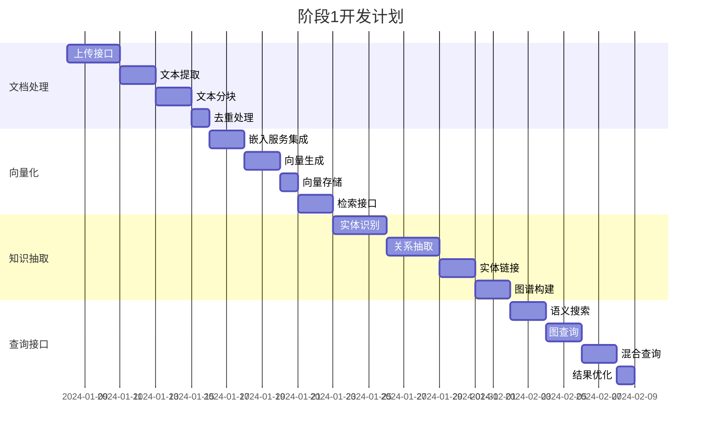
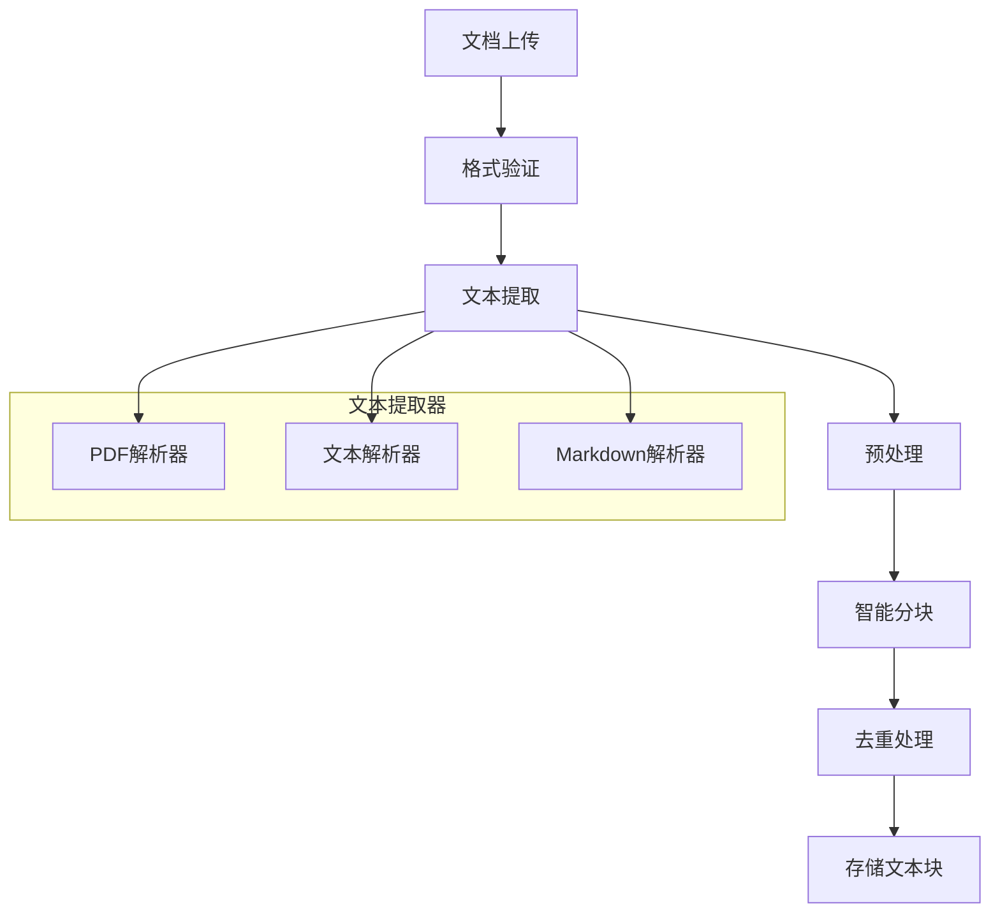
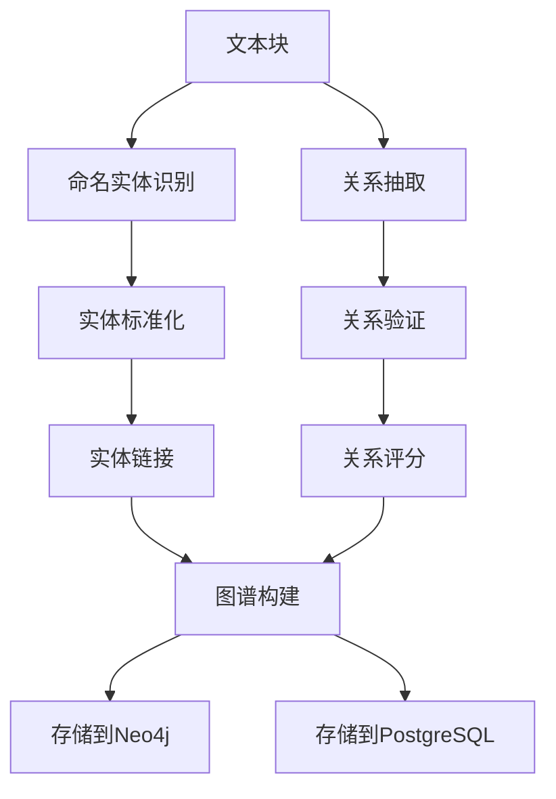

# 阶段1：MVP功能实现

## 阶段目标

实现系统的核心MVP功能，包括文档上传、文本处理、实体抽取、关系构建和基础查询功能。

## 核心功能

### 1. 文档处理管道
- [ ] 文档上传接口（PDF/TXT/Markdown）
- [ ] 文本提取和预处理
- [ ] 智能文本分块（chunking）
- [ ] 文本去重和标准化
- [ ] 文档元数据管理

### 2. 向量化处理
- [ ] 集成嵌入服务（OpenAI/本地模型）
- [ ] 文本向量生成
- [ ] 向量存储到Weaviate
- [ ] 向量检索接口

### 3. 知识抽取
- [ ] 命名实体识别（NER）
- [ ] 关系抽取（RE）
- [ ] 实体标准化和链接
- [ ] 知识图谱构建

### 4. 查询接口
- [ ] 语义搜索API
- [ ] 图查询API
- [ ] 混合查询支持
- [ ] 结果排序和过滤

## 详细任务规划



## 技术实现

### 文档处理架构



### 知识抽取流程



## API设计

### 文档管理API

```python
# 文档上传
POST /api/v1/documents
Content-Type: multipart/form-data
{
    "file": <binary>,
    "title": "文档标题",
    "authors": ["作者1", "作者2"],
    "doc_type": "pdf",
    "metadata": {}
}

# 获取文档信息
GET /api/v1/documents/{doc_id}

# 获取文档列表
GET /api/v1/documents?page=1&size=20&doc_type=pdf

# 删除文档
DELETE /api/v1/documents/{doc_id}
```

### 查询API

```python
# 语义搜索
POST /api/v1/search/semantic
{
    "query": "搜索查询",
    "limit": 10,
    "threshold": 0.7
}

# 图查询
POST /api/v1/search/graph
{
    "entity": "实体名称",
    "relation_types": ["RELATED_TO"],
    "depth": 2
}

# 混合查询
POST /api/v1/search/hybrid
{
    "query": "查询文本",
    "entities": ["实体1", "实体2"],
    "limit": 20
}
```

### 实体和关系API

```python
# 创建/更新实体
POST /api/v1/entities
{
    "canonical": "标准名称",
    "display": "显示名称",
    "types": ["Person", "Researcher"],
    "auto_link": true
}

# 获取实体信息
GET /api/v1/entities/{entity_id}

# 创建关系
POST /api/v1/relations
{
    "subject_entity": "实体1",
    "object_entity": "实体2",
    "predicate": "WORKS_WITH",
    "confidence": 0.9,
    "evidence": [
        {
            "doc_id": "uuid",
            "chunk_id": "uuid",
            "excerpt": "证据文本",
            "score": 0.8
        }
    ]
}
```

## 数据模型

### PostgreSQL表结构

```sql
-- 文档表
CREATE TABLE documents (
    id UUID PRIMARY KEY DEFAULT gen_random_uuid(),
    title TEXT NOT NULL,
    source TEXT,
    authors JSONB,
    doc_type TEXT NOT NULL,
    metadata JSONB DEFAULT '{}',
    file_path TEXT,
    file_size BIGINT,
    uploaded_by TEXT,
    status TEXT DEFAULT 'processing',
    created_at TIMESTAMPTZ DEFAULT NOW(),
    updated_at TIMESTAMPTZ DEFAULT NOW()
);

-- 文本块表
CREATE TABLE chunks (
    id UUID PRIMARY KEY DEFAULT gen_random_uuid(),
    document_id UUID REFERENCES documents(id) ON DELETE CASCADE,
    chunk_index INTEGER NOT NULL,
    text TEXT NOT NULL,
    token_count INTEGER,
    embedding VECTOR(1536),
    metadata JSONB DEFAULT '{}',
    created_at TIMESTAMPTZ DEFAULT NOW(),
    UNIQUE(document_id, chunk_index)
);

-- 实体表
CREATE TABLE entities (
    id UUID PRIMARY KEY DEFAULT gen_random_uuid(),
    canonical TEXT UNIQUE NOT NULL,
    display TEXT,
    types TEXT[] DEFAULT '{}',
    alias_count INTEGER DEFAULT 0,
    metadata JSONB DEFAULT '{}',
    created_at TIMESTAMPTZ DEFAULT NOW(),
    updated_at TIMESTAMPTZ DEFAULT NOW()
);

-- 关系表
CREATE TABLE relations (
    id UUID PRIMARY KEY DEFAULT gen_random_uuid(),
    subject_entity UUID REFERENCES entities(id),
    object_entity UUID REFERENCES entities(id),
    predicate TEXT NOT NULL,
    confidence FLOAT DEFAULT 0.0,
    evidence JSONB DEFAULT '[]',
    created_at TIMESTAMPTZ DEFAULT NOW(),
    updated_at TIMESTAMPTZ DEFAULT NOW()
);

-- 处理任务表
CREATE TABLE ingest_jobs (
    id UUID PRIMARY KEY DEFAULT gen_random_uuid(),
    document_id UUID REFERENCES documents(id),
    status TEXT DEFAULT 'pending',
    progress INTEGER DEFAULT 0,
    error_message TEXT,
    started_at TIMESTAMPTZ,
    completed_at TIMESTAMPTZ,
    created_at TIMESTAMPTZ DEFAULT NOW()
);
```

### Neo4j图模型

```cypher
-- 创建约束
CREATE CONSTRAINT entity_canonical_unique IF NOT EXISTS 
FOR (e:Entity) REQUIRE e.canonical IS UNIQUE;

CREATE CONSTRAINT document_id_unique IF NOT EXISTS 
FOR (d:Document) REQUIRE d.id IS UNIQUE;

-- 创建索引
CREATE INDEX entity_types_index IF NOT EXISTS 
FOR (e:Entity) ON (e.types);

CREATE INDEX relation_predicate_index IF NOT EXISTS 
FOR ()-[r:RELATED_TO]-() ON (r.predicate);
```

## 核心服务实现

### 文档处理服务

```python
class DocumentProcessor:
    """文档处理服务"""
    
    def __init__(self, db_session, minio_client, redis_client):
        self.db = db_session
        self.minio = minio_client
        self.redis = redis_client
    
    async def process_document(self, file_data: bytes, metadata: dict) -> str:
        """处理上传的文档"""
        # 1. 保存文件到MinIO
        file_path = await self.save_file(file_data, metadata)
        
        # 2. 创建文档记录
        doc_id = await self.create_document_record(file_path, metadata)
        
        # 3. 创建处理任务
        job_id = await self.create_ingest_job(doc_id)
        
        # 4. 入队处理任务
        await self.queue_processing_task(job_id)
        
        return doc_id
    
    async def extract_text(self, file_path: str, doc_type: str) -> str:
        """提取文档文本"""
        if doc_type == 'pdf':
            return await self.extract_pdf_text(file_path)
        elif doc_type == 'txt':
            return await self.extract_txt_text(file_path)
        elif doc_type == 'markdown':
            return await self.extract_markdown_text(file_path)
        else:
            raise ValueError(f"Unsupported document type: {doc_type}")
    
    async def chunk_text(self, text: str, chunk_size: int = 1000) -> List[str]:
        """智能文本分块"""
        # 实现智能分块逻辑
        # 考虑句子边界、段落结构等
        pass
```

### 知识抽取服务

```python
class KnowledgeExtractor:
    """知识抽取服务"""
    
    def __init__(self, llm_client, embedding_client):
        self.llm = llm_client
        self.embedding = embedding_client
    
    async def extract_entities(self, text: str) -> List[dict]:
        """实体抽取"""
        prompt = f"""
        从以下文本中提取命名实体，包括人名、机构、概念等：
        
        文本：{text}
        
        请以JSON格式返回，包含实体名称、类型和在文本中的位置。
        """
        
        response = await self.llm.complete(prompt)
        return self.parse_entities(response)
    
    async def extract_relations(self, text: str, entities: List[dict]) -> List[dict]:
        """关系抽取"""
        prompt = f"""
        基于以下实体和文本，抽取实体之间的关系：
        
        实体：{entities}
        文本：{text}
        
        请以JSON格式返回关系三元组。
        """
        
        response = await self.llm.complete(prompt)
        return self.parse_relations(response)
    
    async def link_entities(self, entity: dict) -> str:
        """实体链接"""
        # 1. 标准化实体名称
        canonical = self.normalize_entity_name(entity['name'])
        
        # 2. 精确匹配
        existing = await self.find_exact_match(canonical)
        if existing:
            return existing['id']
        
        # 3. 向量相似度匹配
        embedding = await self.embedding.embed(canonical)
        similar = await self.find_similar_entities(embedding)
        
        if similar and similar[0]['score'] > 0.92:
            return similar[0]['id']
        elif similar and similar[0]['score'] > 0.75:
            # 标记为待审核
            await self.mark_for_review(entity, similar[0])
            return similar[0]['id']
        else:
            # 创建新实体
            return await self.create_new_entity(canonical, entity)
```

## 测试策略

### 单元测试
- API接口测试
- 数据模型测试
- 业务逻辑测试
- 工具函数测试

### 集成测试
- 端到端文档处理流程
- 数据库操作测试
- 外部服务集成测试
- 并发处理测试

### 性能测试
- 文档处理性能
- 查询响应时间
- 并发用户支持
- 内存使用优化

## 验收标准

### 功能验收
- [ ] 支持PDF/TXT/Markdown文档上传
- [ ] 文本提取准确率 > 95%
- [ ] 实体抽取准确率 > 80%
- [ ] 关系抽取准确率 > 70%
- [ ] 语义搜索功能正常
- [ ] 图查询功能正常

### 性能验收
- [ ] 文档处理速度 > 1MB/分钟
- [ ] API响应时间 < 500ms
- [ ] 支持并发用户数 > 10
- [ ] 系统可用性 > 99%

### 质量验收
- [ ] 代码覆盖率 > 85%
- [ ] 所有测试用例通过
- [ ] 性能测试通过
- [ ] 安全测试通过

## 下一阶段

完成阶段1后，进入[阶段2：多模态扩展](../phase2/README.md)，开始支持图像处理和多模态检索功能。