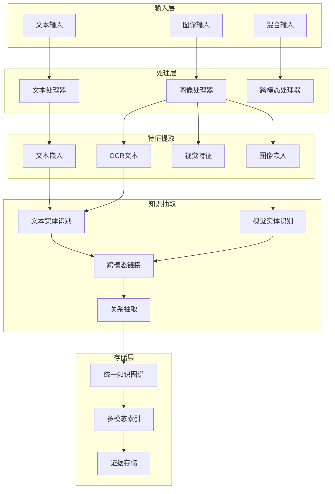
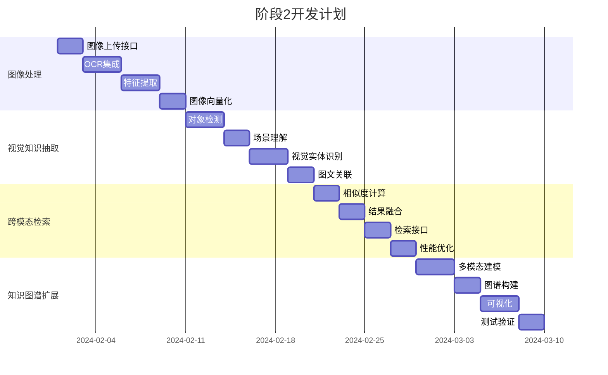

# 阶段2：多模态扩展

## 阶段目标

扩展系统支持图像处理和多模态检索，实现文本、图像的统一知识图谱构建和跨模态检索功能。

## 核心功能

### 1. 图像处理管道
- [ ] 图像上传和存储
- [ ] OCR文字识别
- [ ] 图像特征提取
- [ ] 图像向量化
- [ ] 图像元数据管理

### 2. 视觉知识抽取
- [ ] 图像对象检测
- [ ] 场景理解和描述
- [ ] 视觉实体识别
- [ ] 图文关联分析
- [ ] 多模态实体链接

### 3. 跨模态检索
- [ ] 文本查图像
- [ ] 图像查文本
- [ ] 多模态相似度计算
- [ ] 跨模态结果融合
- [ ] 统一检索接口

### 4. 多模态知识图谱
- [ ] 视觉实体节点
- [ ] 图文关系建模
- [ ] 多模态证据链
- [ ] 跨模态推理
- [ ] 可视化展示

## 技术架构



## 详细任务规划



## 技术选型

### 图像处理
- **OCR引擎**: Tesseract, PaddleOCR
- **特征提取**: DINO, CLIP, DEIMv2
- **对象检测**: YOLO, DETR
- **场景理解**: BLIP, LLaVA

### 向量化模型
- **图像嵌入**: CLIP, DINO
- **多模态嵌入**: CLIP, ALIGN
- **文本嵌入**: Sentence-BERT, OpenAI

### 存储扩展
- **Weaviate Schema**: 多模态类定义
- **Neo4j扩展**: 视觉节点和关系
- **MinIO**: 图像文件存储

## 数据模型扩展

### PostgreSQL表结构扩展

```sql
-- 图像表
CREATE TABLE images (
    id UUID PRIMARY KEY DEFAULT gen_random_uuid(),
    document_id UUID REFERENCES documents(id),
    file_path TEXT NOT NULL,
    file_size BIGINT,
    width INTEGER,
    height INTEGER,
    format TEXT,
    ocr_text TEXT,
    metadata JSONB DEFAULT '{}',
    created_at TIMESTAMPTZ DEFAULT NOW()
);

-- 视觉对象表
CREATE TABLE visual_objects (
    id UUID PRIMARY KEY DEFAULT gen_random_uuid(),
    image_id UUID REFERENCES images(id),
    object_type TEXT NOT NULL,
    confidence FLOAT,
    bbox JSONB, -- 边界框坐标
    features VECTOR(512), -- 视觉特征向量
    description TEXT,
    created_at TIMESTAMPTZ DEFAULT NOW()
);

-- 跨模态关系表
CREATE TABLE cross_modal_relations (
    id UUID PRIMARY KEY DEFAULT gen_random_uuid(),
    text_entity UUID REFERENCES entities(id),
    visual_object UUID REFERENCES visual_objects(id),
    relation_type TEXT NOT NULL,
    confidence FLOAT,
    evidence JSONB DEFAULT '[]',
    created_at TIMESTAMPTZ DEFAULT NOW()
);
```

### Neo4j图模型扩展

```cypher
-- 创建视觉节点标签
CREATE CONSTRAINT visual_object_id_unique IF NOT EXISTS 
FOR (v:VisualObject) REQUIRE v.id IS UNIQUE;

-- 创建图像节点标签
CREATE CONSTRAINT image_id_unique IF NOT EXISTS 
FOR (i:Image) REQUIRE i.id IS UNIQUE;

-- 创建跨模态关系索引
CREATE INDEX cross_modal_relation_index IF NOT EXISTS 
FOR ()-[r:VISUALLY_RELATED]-() ON (r.confidence);

-- 示例节点和关系创建
MERGE (img:Image {id: $image_id, path: $file_path})
MERGE (obj:VisualObject {id: $object_id, type: $object_type})
MERGE (entity:Entity {canonical: $entity_name})
MERGE (img)-[:CONTAINS]->(obj)
MERGE (obj)-[:REPRESENTS {confidence: $confidence}]->(entity)
```

### Weaviate Schema扩展

```python
# 图像类定义
image_class = {
    "class": "ImageObject",
    "description": "图像对象",
    "vectorizer": "none",
    "properties": [
        {
            "name": "imageId",
            "dataType": ["string"],
            "description": "图像ID"
        },
        {
            "name": "objectType",
            "dataType": ["string"],
            "description": "对象类型"
        },
        {
            "name": "description",
            "dataType": ["text"],
            "description": "对象描述"
        },
        {
            "name": "confidence",
            "dataType": ["number"],
            "description": "置信度"
        },
        {
            "name": "bbox",
            "dataType": ["object"],
            "description": "边界框"
        }
    ]
}

# 多模态类定义
multimodal_class = {
    "class": "MultimodalChunk",
    "description": "多模态文本块",
    "vectorizer": "none",
    "properties": [
        {
            "name": "text",
            "dataType": ["text"],
            "description": "文本内容"
        },
        {
            "name": "hasImage",
            "dataType": ["boolean"],
            "description": "是否包含图像"
        },
        {
            "name": "imageObjects",
            "dataType": ["ImageObject"],
            "description": "关联的图像对象"
        },
        {
            "name": "modality",
            "dataType": ["string"],
            "description": "模态类型"
        }
    ]
}
```

## API设计扩展

### 图像处理API

```python
# 图像上传
POST /api/v1/images
Content-Type: multipart/form-data
{
    "file": <binary>,
    "document_id": "uuid",
    "description": "图像描述",
    "metadata": {}
}

# 图像OCR
POST /api/v1/images/{image_id}/ocr
{
    "language": "zh-cn",
    "extract_tables": true
}

# 图像对象检测
POST /api/v1/images/{image_id}/detect
{
    "model": "yolo",
    "confidence_threshold": 0.5
}
```

### 跨模态检索API

```python
# 文本查图像
POST /api/v1/search/text-to-image
{
    "query": "查询文本",
    "limit": 10,
    "filters": {
        "image_type": ["photo", "diagram"],
        "confidence": {"gte": 0.7}
    }
}

# 图像查文本
POST /api/v1/search/image-to-text
{
    "image_id": "uuid",
    "limit": 10,
    "include_ocr": true
}

# 多模态混合查询
POST /api/v1/search/multimodal
{
    "text_query": "查询文本",
    "image_query": "image_id",
    "fusion_method": "weighted",
    "weights": {
        "text": 0.6,
        "image": 0.4
    }
}
```

## 核心服务实现

### 图像处理服务

```python
class ImageProcessor:
    """图像处理服务"""
    
    def __init__(self, ocr_client, vision_model, embedding_client):
        self.ocr = ocr_client
        self.vision = vision_model
        self.embedding = embedding_client
    
    async def process_image(self, image_data: bytes, metadata: dict) -> str:
        """处理上传的图像"""
        # 1. 保存图像文件
        image_path = await self.save_image(image_data, metadata)
        
        # 2. 提取图像元数据
        image_info = await self.extract_image_info(image_path)
        
        # 3. OCR文字识别
        ocr_text = await self.extract_text_from_image(image_path)
        
        # 4. 对象检测
        objects = await self.detect_objects(image_path)
        
        # 5. 生成图像嵌入
        image_embedding = await self.generate_image_embedding(image_path)
        
        # 6. 存储到数据库
        image_id = await self.store_image_data(
            image_path, image_info, ocr_text, objects, image_embedding
        )
        
        return image_id
    
    async def extract_text_from_image(self, image_path: str) -> str:
        """OCR文字识别"""
        result = await self.ocr.recognize(image_path)
        return result.get('text', '')
    
    async def detect_objects(self, image_path: str) -> List[dict]:
        """对象检测"""
        detections = await self.vision.detect_objects(image_path)
        return [
            {
                'type': det['class'],
                'confidence': det['confidence'],
                'bbox': det['bbox'],
                'description': det.get('description', '')
            }
            for det in detections
            if det['confidence'] > 0.5
        ]
```

### 跨模态检索服务

```python
class CrossModalSearchService:
    """跨模态检索服务"""
    
    def __init__(self, weaviate_client, neo4j_client, embedding_client):
        self.weaviate = weaviate_client
        self.neo4j = neo4j_client
        self.embedding = embedding_client
    
    async def text_to_image_search(self, query: str, limit: int = 10) -> List[dict]:
        """文本查图像"""
        # 1. 生成查询向量
        query_vector = await self.embedding.embed_text(query)
        
        # 2. 向量检索图像
        image_results = await self.weaviate.query(
            class_name="ImageObject",
            vector=query_vector,
            limit=limit
        )
        
        # 3. 获取图像详细信息
        enriched_results = []
        for result in image_results:
            image_info = await self.get_image_info(result['imageId'])
            enriched_results.append({
                **result,
                'image_info': image_info,
                'similarity_score': result['_additional']['distance']
            })
        
        return enriched_results
    
    async def image_to_text_search(self, image_id: str, limit: int = 10) -> List[dict]:
        """图像查文本"""
        # 1. 获取图像嵌入
        image_embedding = await self.get_image_embedding(image_id)
        
        # 2. 向量检索相关文本
        text_results = await self.weaviate.query(
            class_name="TextChunk",
            vector=image_embedding,
            limit=limit
        )
        
        # 3. 获取文本上下文
        enriched_results = []
        for result in text_results:
            context = await self.get_text_context(result['chunkId'])
            enriched_results.append({
                **result,
                'context': context,
                'similarity_score': result['_additional']['distance']
            })
        
        return enriched_results
    
    async def multimodal_fusion_search(
        self, 
        text_query: str = None, 
        image_id: str = None,
        weights: dict = None
    ) -> List[dict]:
        """多模态融合检索"""
        weights = weights or {'text': 0.5, 'image': 0.5}
        results = []
        
        # 1. 文本检索
        if text_query:
            text_results = await self.semantic_text_search(text_query)
            for result in text_results:
                result['modality'] = 'text'
                result['base_score'] = result['score'] * weights['text']
                results.append(result)
        
        # 2. 图像检索
        if image_id:
            image_results = await self.image_to_text_search(image_id)
            for result in image_results:
                result['modality'] = 'image'
                result['base_score'] = result['similarity_score'] * weights['image']
                results.append(result)
        
        # 3. 结果融合和排序
        fused_results = await self.fuse_and_rank_results(results)
        
        return fused_results
```

### 多模态知识图谱构建

```python
class MultimodalGraphBuilder:
    """多模态知识图谱构建器"""
    
    def __init__(self, neo4j_client, entity_linker):
        self.neo4j = neo4j_client
        self.entity_linker = entity_linker
    
    async def build_image_graph(self, image_id: str, objects: List[dict]) -> None:
        """构建图像知识图谱"""
        # 1. 创建图像节点
        await self.create_image_node(image_id)
        
        # 2. 处理每个检测到的对象
        for obj in objects:
            # 创建视觉对象节点
            obj_id = await self.create_visual_object_node(obj)
            
            # 链接图像和对象
            await self.link_image_to_object(image_id, obj_id)
            
            # 实体链接
            entity_id = await self.entity_linker.link_visual_object(obj)
            if entity_id:
                await self.link_object_to_entity(obj_id, entity_id)
    
    async def build_cross_modal_relations(
        self, 
        text_chunk_id: str, 
        image_id: str
    ) -> None:
        """构建跨模态关系"""
        # 1. 分析文本和图像的语义关联
        relations = await self.analyze_cross_modal_relations(
            text_chunk_id, image_id
        )
        
        # 2. 创建跨模态关系
        for relation in relations:
            await self.create_cross_modal_relation(
                relation['text_entity'],
                relation['visual_object'],
                relation['relation_type'],
                relation['confidence']
            )
    
    async def create_cross_modal_relation(
        self,
        text_entity_id: str,
        visual_object_id: str,
        relation_type: str,
        confidence: float
    ) -> None:
        """创建跨模态关系"""
        query = """
        MATCH (te:Entity {id: $text_entity_id})
        MATCH (vo:VisualObject {id: $visual_object_id})
        MERGE (te)-[r:CROSS_MODAL_RELATED {
            type: $relation_type,
            confidence: $confidence,
            created_at: datetime()
        }]->(vo)
        RETURN r
        """
        
        await self.neo4j.run(
            query,
            text_entity_id=text_entity_id,
            visual_object_id=visual_object_id,
            relation_type=relation_type,
            confidence=confidence
        )
```

## 测试策略

### 功能测试
- 图像上传和处理
- OCR准确性测试
- 对象检测精度测试
- 跨模态检索准确性
- 多模态融合效果

### 性能测试
- 图像处理速度
- 向量检索性能
- 跨模态查询响应时间
- 并发处理能力
- 存储空间使用

### 质量测试
- 多模态数据一致性
- 跨模态关系准确性
- 系统稳定性测试
- 错误处理测试

## 验收标准

### 功能验收
- [ ] 支持常见图像格式上传
- [ ] OCR识别准确率 > 90%
- [ ] 对象检测准确率 > 85%
- [ ] 跨模态检索相关性 > 80%
- [ ] 多模态融合效果良好

### 性能验收
- [ ] 图像处理速度 > 10张/分钟
- [ ] 跨模态查询响应 < 1秒
- [ ] 支持图像文件 < 50MB
- [ ] 系统可用性 > 99.5%

### 质量验收
- [ ] 代码覆盖率 > 80%
- [ ] 多模态测试通过
- [ ] 性能基准测试通过
- [ ] 用户体验测试通过

## 下一阶段

完成阶段2后，进入[阶段3：企业级部署](../phase3/README.md)，实现生产环境部署、监控和运维功能。