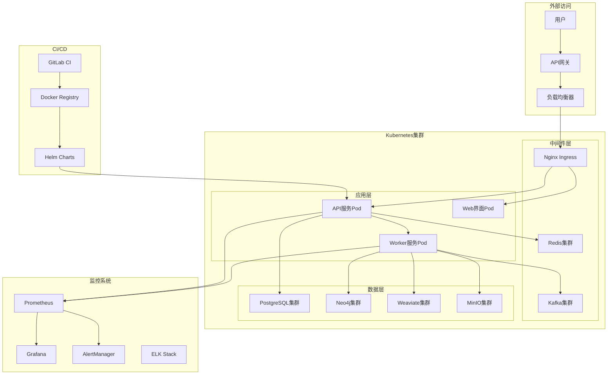
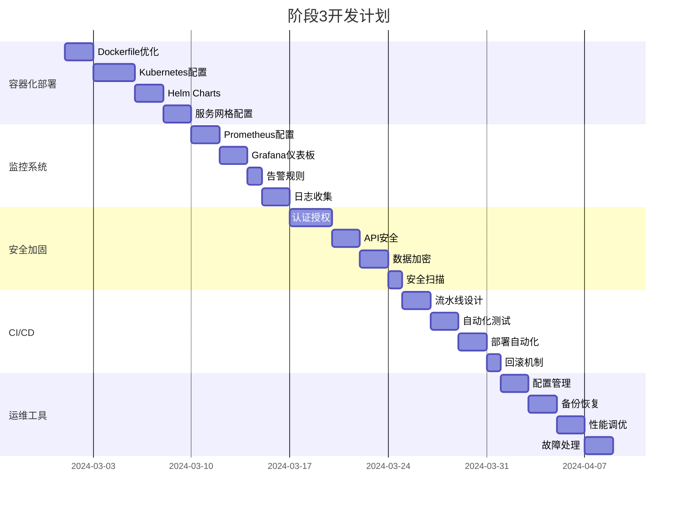

# 阶段3：企业级部署

## 阶段目标

实现生产环境部署、监控、运维和安全功能，确保系统在企业环境中稳定、安全、高效运行。

## 核心功能

### 1. 生产环境部署
- [ ] Kubernetes集群部署
- [ ] 容器编排和管理
- [ ] 服务发现和负载均衡
- [ ] 自动扩缩容
- [ ] 滚动更新和回滚

### 2. 监控和告警
- [ ] 系统性能监控
- [ ] 应用指标收集
- [ ] 日志聚合和分析
- [ ] 告警规则配置
- [ ] 可视化仪表板

### 3. 安全和权限
- [ ] 身份认证和授权
- [ ] API安全防护
- [ ] 数据加密传输
- [ ] 访问控制策略
- [ ] 安全审计日志

### 4. 运维自动化
- [ ] 自动化部署流水线
- [ ] 配置管理
- [ ] 备份和恢复
- [ ] 故障自愈
- [ ] 性能调优

## 技术架构



## 详细任务规划



## Kubernetes部署配置

### Namespace配置

```yaml
# namespace.yaml
apiVersion: v1
kind: Namespace
metadata:
  name: graphrag
  labels:
    name: graphrag
    environment: production
---
apiVersion: v1
kind: ResourceQuota
metadata:
  name: graphrag-quota
  namespace: graphrag
spec:
  hard:
    requests.cpu: "20"
    requests.memory: 40Gi
    limits.cpu: "40"
    limits.memory: 80Gi
    persistentvolumeclaims: "20"
```

### API服务部署

```yaml
# api-deployment.yaml
apiVersion: apps/v1
kind: Deployment
metadata:
  name: graphrag-api
  namespace: graphrag
  labels:
    app: graphrag-api
spec:
  replicas: 3
  selector:
    matchLabels:
      app: graphrag-api
  template:
    metadata:
      labels:
        app: graphrag-api
    spec:
      containers:
      - name: api
        image: graphrag/api:latest
        ports:
        - containerPort: 8000
        env:
        - name: DATABASE_URL
          valueFrom:
            secretKeyRef:
              name: graphrag-secrets
              key: database-url
        - name: NEO4J_URI
          valueFrom:
            secretKeyRef:
              name: graphrag-secrets
              key: neo4j-uri
        resources:
          requests:
            memory: "512Mi"
            cpu: "250m"
          limits:
            memory: "1Gi"
            cpu: "500m"
        livenessProbe:
          httpGet:
            path: /health
            port: 8000
          initialDelaySeconds: 30
          periodSeconds: 10
        readinessProbe:
          httpGet:
            path: /ready
            port: 8000
          initialDelaySeconds: 5
          periodSeconds: 5
---
apiVersion: v1
kind: Service
metadata:
  name: graphrag-api-service
  namespace: graphrag
spec:
  selector:
    app: graphrag-api
  ports:
  - protocol: TCP
    port: 80
    targetPort: 8000
  type: ClusterIP
```

### Worker服务部署

```yaml
# worker-deployment.yaml
apiVersion: apps/v1
kind: Deployment
metadata:
  name: graphrag-worker
  namespace: graphrag
  labels:
    app: graphrag-worker
spec:
  replicas: 2
  selector:
    matchLabels:
      app: graphrag-worker
  template:
    metadata:
      labels:
        app: graphrag-worker
    spec:
      containers:
      - name: worker
        image: graphrag/worker:latest
        env:
        - name: CELERY_BROKER_URL
          valueFrom:
            secretKeyRef:
              name: graphrag-secrets
              key: celery-broker-url
        - name: DATABASE_URL
          valueFrom:
            secretKeyRef:
              name: graphrag-secrets
              key: database-url
        resources:
          requests:
            memory: "1Gi"
            cpu: "500m"
          limits:
            memory: "2Gi"
            cpu: "1000m"
        volumeMounts:
        - name: temp-storage
          mountPath: /tmp/processing
      volumes:
      - name: temp-storage
        emptyDir:
          sizeLimit: 10Gi
---
apiVersion: autoscaling/v2
kind: HorizontalPodAutoscaler
metadata:
  name: graphrag-worker-hpa
  namespace: graphrag
spec:
  scaleTargetRef:
    apiVersion: apps/v1
    kind: Deployment
    name: graphrag-worker
  minReplicas: 2
  maxReplicas: 10
  metrics:
  - type: Resource
    resource:
      name: cpu
      target:
        type: Utilization
        averageUtilization: 70
  - type: Resource
    resource:
      name: memory
      target:
        type: Utilization
        averageUtilization: 80
```

### Ingress配置

```yaml
# ingress.yaml
apiVersion: networking.k8s.io/v1
kind: Ingress
metadata:
  name: graphrag-ingress
  namespace: graphrag
  annotations:
    kubernetes.io/ingress.class: nginx
    cert-manager.io/cluster-issuer: letsencrypt-prod
    nginx.ingress.kubernetes.io/rate-limit: "100"
    nginx.ingress.kubernetes.io/rate-limit-window: "1m"
    nginx.ingress.kubernetes.io/ssl-redirect: "true"
spec:
  tls:
  - hosts:
    - api.graphrag.example.com
    secretName: graphrag-tls
  rules:
  - host: api.graphrag.example.com
    http:
      paths:
      - path: /
        pathType: Prefix
        backend:
          service:
            name: graphrag-api-service
            port:
              number: 80
```

## 监控配置

### Prometheus配置

```yaml
# prometheus-config.yaml
apiVersion: v1
kind: ConfigMap
metadata:
  name: prometheus-config
  namespace: graphrag
data:
  prometheus.yml: |
    global:
      scrape_interval: 15s
      evaluation_interval: 15s
    
    rule_files:
      - "/etc/prometheus/rules/*.yml"
    
    alerting:
      alertmanagers:
        - static_configs:
            - targets:
              - alertmanager:9093
    
    scrape_configs:
      - job_name: 'kubernetes-apiservers'
        kubernetes_sd_configs:
        - role: endpoints
        scheme: https
        tls_config:
          ca_file: /var/run/secrets/kubernetes.io/serviceaccount/ca.crt
        bearer_token_file: /var/run/secrets/kubernetes.io/serviceaccount/token
        relabel_configs:
        - source_labels: [__meta_kubernetes_namespace, __meta_kubernetes_service_name, __meta_kubernetes_endpoint_port_name]
          action: keep
          regex: default;kubernetes;https
      
      - job_name: 'graphrag-api'
        kubernetes_sd_configs:
        - role: endpoints
          namespaces:
            names:
            - graphrag
        relabel_configs:
        - source_labels: [__meta_kubernetes_service_name]
          action: keep
          regex: graphrag-api-service
        - source_labels: [__meta_kubernetes_endpoint_port_name]
          action: keep
          regex: http
      
      - job_name: 'graphrag-worker'
        kubernetes_sd_configs:
        - role: pod
          namespaces:
            names:
            - graphrag
        relabel_configs:
        - source_labels: [__meta_kubernetes_pod_label_app]
          action: keep
          regex: graphrag-worker
        - source_labels: [__meta_kubernetes_pod_annotation_prometheus_io_scrape]
          action: keep
          regex: true
        - source_labels: [__meta_kubernetes_pod_annotation_prometheus_io_path]
          action: replace
          target_label: __metrics_path__
          regex: (.+)
```

### 告警规则

```yaml
# alert-rules.yaml
apiVersion: v1
kind: ConfigMap
metadata:
  name: prometheus-rules
  namespace: graphrag
data:
  graphrag.yml: |
    groups:
    - name: graphrag.rules
      rules:
      - alert: GraphRAGAPIDown
        expr: up{job="graphrag-api"} == 0
        for: 1m
        labels:
          severity: critical
        annotations:
          summary: "GraphRAG API服务不可用"
          description: "GraphRAG API服务已经停止响应超过1分钟"
      
      - alert: GraphRAGHighLatency
        expr: histogram_quantile(0.95, rate(http_request_duration_seconds_bucket{job="graphrag-api"}[5m])) > 2
        for: 5m
        labels:
          severity: warning
        annotations:
          summary: "GraphRAG API响应延迟过高"
          description: "95%的请求响应时间超过2秒，当前值: {{ $value }}秒"
      
      - alert: GraphRAGHighErrorRate
        expr: rate(http_requests_total{job="graphrag-api",status=~"5.."}[5m]) / rate(http_requests_total{job="graphrag-api"}[5m]) > 0.05
        for: 5m
        labels:
          severity: warning
        annotations:
          summary: "GraphRAG API错误率过高"
          description: "5xx错误率超过5%，当前值: {{ $value | humanizePercentage }}"
      
      - alert: GraphRAGWorkerQueueBacklog
        expr: celery_queue_length{queue="default"} > 1000
        for: 10m
        labels:
          severity: warning
        annotations:
          summary: "Worker队列积压严重"
          description: "默认队列中有{{ $value }}个待处理任务"
      
      - alert: GraphRAGDatabaseConnections
        expr: pg_stat_activity_count > 80
        for: 5m
        labels:
          severity: warning
        annotations:
          summary: "数据库连接数过高"
          description: "PostgreSQL活跃连接数: {{ $value }}"
```

### Grafana仪表板

```json
{
  "dashboard": {
    "id": null,
    "title": "GraphRAG System Overview",
    "tags": ["graphrag"],
    "timezone": "browser",
    "panels": [
      {
        "id": 1,
        "title": "API请求量",
        "type": "graph",
        "targets": [
          {
            "expr": "rate(http_requests_total{job=\"graphrag-api\"}[5m])",
            "legendFormat": "{{method}} {{status}}"
          }
        ],
        "yAxes": [
          {
            "label": "请求/秒"
          }
        ]
      },
      {
        "id": 2,
        "title": "响应时间",
        "type": "graph",
        "targets": [
          {
            "expr": "histogram_quantile(0.50, rate(http_request_duration_seconds_bucket{job=\"graphrag-api\"}[5m]))",
            "legendFormat": "50th percentile"
          },
          {
            "expr": "histogram_quantile(0.95, rate(http_request_duration_seconds_bucket{job=\"graphrag-api\"}[5m]))",
            "legendFormat": "95th percentile"
          }
        ]
      },
      {
        "id": 3,
        "title": "系统资源使用",
        "type": "graph",
        "targets": [
          {
            "expr": "rate(container_cpu_usage_seconds_total{namespace=\"graphrag\"}[5m])",
            "legendFormat": "CPU - {{pod}}"
          },
          {
            "expr": "container_memory_usage_bytes{namespace=\"graphrag\"} / 1024 / 1024 / 1024",
            "legendFormat": "Memory - {{pod}}"
          }
        ]
      }
    ],
    "time": {
      "from": "now-1h",
      "to": "now"
    },
    "refresh": "30s"
  }
}
```

## CI/CD配置

### GitLab CI配置

```yaml
# .gitlab-ci.yml
stages:
  - test
  - build
  - security
  - deploy

variables:
  DOCKER_REGISTRY: registry.example.com
  DOCKER_IMAGE_TAG: $CI_COMMIT_SHA
  KUBECONFIG: /tmp/kubeconfig

# 测试阶段
test:unit:
  stage: test
  image: python:3.11
  services:
    - postgres:13
    - redis:6
  variables:
    POSTGRES_DB: test_graphrag
    POSTGRES_USER: test
    POSTGRES_PASSWORD: test
  script:
    - pip install -r requirements.txt
    - pip install pytest pytest-cov
    - pytest tests/ --cov=src/ --cov-report=xml
  coverage: '/TOTAL.+?(\d+\%)$/'
  artifacts:
    reports:
      coverage_report:
        coverage_format: cobertura
        path: coverage.xml

test:integration:
  stage: test
  image: docker/compose:latest
  services:
    - docker:dind
  script:
    - docker-compose -f docker-compose.test.yml up --build --abort-on-container-exit
    - docker-compose -f docker-compose.test.yml down

# 构建阶段
build:api:
  stage: build
  image: docker:latest
  services:
    - docker:dind
  script:
    - docker login -u $CI_REGISTRY_USER -p $CI_REGISTRY_PASSWORD $DOCKER_REGISTRY
    - docker build -t $DOCKER_REGISTRY/graphrag/api:$DOCKER_IMAGE_TAG -f Dockerfile.api .
    - docker push $DOCKER_REGISTRY/graphrag/api:$DOCKER_IMAGE_TAG
    - docker tag $DOCKER_REGISTRY/graphrag/api:$DOCKER_IMAGE_TAG $DOCKER_REGISTRY/graphrag/api:latest
    - docker push $DOCKER_REGISTRY/graphrag/api:latest
  only:
    - main
    - develop

build:worker:
  stage: build
  image: docker:latest
  services:
    - docker:dind
  script:
    - docker login -u $CI_REGISTRY_USER -p $CI_REGISTRY_PASSWORD $DOCKER_REGISTRY
    - docker build -t $DOCKER_REGISTRY/graphrag/worker:$DOCKER_IMAGE_TAG -f Dockerfile.worker .
    - docker push $DOCKER_REGISTRY/graphrag/worker:$DOCKER_IMAGE_TAG
    - docker tag $DOCKER_REGISTRY/graphrag/worker:$DOCKER_IMAGE_TAG $DOCKER_REGISTRY/graphrag/worker:latest
    - docker push $DOCKER_REGISTRY/graphrag/worker:latest
  only:
    - main
    - develop

# 安全扫描
security:container:
  stage: security
  image: aquasec/trivy:latest
  script:
    - trivy image --exit-code 0 --severity HIGH,CRITICAL $DOCKER_REGISTRY/graphrag/api:$DOCKER_IMAGE_TAG
    - trivy image --exit-code 0 --severity HIGH,CRITICAL $DOCKER_REGISTRY/graphrag/worker:$DOCKER_IMAGE_TAG
  allow_failure: true
  only:
    - main
    - develop

security:code:
  stage: security
  image: python:3.11
  script:
    - pip install bandit safety
    - bandit -r src/ -f json -o bandit-report.json
    - safety check --json --output safety-report.json
  artifacts:
    reports:
      security:
        - bandit-report.json
        - safety-report.json
  allow_failure: true

# 部署阶段
deploy:staging:
  stage: deploy
  image: bitnami/kubectl:latest
  environment:
    name: staging
    url: https://staging-api.graphrag.example.com
  script:
    - echo $KUBE_CONFIG_STAGING | base64 -d > $KUBECONFIG
    - helm upgrade --install graphrag-staging ./helm/graphrag 
        --namespace graphrag-staging 
        --create-namespace
        --set image.tag=$DOCKER_IMAGE_TAG
        --set environment=staging
        --values ./helm/values-staging.yaml
  only:
    - develop

deploy:production:
  stage: deploy
  image: bitnami/kubectl:latest
  environment:
    name: production
    url: https://api.graphrag.example.com
  script:
    - echo $KUBE_CONFIG_PROD | base64 -d > $KUBECONFIG
    - helm upgrade --install graphrag ./helm/graphrag 
        --namespace graphrag 
        --create-namespace
        --set image.tag=$DOCKER_IMAGE_TAG
        --set environment=production
        --values ./helm/values-production.yaml
  when: manual
  only:
    - main
```

### Helm Chart配置

```yaml
# helm/graphrag/Chart.yaml
apiVersion: v2
name: graphrag
description: GraphRAG Knowledge Base System
type: application
version: 0.1.0
appVersion: "1.0.0"

dependencies:
  - name: postgresql
    version: 12.1.9
    repository: https://charts.bitnami.com/bitnami
    condition: postgresql.enabled
  - name: redis
    version: 17.3.7
    repository: https://charts.bitnami.com/bitnami
    condition: redis.enabled
```

```yaml
# helm/graphrag/values.yaml
# 默认配置值
replicaCount:
  api: 3
  worker: 2

image:
  registry: registry.example.com
  repository: graphrag
  tag: latest
  pullPolicy: IfNotPresent

service:
  type: ClusterIP
  port: 80
  targetPort: 8000

ingress:
  enabled: true
  className: nginx
  annotations:
    cert-manager.io/cluster-issuer: letsencrypt-prod
    nginx.ingress.kubernetes.io/rate-limit: "100"
  hosts:
    - host: api.graphrag.example.com
      paths:
        - path: /
          pathType: Prefix
  tls:
    - secretName: graphrag-tls
      hosts:
        - api.graphrag.example.com

resources:
  api:
    limits:
      cpu: 500m
      memory: 1Gi
    requests:
      cpu: 250m
      memory: 512Mi
  worker:
    limits:
      cpu: 1000m
      memory: 2Gi
    requests:
      cpu: 500m
      memory: 1Gi

autoscaling:
  enabled: true
  minReplicas: 2
  maxReplicas: 10
  targetCPUUtilizationPercentage: 70
  targetMemoryUtilizationPercentage: 80

# 外部依赖配置
postgresql:
  enabled: true
  auth:
    postgresPassword: "changeme"
    database: "graphrag"
  primary:
    persistence:
      enabled: true
      size: 100Gi

redis:
  enabled: true
  auth:
    enabled: false
  master:
    persistence:
      enabled: true
      size: 10Gi

# 监控配置
monitoring:
  enabled: true
  serviceMonitor:
    enabled: true
    interval: 30s
    path: /metrics

# 安全配置
security:
  networkPolicy:
    enabled: true
  podSecurityPolicy:
    enabled: true
```

## 安全配置

### 网络策略

```yaml
# network-policy.yaml
apiVersion: networking.k8s.io/v1
kind: NetworkPolicy
metadata:
  name: graphrag-network-policy
  namespace: graphrag
spec:
  podSelector:
    matchLabels:
      app: graphrag-api
  policyTypes:
  - Ingress
  - Egress
  ingress:
  - from:
    - namespaceSelector:
        matchLabels:
          name: ingress-nginx
    ports:
    - protocol: TCP
      port: 8000
  - from:
    - podSelector:
        matchLabels:
          app: graphrag-worker
    ports:
    - protocol: TCP
      port: 8000
  egress:
  - to:
    - podSelector:
        matchLabels:
          app: postgres
    ports:
    - protocol: TCP
      port: 5432
  - to:
    - podSelector:
        matchLabels:
          app: redis
    ports:
    - protocol: TCP
      port: 6379
  - to: []
    ports:
    - protocol: TCP
      port: 53
    - protocol: UDP
      port: 53
```

### Pod安全策略

```yaml
# pod-security-policy.yaml
apiVersion: policy/v1beta1
kind: PodSecurityPolicy
metadata:
  name: graphrag-psp
spec:
  privileged: false
  allowPrivilegeEscalation: false
  requiredDropCapabilities:
    - ALL
  volumes:
    - 'configMap'
    - 'emptyDir'
    - 'projected'
    - 'secret'
    - 'downwardAPI'
    - 'persistentVolumeClaim'
  runAsUser:
    rule: 'MustRunAsNonRoot'
  seLinux:
    rule: 'RunAsAny'
  fsGroup:
    rule: 'RunAsAny'
```

### RBAC配置

```yaml
# rbac.yaml
apiVersion: v1
kind: ServiceAccount
metadata:
  name: graphrag-service-account
  namespace: graphrag
---
apiVersion: rbac.authorization.k8s.io/v1
kind: Role
metadata:
  namespace: graphrag
  name: graphrag-role
rules:
- apiGroups: [""]
  resources: ["pods", "services", "endpoints"]
  verbs: ["get", "list", "watch"]
- apiGroups: ["apps"]
  resources: ["deployments", "replicasets"]
  verbs: ["get", "list", "watch"]
---
apiVersion: rbac.authorization.k8s.io/v1
kind: RoleBinding
metadata:
  name: graphrag-role-binding
  namespace: graphrag
subjects:
- kind: ServiceAccount
  name: graphrag-service-account
  namespace: graphrag
roleRef:
  kind: Role
  name: graphrag-role
  apiGroup: rbac.authorization.k8s.io
```

## 备份和恢复

### 数据库备份

```yaml
# backup-cronjob.yaml
apiVersion: batch/v1
kind: CronJob
metadata:
  name: postgres-backup
  namespace: graphrag
spec:
  schedule: "0 2 * * *"  # 每天凌晨2点
  jobTemplate:
    spec:
      template:
        spec:
          containers:
          - name: postgres-backup
            image: postgres:13
            env:
            - name: PGPASSWORD
              valueFrom:
                secretKeyRef:
                  name: postgres-secret
                  key: password
            command:
            - /bin/bash
            - -c
            - |
              DATE=$(date +%Y%m%d_%H%M%S)
              pg_dump -h postgres-service -U postgres -d graphrag > /backup/graphrag_$DATE.sql
              # 上传到对象存储
              aws s3 cp /backup/graphrag_$DATE.sql s3://graphrag-backups/postgres/
              # 清理本地文件
              rm /backup/graphrag_$DATE.sql
            volumeMounts:
            - name: backup-storage
              mountPath: /backup
          volumes:
          - name: backup-storage
            emptyDir: {}
          restartPolicy: OnFailure
```

### Neo4j备份

```yaml
# neo4j-backup-cronjob.yaml
apiVersion: batch/v1
kind: CronJob
metadata:
  name: neo4j-backup
  namespace: graphrag
spec:
  schedule: "0 3 * * *"  # 每天凌晨3点
  jobTemplate:
    spec:
      template:
        spec:
          containers:
          - name: neo4j-backup
            image: neo4j:5.0
            env:
            - name: NEO4J_AUTH
              valueFrom:
                secretKeyRef:
                  name: neo4j-secret
                  key: auth
            command:
            - /bin/bash
            - -c
            - |
              DATE=$(date +%Y%m%d_%H%M%S)
              neo4j-admin database dump --database=neo4j --to-path=/backup/neo4j_$DATE.dump
              # 上传到对象存储
              aws s3 cp /backup/neo4j_$DATE.dump s3://graphrag-backups/neo4j/
              # 清理本地文件
              rm /backup/neo4j_$DATE.dump
            volumeMounts:
            - name: backup-storage
              mountPath: /backup
          volumes:
          - name: backup-storage
            emptyDir: {}
          restartPolicy: OnFailure
```

## 性能调优

### 数据库优化

```sql
-- PostgreSQL性能优化配置
-- postgresql.conf 关键参数
shared_buffers = 256MB
effective_cache_size = 1GB
maintenance_work_mem = 64MB
checkpoint_completion_target = 0.9
wal_buffers = 16MB
default_statistics_target = 100
random_page_cost = 1.1
effective_io_concurrency = 200

-- 创建必要的索引
CREATE INDEX CONCURRENTLY idx_documents_created_at ON documents(created_at);
CREATE INDEX CONCURRENTLY idx_chunks_document_id ON chunks(document_id);
CREATE INDEX CONCURRENTLY idx_entities_canonical ON entities(canonical);
CREATE INDEX CONCURRENTLY idx_relations_source_target ON relations(source_entity_id, target_entity_id);

-- 分区表设计（按时间分区）
CREATE TABLE documents_partitioned (
    LIKE documents INCLUDING ALL
) PARTITION BY RANGE (created_at);

CREATE TABLE documents_2024_q1 PARTITION OF documents_partitioned
    FOR VALUES FROM ('2024-01-01') TO ('2024-04-01');
```

### 应用层优化

```python
# 连接池配置
DATABASE_CONFIG = {
    'pool_size': 20,
    'max_overflow': 30,
    'pool_timeout': 30,
    'pool_recycle': 3600,
    'pool_pre_ping': True
}

# Redis缓存配置
REDIS_CONFIG = {
    'host': 'redis-cluster',
    'port': 6379,
    'db': 0,
    'max_connections': 50,
    'retry_on_timeout': True,
    'socket_keepalive': True,
    'socket_keepalive_options': {}
}

# 异步任务优化
CELERY_CONFIG = {
    'worker_prefetch_multiplier': 1,
    'task_acks_late': True,
    'worker_max_tasks_per_child': 1000,
    'task_compression': 'gzip',
    'result_compression': 'gzip'
}
```

## 测试策略

### 负载测试

```yaml
# load-test-job.yaml
apiVersion: batch/v1
kind: Job
metadata:
  name: load-test
  namespace: graphrag
spec:
  template:
    spec:
      containers:
      - name: k6
        image: grafana/k6:latest
        command: ["k6", "run", "--vus", "100", "--duration", "10m", "/scripts/load-test.js"]
        volumeMounts:
        - name: test-scripts
          mountPath: /scripts
      volumes:
      - name: test-scripts
        configMap:
          name: load-test-scripts
      restartPolicy: Never
```

```javascript
// load-test.js
import http from 'k6/http';
import { check, sleep } from 'k6';

export let options = {
  stages: [
    { duration: '2m', target: 20 },
    { duration: '5m', target: 20 },
    { duration: '2m', target: 50 },
    { duration: '5m', target: 50 },
    { duration: '2m', target: 100 },
    { duration: '5m', target: 100 },
    { duration: '10m', target: 0 },
  ],
};

export default function () {
  // 测试文档上传
  let uploadResponse = http.post('http://graphrag-api-service/api/v1/documents', {
    file: http.file(open('./test-document.pdf', 'b'), 'test-document.pdf'),
  });
  
  check(uploadResponse, {
    'upload status is 200': (r) => r.status === 200,
    'upload response time < 5s': (r) => r.timings.duration < 5000,
  });
  
  // 测试查询接口
  let queryResponse = http.post('http://graphrag-api-service/api/v1/query', 
    JSON.stringify({
      query: 'What is machine learning?',
      limit: 10
    }),
    { headers: { 'Content-Type': 'application/json' } }
  );
  
  check(queryResponse, {
    'query status is 200': (r) => r.status === 200,
    'query response time < 2s': (r) => r.timings.duration < 2000,
  });
  
  sleep(1);
}
```

## 验收标准

### 部署验收
- [ ] Kubernetes集群部署成功
- [ ] 所有服务Pod正常运行
- [ ] 负载均衡和自动扩缩容正常
- [ ] 滚动更新和回滚机制正常
- [ ] 服务发现和网络通信正常

### 监控验收
- [ ] Prometheus指标收集正常
- [ ] Grafana仪表板显示正常
- [ ] 告警规则触发正常
- [ ] 日志聚合和查询正常
- [ ] 性能指标达标

### 安全验收
- [ ] 身份认证和授权正常
- [ ] API安全防护有效
- [ ] 网络策略限制正常
- [ ] 数据传输加密
- [ ] 安全扫描通过

### 运维验收
- [ ] CI/CD流水线正常
- [ ] 自动化部署成功
- [ ] 备份和恢复正常
- [ ] 配置管理有效
- [ ] 故障处理及时

### 性能验收
- [ ] API响应时间 < 1秒
- [ ] 系统可用性 > 99.9%
- [ ] 并发处理 > 1000 QPS
- [ ] 资源利用率合理
- [ ] 扩缩容响应及时

## 运维手册

### 常见问题处理

1. **Pod启动失败**
   ```bash
   # 查看Pod状态
   kubectl get pods -n graphrag
   
   # 查看Pod详细信息
   kubectl describe pod <pod-name> -n graphrag
   
   # 查看Pod日志
   kubectl logs <pod-name> -n graphrag
   ```

2. **服务不可访问**
   ```bash
   # 检查Service状态
   kubectl get svc -n graphrag
   
   # 检查Ingress状态
   kubectl get ingress -n graphrag
   
   # 测试服务连通性
   kubectl exec -it <pod-name> -n graphrag -- curl http://service-name
   ```

3. **数据库连接问题**
   ```bash
   # 检查数据库Pod状态
   kubectl get pods -l app=postgresql -n graphrag
   
   # 测试数据库连接
   kubectl exec -it <api-pod> -n graphrag -- psql $DATABASE_URL -c "SELECT 1"
   ```

### 扩容操作

```bash
# 手动扩容API服务
kubectl scale deployment graphrag-api --replicas=5 -n graphrag

# 手动扩容Worker服务
kubectl scale deployment graphrag-worker --replicas=8 -n graphrag

# 更新HPA配置
kubectl patch hpa graphrag-worker-hpa -n graphrag -p '{"spec":{"maxReplicas":15}}'
```

### 版本更新

```bash
# 使用Helm更新版本
helm upgrade graphrag ./helm/graphrag \
  --namespace graphrag \
  --set image.tag=v1.1.0 \
  --reuse-values

# 查看更新状态
kubectl rollout status deployment/graphrag-api -n graphrag

# 如需回滚
kubectl rollout undo deployment/graphrag-api -n graphrag
```

## 下一步

完成阶段3后，系统已具备企业级生产环境运行能力。后续可以考虑：

1. **功能扩展**: 添加更多AI模型支持、增强分析能力
2. **性能优化**: 进一步优化查询性能、扩展存储能力
3. **生态集成**: 与更多企业系统集成、开发插件体系
4. **智能运维**: 引入AIOps、自动化故障处理