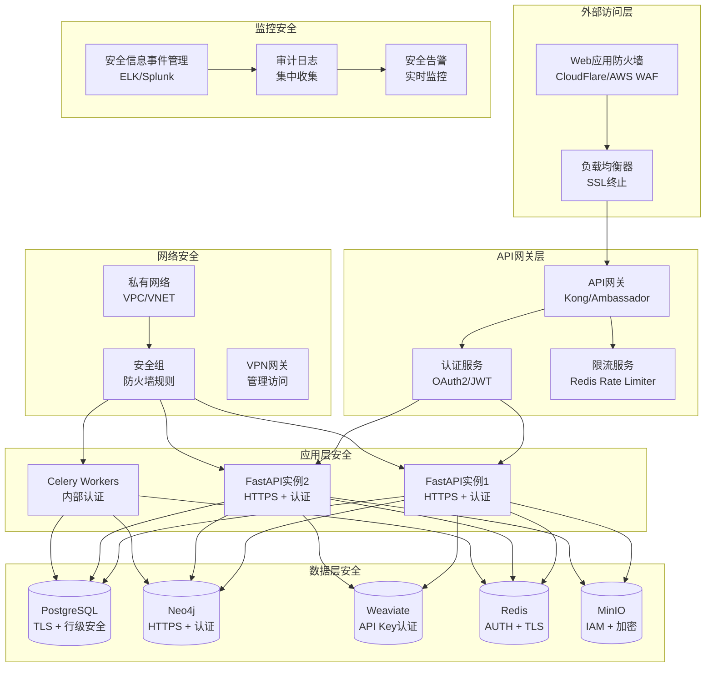

# 安全指南

## 概述

本文档提供了GraphRAG知识库系统的全面安全指南，涵盖身份认证、授权、数据保护、网络安全、审计日志等关键安全领域。

## 安全架构



## 1. 身份认证和授权

### 1.1 JWT认证实现

```python
# src/core/auth/jwt_handler.py
"""
JWT认证处理器
提供JWT令牌的生成、验证和刷新功能
"""

import jwt
from datetime import datetime, timedelta
from typing import Optional, Dict, Any
from fastapi import HTTPException, status
from passlib.context import CryptContext
import secrets

class JWTHandler:
    """JWT认证处理器"""
    
    def __init__(self, secret_key: str, algorithm: str = "HS256"):
        """
        初始化JWT处理器
        
        Args:
            secret_key: JWT签名密钥
            algorithm: 签名算法
        """
        self.secret_key = secret_key
        self.algorithm = algorithm
        self.pwd_context = CryptContext(schemes=["bcrypt"], deprecated="auto")
        
    def create_access_token(
        self, 
        data: Dict[str, Any], 
        expires_delta: Optional[timedelta] = None
    ) -> str:
        """
        创建访问令牌
        
        Args:
            data: 要编码的数据
            expires_delta: 过期时间增量
            
        Returns:
            JWT访问令牌
        """
        to_encode = data.copy()
        
        if expires_delta:
            expire = datetime.utcnow() + expires_delta
        else:
            expire = datetime.utcnow() + timedelta(minutes=15)
            
        to_encode.update({
            "exp": expire,
            "iat": datetime.utcnow(),
            "type": "access"
        })
        
        return jwt.encode(to_encode, self.secret_key, algorithm=self.algorithm)
    
    def create_refresh_token(self, data: Dict[str, Any]) -> str:
        """
        创建刷新令牌
        
        Args:
            data: 要编码的数据
            
        Returns:
            JWT刷新令牌
        """
        to_encode = data.copy()
        expire = datetime.utcnow() + timedelta(days=7)
        
        to_encode.update({
            "exp": expire,
            "iat": datetime.utcnow(),
            "type": "refresh"
        })
        
        return jwt.encode(to_encode, self.secret_key, algorithm=self.algorithm)
    
    def verify_token(self, token: str) -> Dict[str, Any]:
        """
        验证JWT令牌
        
        Args:
            token: JWT令牌
            
        Returns:
            解码后的数据
            
        Raises:
            HTTPException: 令牌无效或过期
        """
        try:
            payload = jwt.decode(token, self.secret_key, algorithms=[self.algorithm])
            return payload
        except jwt.ExpiredSignatureError:
            raise HTTPException(
                status_code=status.HTTP_401_UNAUTHORIZED,
                detail="令牌已过期"
            )
        except jwt.JWTError:
            raise HTTPException(
                status_code=status.HTTP_401_UNAUTHORIZED,
                detail="无效的令牌"
            )
    
    def hash_password(self, password: str) -> str:
        """
        哈希密码
        
        Args:
            password: 明文密码
            
        Returns:
            哈希后的密码
        """
        return self.pwd_context.hash(password)
    
    def verify_password(self, plain_password: str, hashed_password: str) -> bool:
        """
        验证密码
        
        Args:
            plain_password: 明文密码
            hashed_password: 哈希密码
            
        Returns:
            密码是否匹配
        """
        return self.pwd_context.verify(plain_password, hashed_password)
    
    def generate_api_key(self) -> str:
        """
        生成API密钥
        
        Returns:
            随机生成的API密钥
        """
        return secrets.token_urlsafe(32)
```

### 1.2 RBAC权限模型

```python
# src/core/auth/rbac.py
"""
基于角色的访问控制(RBAC)实现
定义用户、角色、权限的关系和验证逻辑
"""

from enum import Enum
from typing import List, Set, Optional
from dataclasses import dataclass
from fastapi import HTTPException, status

class Permission(Enum):
    """权限枚举"""
    # 文档权限
    DOCUMENT_READ = "document:read"
    DOCUMENT_WRITE = "document:write"
    DOCUMENT_DELETE = "document:delete"
    
    # 知识图谱权限
    GRAPH_READ = "graph:read"
    GRAPH_WRITE = "graph:write"
    GRAPH_DELETE = "graph:delete"
    
    # 查询权限
    QUERY_EXECUTE = "query:execute"
    QUERY_ADVANCED = "query:advanced"
    
    # 用户管理权限
    USER_READ = "user:read"
    USER_WRITE = "user:write"
    USER_DELETE = "user:delete"
    
    # 系统管理权限
    SYSTEM_CONFIG = "system:config"
    SYSTEM_MONITOR = "system:monitor"
    SYSTEM_BACKUP = "system:backup"

class Role(Enum):
    """角色枚举"""
    GUEST = "guest"           # 访客
    USER = "user"             # 普通用户
    RESEARCHER = "researcher" # 研究员
    ADMIN = "admin"           # 管理员
    SUPER_ADMIN = "super_admin" # 超级管理员

@dataclass
class User:
    """用户数据类"""
    id: int
    username: str
    email: str
    roles: List[Role]
    is_active: bool = True
    is_verified: bool = False

class RBACManager:
    """RBAC权限管理器"""
    
    def __init__(self):
        """初始化权限映射"""
        self.role_permissions = {
            Role.GUEST: {
                Permission.DOCUMENT_READ,
                Permission.GRAPH_READ,
                Permission.QUERY_EXECUTE
            },
            Role.USER: {
                Permission.DOCUMENT_READ,
                Permission.DOCUMENT_WRITE,
                Permission.GRAPH_READ,
                Permission.QUERY_EXECUTE,
                Permission.QUERY_ADVANCED
            },
            Role.RESEARCHER: {
                Permission.DOCUMENT_READ,
                Permission.DOCUMENT_WRITE,
                Permission.DOCUMENT_DELETE,
                Permission.GRAPH_READ,
                Permission.GRAPH_WRITE,
                Permission.QUERY_EXECUTE,
                Permission.QUERY_ADVANCED
            },
            Role.ADMIN: {
                Permission.DOCUMENT_READ,
                Permission.DOCUMENT_WRITE,
                Permission.DOCUMENT_DELETE,
                Permission.GRAPH_READ,
                Permission.GRAPH_WRITE,
                Permission.GRAPH_DELETE,
                Permission.QUERY_EXECUTE,
                Permission.QUERY_ADVANCED,
                Permission.USER_READ,
                Permission.USER_WRITE,
                Permission.SYSTEM_MONITOR
            },
            Role.SUPER_ADMIN: set(Permission)  # 所有权限
        }
    
    def get_user_permissions(self, user: User) -> Set[Permission]:
        """
        获取用户的所有权限
        
        Args:
            user: 用户对象
            
        Returns:
            用户权限集合
        """
        permissions = set()
        for role in user.roles:
            permissions.update(self.role_permissions.get(role, set()))
        return permissions
    
    def check_permission(self, user: User, permission: Permission) -> bool:
        """
        检查用户是否具有指定权限
        
        Args:
            user: 用户对象
            permission: 要检查的权限
            
        Returns:
            是否具有权限
        """
        if not user.is_active:
            return False
            
        user_permissions = self.get_user_permissions(user)
        return permission in user_permissions
    
    def require_permission(self, user: User, permission: Permission):
        """
        要求用户具有指定权限，否则抛出异常
        
        Args:
            user: 用户对象
            permission: 要求的权限
            
        Raises:
            HTTPException: 权限不足
        """
        if not self.check_permission(user, permission):
            raise HTTPException(
                status_code=status.HTTP_403_FORBIDDEN,
                detail=f"权限不足，需要权限: {permission.value}"
            )
    
    def require_any_permission(self, user: User, permissions: List[Permission]):
        """
        要求用户具有任一指定权限
        
        Args:
            user: 用户对象
            permissions: 权限列表
            
        Raises:
            HTTPException: 权限不足
        """
        for permission in permissions:
            if self.check_permission(user, permission):
                return
                
        raise HTTPException(
            status_code=status.HTTP_403_FORBIDDEN,
            detail="权限不足"
        )
```

### 1.3 API认证中间件

```python
# src/core/auth/middleware.py
"""
认证中间件
处理API请求的身份验证和授权
"""

from fastapi import Request, HTTPException, status, Depends
from fastapi.security import HTTPBearer, HTTPAuthorizationCredentials
from typing import Optional
import redis
import json

from .jwt_handler import JWTHandler
from .rbac import RBACManager, User, Permission

security = HTTPBearer()
jwt_handler = JWTHandler(secret_key="your-secret-key")
rbac_manager = RBACManager()
redis_client = redis.Redis(host="localhost", port=6379, db=0)

class AuthMiddleware:
    """认证中间件"""
    
    def __init__(self):
        self.jwt_handler = jwt_handler
        self.rbac_manager = rbac_manager
        self.redis_client = redis_client
    
    async def get_current_user(
        self, 
        credentials: HTTPAuthorizationCredentials = Depends(security)
    ) -> User:
        """
        获取当前用户
        
        Args:
            credentials: HTTP认证凭据
            
        Returns:
            当前用户对象
            
        Raises:
            HTTPException: 认证失败
        """
        token = credentials.credentials
        
        # 检查令牌是否在黑名单中
        if self.redis_client.get(f"blacklist:{token}"):
            raise HTTPException(
                status_code=status.HTTP_401_UNAUTHORIZED,
                detail="令牌已失效"
            )
        
        # 验证JWT令牌
        payload = self.jwt_handler.verify_token(token)
        user_id = payload.get("sub")
        
        if not user_id:
            raise HTTPException(
                status_code=status.HTTP_401_UNAUTHORIZED,
                detail="无效的令牌"
            )
        
        # 从缓存或数据库获取用户信息
        user_data = self.redis_client.get(f"user:{user_id}")
        if user_data:
            user_dict = json.loads(user_data)
            return User(**user_dict)
        
        # 如果缓存中没有，从数据库查询
        # 这里应该调用用户服务获取用户信息
        # user = await user_service.get_user_by_id(user_id)
        
        raise HTTPException(
            status_code=status.HTTP_401_UNAUTHORIZED,
            detail="用户不存在"
        )
    
    def require_permission(self, permission: Permission):
        """
        权限装饰器工厂
        
        Args:
            permission: 要求的权限
            
        Returns:
            权限检查装饰器
        """
        def permission_checker(user: User = Depends(self.get_current_user)):
            self.rbac_manager.require_permission(user, permission)
            return user
        
        return permission_checker
    
    async def logout_user(self, token: str, user_id: int):
        """
        用户登出，将令牌加入黑名单
        
        Args:
            token: JWT令牌
            user_id: 用户ID
        """
        # 将令牌加入黑名单
        self.redis_client.setex(f"blacklist:{token}", 3600 * 24 * 7, "1")
        
        # 清除用户缓存
        self.redis_client.delete(f"user:{user_id}")

# 创建全局实例
auth_middleware = AuthMiddleware()

# 便捷的依赖注入函数
async def get_current_user(
    credentials: HTTPAuthorizationCredentials = Depends(security)
) -> User:
    """获取当前用户的便捷函数"""
    return await auth_middleware.get_current_user(credentials)

def require_permission(permission: Permission):
    """权限要求装饰器"""
    return auth_middleware.require_permission(permission)
```

## 2. 数据保护

### 2.1 数据加密配置

```python
# src/core/security/encryption.py
"""
数据加密工具
提供数据的加密和解密功能
"""

from cryptography.fernet import Fernet
from cryptography.hazmat.primitives import hashes
from cryptography.hazmat.primitives.kdf.pbkdf2 import PBKDF2HMAC
import base64
import os
from typing import Union

class DataEncryption:
    """数据加密工具类"""
    
    def __init__(self, password: str):
        """
        初始化加密工具
        
        Args:
            password: 加密密码
        """
        self.password = password.encode()
        self.salt = os.urandom(16)
        self.key = self._derive_key()
        self.fernet = Fernet(self.key)
    
    def _derive_key(self) -> bytes:
        """
        从密码派生加密密钥
        
        Returns:
            派生的密钥
        """
        kdf = PBKDF2HMAC(
            algorithm=hashes.SHA256(),
            length=32,
            salt=self.salt,
            iterations=100000,
        )
        key = base64.urlsafe_b64encode(kdf.derive(self.password))
        return key
    
    def encrypt(self, data: Union[str, bytes]) -> str:
        """
        加密数据
        
        Args:
            data: 要加密的数据
            
        Returns:
            加密后的数据（Base64编码）
        """
        if isinstance(data, str):
            data = data.encode()
        
        encrypted_data = self.fernet.encrypt(data)
        return base64.urlsafe_b64encode(encrypted_data).decode()
    
    def decrypt(self, encrypted_data: str) -> str:
        """
        解密数据
        
        Args:
            encrypted_data: 加密的数据（Base64编码）
            
        Returns:
            解密后的数据
        """
        encrypted_bytes = base64.urlsafe_b64decode(encrypted_data.encode())
        decrypted_data = self.fernet.decrypt(encrypted_bytes)
        return decrypted_data.decode()

# 敏感字段加密装饰器
def encrypt_field(encryption_key: str):
    """
    敏感字段加密装饰器
    
    Args:
        encryption_key: 加密密钥
    """
    def decorator(cls):
        original_init = cls.__init__
        
        def new_init(self, *args, **kwargs):
            original_init(self, *args, **kwargs)
            self._encryption = DataEncryption(encryption_key)
        
        cls.__init__ = new_init
        return cls
    
    return decorator
```

### 2.2 数据库安全配置

```sql
-- PostgreSQL安全配置
-- scripts/postgres_security.sql

-- 创建专用用户和角色
CREATE ROLE graphrag_read;
CREATE ROLE graphrag_write;
CREATE ROLE graphrag_admin;

-- 创建应用用户
CREATE USER graphrag_app WITH PASSWORD 'secure_password_here';
CREATE USER graphrag_readonly WITH PASSWORD 'readonly_password_here';

-- 分配角色
GRANT graphrag_read TO graphrag_readonly;
GRANT graphrag_read, graphrag_write TO graphrag_app;
GRANT graphrag_admin TO postgres;

-- 启用行级安全策略
ALTER TABLE documents ENABLE ROW LEVEL SECURITY;
ALTER TABLE knowledge_entities ENABLE ROW LEVEL SECURITY;
ALTER TABLE knowledge_relations ENABLE ROW LEVEL SECURITY;

-- 创建行级安全策略
CREATE POLICY document_access_policy ON documents
    FOR ALL TO graphrag_app
    USING (owner_id = current_setting('app.current_user_id')::int 
           OR 'admin' = ANY(current_setting('app.user_roles')::text[]));

CREATE POLICY entity_access_policy ON knowledge_entities
    FOR ALL TO graphrag_app
    USING (EXISTS (
        SELECT 1 FROM documents d 
        WHERE d.id = knowledge_entities.document_id 
        AND (d.owner_id = current_setting('app.current_user_id')::int
             OR 'admin' = ANY(current_setting('app.user_roles')::text[]))
    ));

-- 设置SSL连接要求
ALTER SYSTEM SET ssl = on;
ALTER SYSTEM SET ssl_cert_file = '/etc/ssl/certs/server.crt';
ALTER SYSTEM SET ssl_key_file = '/etc/ssl/private/server.key';
ALTER SYSTEM SET ssl_ca_file = '/etc/ssl/certs/ca.crt';

-- 配置连接安全
ALTER SYSTEM SET listen_addresses = 'localhost,10.0.0.0/8';
ALTER SYSTEM SET port = 5432;
ALTER SYSTEM SET max_connections = 200;

-- 启用审计日志
ALTER SYSTEM SET log_statement = 'all';
ALTER SYSTEM SET log_min_duration_statement = 1000;
ALTER SYSTEM SET log_connections = on;
ALTER SYSTEM SET log_disconnections = on;
ALTER SYSTEM SET log_line_prefix = '%t [%p]: [%l-1] user=%u,db=%d,app=%a,client=%h ';

-- 重新加载配置
SELECT pg_reload_conf();
```

### 2.3 Neo4j安全配置

```conf
# neo4j/neo4j.conf - Neo4j安全配置

# 启用认证
dbms.security.auth_enabled=true

# 配置SSL/TLS
dbms.connector.bolt.tls_level=REQUIRED
dbms.connector.https.enabled=true
dbms.ssl.policy.bolt.enabled=true
dbms.ssl.policy.https.enabled=true

# SSL证书配置
dbms.ssl.policy.bolt.base_directory=/var/lib/neo4j/certificates/bolt
dbms.ssl.policy.https.base_directory=/var/lib/neo4j/certificates/https

# 网络安全
dbms.connector.bolt.listen_address=0.0.0.0:7687
dbms.connector.http.listen_address=0.0.0.0:7474
dbms.connector.https.listen_address=0.0.0.0:7473

# 访问控制
dbms.security.procedures.unrestricted=apoc.*
dbms.security.procedures.allowlist=apoc.*

# 审计日志
dbms.logs.security.level=INFO
dbms.logs.query.enabled=true
dbms.logs.query.threshold=1s

# 内存和性能安全
dbms.memory.heap.initial_size=2G
dbms.memory.heap.max_size=2G
dbms.memory.pagecache.size=1G

# 事务超时
dbms.transaction.timeout=60s
dbms.transaction.concurrent.maximum=1000
```

## 3. 网络安全

### 3.1 Kubernetes网络策略

```yaml
# k8s/network-policies.yaml
apiVersion: networking.k8s.io/v1
kind: NetworkPolicy
metadata:
  name: graphrag-network-policy
  namespace: graphrag-prod
spec:
  podSelector:
    matchLabels:
      app: graphrag-api
  policyTypes:
  - Ingress
  - Egress
  
  ingress:
  # 允许来自Ingress控制器的流量
  - from:
    - namespaceSelector:
        matchLabels:
          name: ingress-nginx
    ports:
    - protocol: TCP
      port: 8000
  
  # 允许来自同命名空间的流量
  - from:
    - namespaceSelector:
        matchLabels:
          name: graphrag-prod
    ports:
    - protocol: TCP
      port: 8000
  
  egress:
  # 允许访问数据库
  - to:
    - podSelector:
        matchLabels:
          app: postgres
    ports:
    - protocol: TCP
      port: 5432
  
  # 允许访问Redis
  - to:
    - podSelector:
        matchLabels:
          app: redis
    ports:
    - protocol: TCP
      port: 6379
  
  # 允许访问Neo4j
  - to:
    - podSelector:
        matchLabels:
          app: neo4j
    ports:
    - protocol: TCP
      port: 7687
    - protocol: TCP
      port: 7474
  
  # 允许DNS查询
  - to: []
    ports:
    - protocol: UDP
      port: 53
  
  # 允许HTTPS出站流量（用于API调用）
  - to: []
    ports:
    - protocol: TCP
      port: 443

---
# Worker网络策略
apiVersion: networking.k8s.io/v1
kind: NetworkPolicy
metadata:
  name: graphrag-worker-policy
  namespace: graphrag-prod
spec:
  podSelector:
    matchLabels:
      app: graphrag-worker
  policyTypes:
  - Egress
  
  egress:
  # 允许访问数据库和缓存
  - to:
    - podSelector:
        matchLabels:
          app: postgres
    ports:
    - protocol: TCP
      port: 5432
  
  - to:
    - podSelector:
        matchLabels:
          app: redis
    ports:
    - protocol: TCP
      port: 6379
  
  - to:
    - podSelector:
        matchLabels:
          app: neo4j
    ports:
    - protocol: TCP
      port: 7687
  
  # 允许DNS和HTTPS
  - to: []
    ports:
    - protocol: UDP
      port: 53
    - protocol: TCP
      port: 443
```

### 3.2 Pod安全策略

```yaml
# k8s/pod-security-policy.yaml
apiVersion: policy/v1beta1
kind: PodSecurityPolicy
metadata:
  name: graphrag-psp
spec:
  privileged: false
  allowPrivilegeEscalation: false
  
  # 要求非root用户
  runAsUser:
    rule: 'MustRunAsNonRoot'
  
  # 禁止特权容器
  requiredDropCapabilities:
    - ALL
  
  # 允许的卷类型
  volumes:
    - 'configMap'
    - 'emptyDir'
    - 'projected'
    - 'secret'
    - 'downwardAPI'
    - 'persistentVolumeClaim'
  
  # 文件系统组
  fsGroup:
    rule: 'RunAsAny'
  
  # SELinux
  seLinux:
    rule: 'RunAsAny'
  
  # 只读根文件系统
  readOnlyRootFilesystem: true
  
  # 主机网络
  hostNetwork: false
  hostIPC: false
  hostPID: false

---
# 角色绑定
apiVersion: rbac.authorization.k8s.io/v1
kind: Role
metadata:
  namespace: graphrag-prod
  name: psp-user
rules:
- apiGroups: ['policy']
  resources: ['podsecuritypolicies']
  verbs: ['use']
  resourceNames:
  - graphrag-psp

---
apiVersion: rbac.authorization.k8s.io/v1
kind: RoleBinding
metadata:
  name: psp-binding
  namespace: graphrag-prod
roleRef:
  kind: Role
  name: psp-user
  apiGroup: rbac.authorization.k8s.io
subjects:
- kind: ServiceAccount
  name: default
  namespace: graphrag-prod
```

## 4. 安全监控和审计

### 4.1 审计日志配置

```python
# src/core/security/audit.py
"""
安全审计日志系统
记录和监控系统的安全相关事件
"""

import logging
import json
from datetime import datetime
from typing import Dict, Any, Optional
from enum import Enum
from dataclasses import dataclass, asdict
import asyncio
from contextlib import asynccontextmanager

class AuditEventType(Enum):
    """审计事件类型"""
    LOGIN_SUCCESS = "login_success"
    LOGIN_FAILURE = "login_failure"
    LOGOUT = "logout"
    PERMISSION_DENIED = "permission_denied"
    DATA_ACCESS = "data_access"
    DATA_MODIFICATION = "data_modification"
    SYSTEM_CONFIG_CHANGE = "system_config_change"
    SECURITY_VIOLATION = "security_violation"
    API_RATE_LIMIT = "api_rate_limit"

@dataclass
class AuditEvent:
    """审计事件数据类"""
    event_type: AuditEventType
    user_id: Optional[int]
    username: Optional[str]
    ip_address: str
    user_agent: str
    resource: str
    action: str
    result: str
    details: Dict[str, Any]
    timestamp: datetime
    session_id: Optional[str] = None
    risk_level: str = "low"

class AuditLogger:
    """审计日志记录器"""
    
    def __init__(self):
        """初始化审计日志记录器"""
        self.logger = logging.getLogger("security.audit")
        self.logger.setLevel(logging.INFO)
        
        # 配置日志格式
        formatter = logging.Formatter(
            '%(asctime)s - AUDIT - %(levelname)s - %(message)s'
        )
        
        # 文件处理器
        file_handler = logging.FileHandler('/var/log/graphrag/audit.log')
        file_handler.setFormatter(formatter)
        self.logger.addHandler(file_handler)
        
        # 控制台处理器（开发环境）
        console_handler = logging.StreamHandler()
        console_handler.setFormatter(formatter)
        self.logger.addHandler(console_handler)
    
    def log_event(self, event: AuditEvent):
        """
        记录审计事件
        
        Args:
            event: 审计事件对象
        """
        event_data = asdict(event)
        event_data['timestamp'] = event.timestamp.isoformat()
        
        log_message = json.dumps(event_data, ensure_ascii=False)
        
        # 根据风险级别选择日志级别
        if event.risk_level == "high":
            self.logger.error(log_message)
        elif event.risk_level == "medium":
            self.logger.warning(log_message)
        else:
            self.logger.info(log_message)
    
    def log_login_success(self, user_id: int, username: str, ip_address: str, user_agent: str):
        """记录登录成功事件"""
        event = AuditEvent(
            event_type=AuditEventType.LOGIN_SUCCESS,
            user_id=user_id,
            username=username,
            ip_address=ip_address,
            user_agent=user_agent,
            resource="auth",
            action="login",
            result="success",
            details={},
            timestamp=datetime.utcnow(),
            risk_level="low"
        )
        self.log_event(event)
    
    def log_login_failure(self, username: str, ip_address: str, user_agent: str, reason: str):
        """记录登录失败事件"""
        event = AuditEvent(
            event_type=AuditEventType.LOGIN_FAILURE,
            user_id=None,
            username=username,
            ip_address=ip_address,
            user_agent=user_agent,
            resource="auth",
            action="login",
            result="failure",
            details={"reason": reason},
            timestamp=datetime.utcnow(),
            risk_level="medium"
        )
        self.log_event(event)
    
    def log_permission_denied(self, user_id: int, username: str, ip_address: str, 
                            resource: str, action: str, required_permission: str):
        """记录权限拒绝事件"""
        event = AuditEvent(
            event_type=AuditEventType.PERMISSION_DENIED,
            user_id=user_id,
            username=username,
            ip_address=ip_address,
            user_agent="",
            resource=resource,
            action=action,
            result="denied",
            details={"required_permission": required_permission},
            timestamp=datetime.utcnow(),
            risk_level="medium"
        )
        self.log_event(event)
    
    def log_data_access(self, user_id: int, username: str, ip_address: str,
                       resource_type: str, resource_id: str, action: str):
        """记录数据访问事件"""
        event = AuditEvent(
            event_type=AuditEventType.DATA_ACCESS,
            user_id=user_id,
            username=username,
            ip_address=ip_address,
            user_agent="",
            resource=f"{resource_type}:{resource_id}",
            action=action,
            result="success",
            details={"resource_type": resource_type, "resource_id": resource_id},
            timestamp=datetime.utcnow(),
            risk_level="low"
        )
        self.log_event(event)

# 全局审计日志记录器
audit_logger = AuditLogger()

# 审计装饰器
def audit_action(resource: str, action: str):
    """
    审计装饰器
    
    Args:
        resource: 资源名称
        action: 操作名称
    """
    def decorator(func):
        async def wrapper(*args, **kwargs):
            # 从请求中获取用户信息
            # 这里需要根据实际的请求上下文获取用户信息
            user_id = kwargs.get('current_user', {}).get('id')
            username = kwargs.get('current_user', {}).get('username')
            ip_address = kwargs.get('request', {}).get('client', {}).get('host', 'unknown')
            
            try:
                result = await func(*args, **kwargs)
                
                # 记录成功的操作
                audit_logger.log_data_access(
                    user_id=user_id,
                    username=username,
                    ip_address=ip_address,
                    resource_type=resource,
                    resource_id=str(kwargs.get('id', 'unknown')),
                    action=action
                )
                
                return result
                
            except Exception as e:
                # 记录失败的操作
                audit_logger.log_event(AuditEvent(
                    event_type=AuditEventType.SECURITY_VIOLATION,
                    user_id=user_id,
                    username=username,
                    ip_address=ip_address,
                    user_agent="",
                    resource=resource,
                    action=action,
                    result="error",
                    details={"error": str(e)},
                    timestamp=datetime.utcnow(),
                    risk_level="high"
                ))
                raise
        
        return wrapper
    return decorator
```

### 4.2 安全监控告警

```python
# src/core/security/monitoring.py
"""
安全监控系统
实时监控安全威胁和异常行为
"""

import asyncio
import redis
from datetime import datetime, timedelta
from typing import Dict, List, Optional
from dataclasses import dataclass
from collections import defaultdict, deque
import json

@dataclass
class SecurityAlert:
    """安全告警数据类"""
    alert_type: str
    severity: str  # low, medium, high, critical
    source_ip: str
    user_id: Optional[int]
    username: Optional[str]
    description: str
    details: Dict
    timestamp: datetime
    resolved: bool = False

class SecurityMonitor:
    """安全监控器"""
    
    def __init__(self, redis_client: redis.Redis):
        """
        初始化安全监控器
        
        Args:
            redis_client: Redis客户端
        """
        self.redis = redis_client
        self.alerts = deque(maxlen=1000)  # 保留最近1000个告警
        
        # 监控阈值配置
        self.thresholds = {
            'login_failures': 5,      # 5分钟内登录失败次数
            'api_requests': 1000,     # 1分钟内API请求次数
            'permission_denials': 10, # 5分钟内权限拒绝次数
            'data_access': 100,       # 1分钟内数据访问次数
        }
        
        # 时间窗口配置
        self.time_windows = {
            'login_failures': 300,    # 5分钟
            'api_requests': 60,       # 1分钟
            'permission_denials': 300, # 5分钟
            'data_access': 60,        # 1分钟
        }
    
    async def track_login_failure(self, ip_address: str, username: str):
        """
        跟踪登录失败
        
        Args:
            ip_address: IP地址
            username: 用户名
        """
        key = f"login_failures:{ip_address}"
        count = await self.redis.incr(key)
        await self.redis.expire(key, self.time_windows['login_failures'])
        
        if count >= self.thresholds['login_failures']:
            alert = SecurityAlert(
                alert_type="brute_force_attack",
                severity="high",
                source_ip=ip_address,
                user_id=None,
                username=username,
                description=f"检测到暴力破解攻击：IP {ip_address} 在5分钟内登录失败{count}次",
                details={"failure_count": count, "username": username},
                timestamp=datetime.utcnow()
            )
            await self.create_alert(alert)
            
            # 临时封禁IP
            await self.block_ip(ip_address, duration=3600)  # 封禁1小时
    
    async def track_api_request(self, ip_address: str, user_id: Optional[int] = None):
        """
        跟踪API请求频率
        
        Args:
            ip_address: IP地址
            user_id: 用户ID
        """
        key = f"api_requests:{ip_address}"
        count = await self.redis.incr(key)
        await self.redis.expire(key, self.time_windows['api_requests'])
        
        if count >= self.thresholds['api_requests']:
            alert = SecurityAlert(
                alert_type="rate_limit_exceeded",
                severity="medium",
                source_ip=ip_address,
                user_id=user_id,
                username=None,
                description=f"API请求频率过高：IP {ip_address} 在1分钟内请求{count}次",
                details={"request_count": count},
                timestamp=datetime.utcnow()
            )
            await self.create_alert(alert)
            
            # 临时限制API访问
            await self.rate_limit_ip(ip_address, duration=300)  # 限制5分钟
    
    async def track_permission_denial(self, ip_address: str, user_id: int, username: str):
        """
        跟踪权限拒绝
        
        Args:
            ip_address: IP地址
            user_id: 用户ID
            username: 用户名
        """
        key = f"permission_denials:{user_id}"
        count = await self.redis.incr(key)
        await self.redis.expire(key, self.time_windows['permission_denials'])
        
        if count >= self.thresholds['permission_denials']:
            alert = SecurityAlert(
                alert_type="privilege_escalation_attempt",
                severity="high",
                source_ip=ip_address,
                user_id=user_id,
                username=username,
                description=f"检测到权限提升尝试：用户 {username} 在5分钟内被拒绝权限{count}次",
                details={"denial_count": count},
                timestamp=datetime.utcnow()
            )
            await self.create_alert(alert)
    
    async def track_suspicious_data_access(self, ip_address: str, user_id: int, 
                                         username: str, resource_type: str):
        """
        跟踪可疑数据访问
        
        Args:
            ip_address: IP地址
            user_id: 用户ID
            username: 用户名
            resource_type: 资源类型
        """
        key = f"data_access:{user_id}:{resource_type}"
        count = await self.redis.incr(key)
        await self.redis.expire(key, self.time_windows['data_access'])
        
        if count >= self.thresholds['data_access']:
            alert = SecurityAlert(
                alert_type="suspicious_data_access",
                severity="medium",
                source_ip=ip_address,
                user_id=user_id,
                username=username,
                description=f"检测到异常数据访问：用户 {username} 在1分钟内访问{resource_type}资源{count}次",
                details={"access_count": count, "resource_type": resource_type},
                timestamp=datetime.utcnow()
            )
            await self.create_alert(alert)
    
    async def create_alert(self, alert: SecurityAlert):
        """
        创建安全告警
        
        Args:
            alert: 安全告警对象
        """
        self.alerts.append(alert)
        
        # 存储到Redis
        alert_data = {
            "alert_type": alert.alert_type,
            "severity": alert.severity,
            "source_ip": alert.source_ip,
            "user_id": alert.user_id,
            "username": alert.username,
            "description": alert.description,
            "details": alert.details,
            "timestamp": alert.timestamp.isoformat(),
            "resolved": alert.resolved
        }
        
        await self.redis.lpush("security_alerts", json.dumps(alert_data))
        await self.redis.ltrim("security_alerts", 0, 999)  # 保留最近1000个告警
        
        # 发送告警通知
        await self.send_alert_notification(alert)
    
    async def send_alert_notification(self, alert: SecurityAlert):
        """
        发送告警通知
        
        Args:
            alert: 安全告警对象
        """
        # 这里可以集成邮件、短信、Slack等通知方式
        if alert.severity in ["high", "critical"]:
            # 发送紧急通知
            print(f"🚨 紧急安全告警: {alert.description}")
            
            # 可以在这里添加实际的通知逻辑
            # await send_email_alert(alert)
            # await send_slack_alert(alert)
    
    async def block_ip(self, ip_address: str, duration: int):
        """
        封禁IP地址
        
        Args:
            ip_address: IP地址
            duration: 封禁时长（秒）
        """
        await self.redis.setex(f"blocked_ip:{ip_address}", duration, "1")
        print(f"🚫 IP {ip_address} 已被封禁 {duration} 秒")
    
    async def rate_limit_ip(self, ip_address: str, duration: int):
        """
        限制IP访问频率
        
        Args:
            ip_address: IP地址
            duration: 限制时长（秒）
        """
        await self.redis.setex(f"rate_limited:{ip_address}", duration, "1")
        print(f"⏱️ IP {ip_address} 访问频率受限 {duration} 秒")
    
    async def is_ip_blocked(self, ip_address: str) -> bool:
        """
        检查IP是否被封禁
        
        Args:
            ip_address: IP地址
            
        Returns:
            是否被封禁
        """
        return bool(await self.redis.get(f"blocked_ip:{ip_address}"))
    
    async def is_ip_rate_limited(self, ip_address: str) -> bool:
        """
        检查IP是否被限频
        
        Args:
            ip_address: IP地址
            
        Returns:
            是否被限频
        """
        return bool(await self.redis.get(f"rate_limited:{ip_address}"))
    
    async def get_recent_alerts(self, limit: int = 50) -> List[Dict]:
        """
        获取最近的安全告警
        
        Args:
            limit: 返回数量限制
            
        Returns:
            告警列表
        """
        alerts_data = await self.redis.lrange("security_alerts", 0, limit - 1)
        alerts = []
        
        for alert_json in alerts_data:
            alert_dict = json.loads(alert_json)
            alerts.append(alert_dict)
        
        return alerts

# 创建全局安全监控器实例
redis_client = redis.Redis(host="localhost", port=6379, db=1)
security_monitor = SecurityMonitor(redis_client)
```

## 5. 安全配置检查清单

### 5.1 应用安全检查

```bash
#!/bin/bash
# scripts/security_check.sh

echo "🔍 GraphRAG安全配置检查"
echo "========================"

# 检查环境变量
echo "1. 检查敏感环境变量..."
if [ -z "$SECRET_KEY" ]; then
    echo "❌ SECRET_KEY未设置"
else
    echo "✅ SECRET_KEY已设置"
fi

if [ -z "$DATABASE_URL" ]; then
    echo "❌ DATABASE_URL未设置"
else
    echo "✅ DATABASE_URL已设置"
fi

# 检查SSL证书
echo "2. 检查SSL证书..."
if [ -f "/etc/ssl/certs/server.crt" ]; then
    echo "✅ SSL证书存在"
    openssl x509 -in /etc/ssl/certs/server.crt -text -noout | grep "Not After"
else
    echo "❌ SSL证书不存在"
fi

# 检查文件权限
echo "3. 检查文件权限..."
check_file_permission() {
    local file=$1
    local expected_perm=$2
    
    if [ -f "$file" ]; then
        actual_perm=$(stat -c "%a" "$file")
        if [ "$actual_perm" = "$expected_perm" ]; then
            echo "✅ $file 权限正确 ($actual_perm)"
        else
            echo "❌ $file 权限错误 (实际: $actual_perm, 期望: $expected_perm)"
        fi
    else
        echo "⚠️ $file 不存在"
    fi
}

check_file_permission "/etc/ssl/private/server.key" "600"
check_file_permission "/app/.env" "600"
check_file_permission "/var/log/graphrag/audit.log" "640"

# 检查网络端口
echo "4. 检查网络端口..."
netstat -tlnp | grep -E ":(8000|5432|6379|7687|7474)" || echo "⚠️ 某些服务端口未监听"

# 检查防火墙规则
echo "5. 检查防火墙规则..."
if command -v ufw &> /dev/null; then
    ufw status | grep -E "(8000|5432|6379|7687|7474)" || echo "⚠️ 防火墙规则可能需要配置"
fi

# 检查Docker安全
echo "6. 检查Docker安全配置..."
if command -v docker &> /dev/null; then
    # 检查是否以非root用户运行
    docker ps --format "table {{.Names}}\t{{.Status}}" | grep graphrag
    
    # 检查容器安全选项
    docker inspect graphrag-api 2>/dev/null | jq '.[0].HostConfig.SecurityOpt' || echo "⚠️ 容器安全选项检查失败"
fi

echo "========================"
echo "✅ 安全检查完成"
```

### 5.2 数据库安全检查

```sql
-- 数据库安全检查查询
-- scripts/db_security_check.sql

-- 检查用户权限
SELECT 
    usename as username,
    usesuper as is_superuser,
    usecreatedb as can_create_db,
    usebypassrls as can_bypass_rls
FROM pg_user
ORDER BY usename;

-- 检查数据库连接
SELECT 
    datname,
    numbackends as active_connections,
    xact_commit as transactions_committed,
    xact_rollback as transactions_rolled_back
FROM pg_stat_database
WHERE datname = 'graphrag_prod';

-- 检查SSL连接状态
SELECT 
    pid,
    usename,
    application_name,
    client_addr,
    ssl,
    ssl_version,
    ssl_cipher
FROM pg_stat_ssl
JOIN pg_stat_activity USING (pid)
WHERE datname = 'graphrag_prod';

-- 检查行级安全策略
SELECT 
    schemaname,
    tablename,
    policyname,
    permissive,
    roles,
    cmd,
    qual
FROM pg_policies
WHERE schemaname = 'public';

-- 检查表权限
SELECT 
    grantee,
    table_schema,
    table_name,
    privilege_type
FROM information_schema.role_table_grants
WHERE table_schema = 'public'
ORDER BY table_name, grantee;
```

## 6. 安全最佳实践

### 6.1 开发安全规范

1. **代码安全**
   - 使用参数化查询防止SQL注入
   - 验证和清理所有用户输入
   - 实施适当的错误处理，避免信息泄露
   - 定期进行代码安全审查

2. **依赖管理**
   - 定期更新依赖包
   - 使用安全扫描工具检查漏洞
   - 锁定依赖版本，避免供应链攻击

3. **配置管理**
   - 使用环境变量管理敏感配置
   - 实施配置加密和访问控制
   - 定期轮换密钥和证书

### 6.2 运维安全规范

1. **访问控制**
   - 实施最小权限原则
   - 使用多因素认证
   - 定期审查用户权限

2. **监控和响应**
   - 实时监控安全事件
   - 建立事件响应流程
   - 定期进行安全演练

3. **备份和恢复**
   - 加密备份数据
   - 定期测试恢复流程
   - 实施异地备份策略

## 总结

这个安全指南提供了：

1. **全面的安全架构**: 从网络到应用的多层安全防护
2. **身份认证和授权**: JWT + RBAC的完整实现
3. **数据保护策略**: 加密、访问控制、审计日志
4. **网络安全配置**: Kubernetes网络策略、Pod安全策略
5. **安全监控系统**: 实时威胁检测和告警机制
6. **安全检查工具**: 自动化安全配置验证
7. **最佳实践指南**: 开发和运维安全规范

通过遵循这些安全指南和最佳实践，可以确保GraphRAG系统的安全性和合规性。