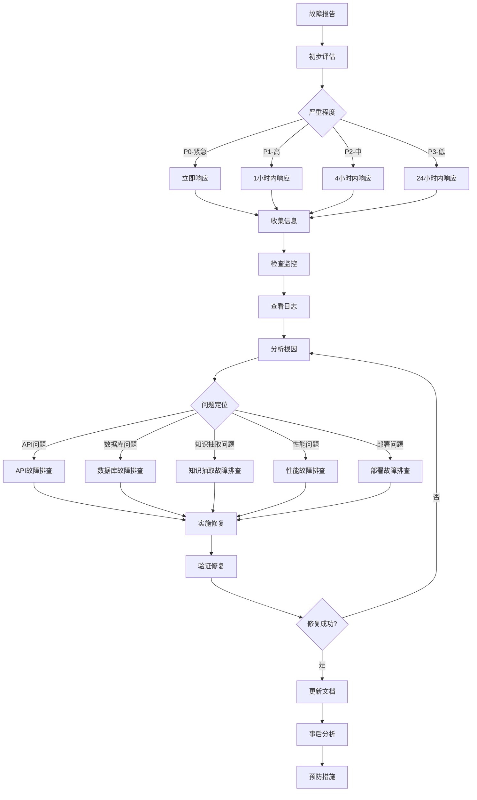

# GraphRAG 系统故障排查指南

## 概述

本文档提供GraphRAG系统的全面故障排查指南，帮助开发和运维人员快速定位和解决系统问题。

## 目录

1. [故障排查流程](#1-故障排查流程)
2. [常见问题分类](#2-常见问题分类)
3. [API相关问题](#3-api相关问题)
4. [数据库问题](#4-数据库问题)
5. [知识抽取问题](#5-知识抽取问题)
6. [性能问题](#6-性能问题)
7. [部署问题](#7-部署问题)
8. [监控和日志](#8-监控和日志)
9. [应急响应](#9-应急响应)
10. [预防措施](#10-预防措施)

## 1. 故障排查流程

### 1.1 故障排查架构图



### 1.2 故障分级标准

| 级别 | 描述 | 响应时间 | 示例 |
|------|------|----------|------|
| P0 | 系统完全不可用 | 立即 | 服务宕机、数据丢失 |
| P1 | 核心功能受影响 | 1小时 | API大量错误、数据库连接失败 |
| P2 | 部分功能异常 | 4小时 | 某些查询失败、性能下降 |
| P3 | 轻微问题 | 24小时 | 日志警告、非关键功能异常 |

### 1.3 故障排查检查清单

```python
# src/core/troubleshooting/checklist.py
"""
故障排查检查清单
系统化的故障排查步骤
"""

from typing import Dict, List, Any
from dataclasses import dataclass
from datetime import datetime
import logging

logger = logging.getLogger(__name__)

@dataclass
class ChecklistItem:
    """检查清单项"""
    name: str
    description: str
    command: str = None
    expected_result: str = None
    status: str = "pending"  # pending, passed, failed, skipped
    result: str = None
    timestamp: datetime = None

class TroubleshootingChecklist:
    """故障排查检查清单"""
    
    def __init__(self):
        self.items = []
        self.current_step = 0
        
    def add_item(self, name: str, description: str, command: str = None, expected_result: str = None):
        """添加检查项"""
        item = ChecklistItem(
            name=name,
            description=description,
            command=command,
            expected_result=expected_result
        )
        self.items.append(item)
    
    def execute_step(self, step_index: int = None) -> ChecklistItem:
        """执行检查步骤"""
        if step_index is None:
            step_index = self.current_step
            
        if step_index >= len(self.items):
            return None
            
        item = self.items[step_index]
        item.timestamp = datetime.utcnow()
        
        try:
            if item.command:
                # 这里可以集成实际的命令执行逻辑
                logger.info(f"Executing: {item.command}")
                # result = execute_command(item.command)
                # item.result = result
                # item.status = "passed" if check_result(result, item.expected_result) else "failed"
            else:
                item.status = "manual"  # 需要手动检查
                
        except Exception as e:
            item.status = "failed"
            item.result = str(e)
            logger.error(f"Check failed: {item.name} - {e}")
        
        if step_index == self.current_step:
            self.current_step += 1
            
        return item
    
    def get_summary(self) -> Dict[str, Any]:
        """获取检查摘要"""
        total = len(self.items)
        passed = sum(1 for item in self.items if item.status == "passed")
        failed = sum(1 for item in self.items if item.status == "failed")
        pending = sum(1 for item in self.items if item.status == "pending")
        
        return {
            'total': total,
            'passed': passed,
            'failed': failed,
            'pending': pending,
            'progress': f"{self.current_step}/{total}",
            'items': [
                {
                    'name': item.name,
                    'status': item.status,
                    'result': item.result,
                    'timestamp': item.timestamp.isoformat() if item.timestamp else None
                }
                for item in self.items
            ]
        }

def create_basic_checklist() -> TroubleshootingChecklist:
    """创建基础故障排查检查清单"""
    checklist = TroubleshootingChecklist()
    
    # 基础连通性检查
    checklist.add_item(
        "API服务状态",
        "检查API服务是否正常运行",
        "curl -f http://localhost:8000/health",
        "HTTP 200"
    )
    
    checklist.add_item(
        "PostgreSQL连接",
        "检查PostgreSQL数据库连接",
        "pg_isready -h localhost -p 5432",
        "accepting connections"
    )
    
    checklist.add_item(
        "Redis连接",
        "检查Redis缓存连接",
        "redis-cli ping",
        "PONG"
    )
    
    checklist.add_item(
        "Neo4j连接",
        "检查Neo4j图数据库连接",
        "cypher-shell -u neo4j -p password 'RETURN 1'",
        "1"
    )
    
    # 系统资源检查
    checklist.add_item(
        "CPU使用率",
        "检查系统CPU使用情况",
        "top -bn1 | grep 'Cpu(s)'",
        "< 80%"
    )
    
    checklist.add_item(
        "内存使用率",
        "检查系统内存使用情况",
        "free -m",
        "< 85%"
    )
    
    checklist.add_item(
        "磁盘空间",
        "检查磁盘空间使用情况",
        "df -h",
        "< 90%"
    )
    
    # 应用层检查
    checklist.add_item(
        "应用日志",
        "检查应用错误日志",
        "tail -n 100 /var/log/graphrag/app.log | grep ERROR",
        "无严重错误"
    )
    
    checklist.add_item(
        "数据库日志",
        "检查数据库错误日志",
        "tail -n 100 /var/log/postgresql/postgresql.log | grep ERROR",
        "无连接错误"
    )
    
    return checklist
```

## 2. 常见问题分类

### 2.1 问题分类矩阵

| 类别 | 子类别 | 常见症状 | 影响范围 |
|------|--------|----------|----------|
| API问题 | 连接失败 | 502/503错误 | 全部用户 |
| | 响应超时 | 请求超时 | 部分用户 |
| | 认证失败 | 401/403错误 | 特定用户 |
| 数据库问题 | 连接池耗尽 | 连接超时 | 全部功能 |
| | 查询性能 | 响应缓慢 | 特定查询 |
| | 数据不一致 | 结果异常 | 数据质量 |
| 知识抽取问题 | 处理失败 | 任务异常 | 文档处理 |
| | 结果质量 | 抽取错误 | 知识质量 |
| | 性能瓶颈 | 处理缓慢 | 处理效率 |

### 2.2 问题诊断工具

```python
# src/core/troubleshooting/diagnostic.py
"""
系统诊断工具
自动化问题检测和诊断
"""

import asyncio
import psutil
import logging
from typing import Dict, List, Any, Optional
from dataclasses import dataclass
from datetime import datetime, timedelta
import aiohttp
import redis
from sqlalchemy import text

logger = logging.getLogger(__name__)

@dataclass
class DiagnosticResult:
    """诊断结果"""
    component: str
    status: str  # healthy, warning, critical
    message: str
    details: Dict[str, Any]
    timestamp: datetime
    recommendations: List[str] = None

class SystemDiagnostic:
    """系统诊断器"""
    
    def __init__(self, config: Dict[str, Any]):
        self.config = config
        self.results = []
        
    async def run_full_diagnostic(self) -> List[DiagnosticResult]:
        """运行完整系统诊断"""
        self.results = []
        
        # 并行执行各项诊断
        tasks = [
            self.diagnose_api_health(),
            self.diagnose_database_health(),
            self.diagnose_system_resources(),
            self.diagnose_application_performance(),
            self.diagnose_network_connectivity()
        ]
        
        results = await asyncio.gather(*tasks, return_exceptions=True)
        
        for result in results:
            if isinstance(result, Exception):
                logger.error(f"Diagnostic failed: {result}")
            elif isinstance(result, list):
                self.results.extend(result)
            else:
                self.results.append(result)
        
        return self.results
    
    async def diagnose_api_health(self) -> List[DiagnosticResult]:
        """诊断API健康状态"""
        results = []
        api_config = self.config.get('api', {})
        base_url = api_config.get('base_url', 'http://localhost:8000')
        
        # 检查健康端点
        try:
            async with aiohttp.ClientSession() as session:
                async with session.get(f"{base_url}/health", timeout=10) as response:
                    if response.status == 200:
                        data = await response.json()
                        results.append(DiagnosticResult(
                            component="api_health",
                            status="healthy",
                            message="API health endpoint responding normally",
                            details=data,
                            timestamp=datetime.utcnow()
                        ))
                    else:
                        results.append(DiagnosticResult(
                            component="api_health",
                            status="critical",
                            message=f"API health endpoint returned {response.status}",
                            details={'status_code': response.status},
                            timestamp=datetime.utcnow(),
                            recommendations=["Check API server logs", "Restart API service"]
                        ))
        except Exception as e:
            results.append(DiagnosticResult(
                component="api_health",
                status="critical",
                message=f"Cannot connect to API: {str(e)}",
                details={'error': str(e)},
                timestamp=datetime.utcnow(),
                recommendations=["Check if API service is running", "Verify network connectivity"]
            ))
        
        # 检查API响应时间
        try:
            start_time = datetime.utcnow()
            async with aiohttp.ClientSession() as session:
                async with session.get(f"{base_url}/api/v1/documents", timeout=30) as response:
                    end_time = datetime.utcnow()
                    response_time = (end_time - start_time).total_seconds()
                    
                    if response_time < 2.0:
                        status = "healthy"
                        message = f"API response time is good: {response_time:.2f}s"
                        recommendations = None
                    elif response_time < 5.0:
                        status = "warning"
                        message = f"API response time is slow: {response_time:.2f}s"
                        recommendations = ["Check database performance", "Review API logs"]
                    else:
                        status = "critical"
                        message = f"API response time is very slow: {response_time:.2f}s"
                        recommendations = ["Check system resources", "Investigate database queries"]
                    
                    results.append(DiagnosticResult(
                        component="api_performance",
                        status=status,
                        message=message,
                        details={'response_time': response_time},
                        timestamp=datetime.utcnow(),
                        recommendations=recommendations
                    ))
        except Exception as e:
            results.append(DiagnosticResult(
                component="api_performance",
                status="critical",
                message=f"API performance test failed: {str(e)}",
                details={'error': str(e)},
                timestamp=datetime.utcnow(),
                recommendations=["Check API service status", "Review system resources"]
            ))
        
        return results
    
    async def diagnose_database_health(self) -> List[DiagnosticResult]:
        """诊断数据库健康状态"""
        results = []
        
        # PostgreSQL诊断
        try:
            from sqlalchemy.ext.asyncio import create_async_engine
            
            pg_config = self.config.get('postgresql', {})
            engine = create_async_engine(
                f"postgresql+asyncpg://{pg_config['username']}:{pg_config['password']}@{pg_config['host']}:{pg_config['port']}/{pg_config['database']}",
                pool_timeout=5
            )
            
            async with engine.begin() as conn:
                # 检查连接
                await conn.execute(text("SELECT 1"))
                
                # 检查活跃连接数
                result = await conn.execute(
                    text("SELECT count(*) FROM pg_stat_activity WHERE state = 'active'")
                )
                active_connections = result.scalar()
                
                # 检查慢查询
                slow_queries = await conn.execute(text("""
                    SELECT query, state, query_start, now() - query_start as duration
                    FROM pg_stat_activity 
                    WHERE state = 'active' AND now() - query_start > interval '30 seconds'
                    ORDER BY duration DESC
                    LIMIT 5
                """))
                slow_query_list = [dict(row) for row in slow_queries.fetchall()]
                
                # 检查数据库大小
                db_size_result = await conn.execute(
                    text("SELECT pg_size_pretty(pg_database_size(current_database()))")
                )
                db_size = db_size_result.scalar()
            
            await engine.dispose()
            
            # 评估PostgreSQL状态
            status = "healthy"
            recommendations = []
            
            if active_connections > 80:
                status = "warning"
                recommendations.append("High number of active connections")
            
            if slow_query_list:
                status = "warning"
                recommendations.append("Slow queries detected")
            
            results.append(DiagnosticResult(
                component="postgresql",
                status=status,
                message="PostgreSQL is accessible",
                details={
                    'active_connections': active_connections,
                    'database_size': db_size,
                    'slow_queries': slow_query_list
                },
                timestamp=datetime.utcnow(),
                recommendations=recommendations if recommendations else None
            ))
            
        except Exception as e:
            results.append(DiagnosticResult(
                component="postgresql",
                status="critical",
                message=f"PostgreSQL connection failed: {str(e)}",
                details={'error': str(e)},
                timestamp=datetime.utcnow(),
                recommendations=["Check PostgreSQL service", "Verify connection parameters"]
            ))
        
        # Redis诊断
        try:
            redis_config = self.config.get('redis', {})
            redis_client = redis.Redis(
                host=redis_config['host'],
                port=redis_config['port'],
                password=redis_config.get('password'),
                socket_timeout=5
            )
            
            # 检查连接
            redis_client.ping()
            
            # 获取Redis信息
            info = redis_client.info()
            
            # 检查内存使用
            used_memory = info.get('used_memory', 0)
            max_memory = info.get('maxmemory', 0)
            
            status = "healthy"
            recommendations = []
            
            if max_memory > 0:
                memory_usage_percent = (used_memory / max_memory) * 100
                if memory_usage_percent > 90:
                    status = "critical"
                    recommendations.append("Redis memory usage is very high")
                elif memory_usage_percent > 80:
                    status = "warning"
                    recommendations.append("Redis memory usage is high")
            
            redis_client.close()
            
            results.append(DiagnosticResult(
                component="redis",
                status=status,
                message="Redis is accessible",
                details={
                    'connected_clients': info.get('connected_clients', 0),
                    'used_memory_human': info.get('used_memory_human', '0B'),
                    'keyspace_hits': info.get('keyspace_hits', 0),
                    'keyspace_misses': info.get('keyspace_misses', 0)
                },
                timestamp=datetime.utcnow(),
                recommendations=recommendations if recommendations else None
            ))
            
        except Exception as e:
            results.append(DiagnosticResult(
                component="redis",
                status="critical",
                message=f"Redis connection failed: {str(e)}",
                details={'error': str(e)},
                timestamp=datetime.utcnow(),
                recommendations=["Check Redis service", "Verify Redis configuration"]
            ))
        
        return results
    
    async def diagnose_system_resources(self) -> List[DiagnosticResult]:
        """诊断系统资源"""
        results = []
        
        # CPU使用率
        cpu_percent = psutil.cpu_percent(interval=1)
        cpu_status = "healthy"
        cpu_recommendations = []
        
        if cpu_percent > 90:
            cpu_status = "critical"
            cpu_recommendations = ["CPU usage is very high", "Check for CPU-intensive processes"]
        elif cpu_percent > 80:
            cpu_status = "warning"
            cpu_recommendations = ["CPU usage is high"]
        
        results.append(DiagnosticResult(
            component="cpu",
            status=cpu_status,
            message=f"CPU usage: {cpu_percent}%",
            details={'cpu_percent': cpu_percent},
            timestamp=datetime.utcnow(),
            recommendations=cpu_recommendations if cpu_recommendations else None
        ))
        
        # 内存使用率
        memory = psutil.virtual_memory()
        memory_status = "healthy"
        memory_recommendations = []
        
        if memory.percent > 90:
            memory_status = "critical"
            memory_recommendations = ["Memory usage is very high", "Check for memory leaks"]
        elif memory.percent > 85:
            memory_status = "warning"
            memory_recommendations = ["Memory usage is high"]
        
        results.append(DiagnosticResult(
            component="memory",
            status=memory_status,
            message=f"Memory usage: {memory.percent}%",
            details={
                'percent': memory.percent,
                'available': memory.available,
                'used': memory.used,
                'total': memory.total
            },
            timestamp=datetime.utcnow(),
            recommendations=memory_recommendations if memory_recommendations else None
        ))
        
        # 磁盘使用率
        disk = psutil.disk_usage('/')
        disk_percent = (disk.used / disk.total) * 100
        disk_status = "healthy"
        disk_recommendations = []
        
        if disk_percent > 95:
            disk_status = "critical"
            disk_recommendations = ["Disk space is critically low", "Clean up old files"]
        elif disk_percent > 90:
            disk_status = "warning"
            disk_recommendations = ["Disk space is running low"]
        
        results.append(DiagnosticResult(
            component="disk",
            status=disk_status,
            message=f"Disk usage: {disk_percent:.1f}%",
            details={
                'percent': disk_percent,
                'free': disk.free,
                'used': disk.used,
                'total': disk.total
            },
            timestamp=datetime.utcnow(),
            recommendations=disk_recommendations if disk_recommendations else None
        ))
        
        return results
    
    async def diagnose_application_performance(self) -> List[DiagnosticResult]:
        """诊断应用性能"""
        results = []
        
        # 这里可以添加应用特定的性能诊断
        # 例如：任务队列长度、缓存命中率等
        
        return results
    
    async def diagnose_network_connectivity(self) -> List[DiagnosticResult]:
        """诊断网络连通性"""
        results = []
        
        # 这里可以添加网络连通性检查
        # 例如：外部API连通性、DNS解析等
        
        return results
    
    def generate_report(self) -> Dict[str, Any]:
        """生成诊断报告"""
        if not self.results:
            return {'error': 'No diagnostic results available'}
        
        # 统计各状态数量
        status_counts = {}
        for result in self.results:
            status_counts[result.status] = status_counts.get(result.status, 0) + 1
        
        # 获取关键问题
        critical_issues = [r for r in self.results if r.status == 'critical']
        warning_issues = [r for r in self.results if r.status == 'warning']
        
        # 生成整体健康评分
        total_components = len(self.results)
        healthy_components = status_counts.get('healthy', 0)
        health_score = (healthy_components / total_components) * 100 if total_components > 0 else 0
        
        return {
            'timestamp': datetime.utcnow().isoformat(),
            'health_score': round(health_score, 1),
            'status_summary': status_counts,
            'critical_issues': len(critical_issues),
            'warning_issues': len(warning_issues),
            'components': [
                {
                    'component': r.component,
                    'status': r.status,
                    'message': r.message,
                    'details': r.details,
                    'recommendations': r.recommendations,
                    'timestamp': r.timestamp.isoformat()
                }
                for r in self.results
            ],
            'recommendations': [
                rec for result in self.results 
                if result.recommendations 
                for rec in result.recommendations
            ]
        }
```

## 3. API相关问题

### 3.1 API连接问题

#### 症状
- 502 Bad Gateway
- 503 Service Unavailable
- Connection refused
- Timeout errors

#### 诊断步骤

```bash
# 1. 检查API服务状态
curl -I http://localhost:8000/health

# 2. 检查进程是否运行
ps aux | grep uvicorn

# 3. 检查端口占用
netstat -tlnp | grep :8000

# 4. 检查服务日志
tail -f /var/log/graphrag/api.log

# 5. 检查系统资源
top -p $(pgrep -f uvicorn)
```

#### 常见解决方案

```python
# src/core/troubleshooting/api_fixes.py
"""
API问题修复工具
"""

import asyncio
import subprocess
import logging
from typing import Dict, Any

logger = logging.getLogger(__name__)

class APITroubleshooter:
    """API故障排查器"""
    
    def __init__(self, config: Dict[str, Any]):
        self.config = config
        
    async def diagnose_connection_issues(self) -> Dict[str, Any]:
        """诊断连接问题"""
        results = {
            'service_running': False,
            'port_available': False,
            'process_healthy': False,
            'recommendations': []
        }
        
        # 检查服务是否运行
        try:
            result = subprocess.run(['pgrep', '-f', 'uvicorn'], 
                                  capture_output=True, text=True)
            if result.returncode == 0:
                results['service_running'] = True
                logger.info("API service is running")
            else:
                results['recommendations'].append("Start API service")
                logger.warning("API service is not running")
        except Exception as e:
            logger.error(f"Failed to check service status: {e}")
        
        # 检查端口
        try:
            result = subprocess.run(['netstat', '-tlnp'], 
                                  capture_output=True, text=True)
            if ':8000' in result.stdout:
                results['port_available'] = True
                logger.info("Port 8000 is in use")
            else:
                results['recommendations'].append("Check port configuration")
                logger.warning("Port 8000 is not in use")
        except Exception as e:
            logger.error(f"Failed to check port status: {e}")
        
        return results
    
    async def restart_service(self) -> bool:
        """重启API服务"""
        try:
            # 停止服务
            subprocess.run(['pkill', '-f', 'uvicorn'], check=False)
            await asyncio.sleep(2)
            
            # 启动服务
            subprocess.Popen([
                'uvicorn', 'src.main:app',
                '--host', '0.0.0.0',
                '--port', '8000',
                '--reload'
            ])
            
            # 等待服务启动
            await asyncio.sleep(5)
            
            # 验证服务状态
            result = subprocess.run(['pgrep', '-f', 'uvicorn'], 
                                  capture_output=True, text=True)
            return result.returncode == 0
            
        except Exception as e:
            logger.error(f"Failed to restart service: {e}")
            return False
```

### 3.2 API性能问题

#### 症状
- 响应时间过长
- 请求超时
- 高CPU/内存使用

#### 性能分析工具

```python
# src/core/troubleshooting/performance_analyzer.py
"""
API性能分析工具
"""

import time
import asyncio
import aiohttp
import statistics
from typing import List, Dict, Any
from dataclasses import dataclass

@dataclass
class PerformanceMetrics:
    """性能指标"""
    endpoint: str
    method: str
    response_times: List[float]
    success_rate: float
    error_count: int
    avg_response_time: float
    p95_response_time: float
    p99_response_time: float

class APIPerformanceAnalyzer:
    """API性能分析器"""
    
    def __init__(self, base_url: str):
        self.base_url = base_url
        
    async def analyze_endpoint_performance(self, 
                                         endpoint: str, 
                                         method: str = 'GET',
                                         requests_count: int = 100,
                                         concurrent_requests: int = 10) -> PerformanceMetrics:
        """分析端点性能"""
        
        semaphore = asyncio.Semaphore(concurrent_requests)
        response_times = []
        error_count = 0
        
        async def make_request():
            async with semaphore:
                start_time = time.time()
                try:
                    async with aiohttp.ClientSession() as session:
                        async with session.request(method, f"{self.base_url}{endpoint}") as response:
                            await response.read()
                            end_time = time.time()
                            response_times.append(end_time - start_time)
                            return response.status < 400
                except Exception:
                    nonlocal error_count
                    error_count += 1
                    return False
        
        # 执行并发请求
        tasks = [make_request() for _ in range(requests_count)]
        results = await asyncio.gather(*tasks)
        
        # 计算指标
        success_count = sum(results)
        success_rate = success_count / requests_count * 100
        
        if response_times:
            avg_response_time = statistics.mean(response_times)
            p95_response_time = statistics.quantiles(response_times, n=20)[18]  # 95th percentile
            p99_response_time = statistics.quantiles(response_times, n=100)[98]  # 99th percentile
        else:
            avg_response_time = p95_response_time = p99_response_time = 0
        
        return PerformanceMetrics(
            endpoint=endpoint,
            method=method,
            response_times=response_times,
            success_rate=success_rate,
            error_count=error_count,
            avg_response_time=avg_response_time,
            p95_response_time=p95_response_time,
            p99_response_time=p99_response_time
        )
    
    async def generate_performance_report(self, endpoints: List[str]) -> Dict[str, Any]:
        """生成性能报告"""
        results = {}
        
        for endpoint in endpoints:
            metrics = await self.analyze_endpoint_performance(endpoint)
            results[endpoint] = {
                'avg_response_time': round(metrics.avg_response_time, 3),
                'p95_response_time': round(metrics.p95_response_time, 3),
                'p99_response_time': round(metrics.p99_response_time, 3),
                'success_rate': round(metrics.success_rate, 2),
                'error_count': metrics.error_count,
                'recommendations': self._get_performance_recommendations(metrics)
            }
        
        return results
    
    def _get_performance_recommendations(self, metrics: PerformanceMetrics) -> List[str]:
        """获取性能优化建议"""
        recommendations = []
        
        if metrics.avg_response_time > 2.0:
            recommendations.append("Average response time is high - consider optimization")
        
        if metrics.p95_response_time > 5.0:
            recommendations.append("95th percentile response time is very high")
        
        if metrics.success_rate < 95:
            recommendations.append("Success rate is low - investigate errors")
        
        if metrics.error_count > 0:
            recommendations.append("Errors detected - check application logs")
        
        return recommendations
```

## 4. 数据库问题

### 4.1 PostgreSQL问题

#### 连接池耗尽

```sql
-- 检查当前连接数
SELECT count(*) as total_connections FROM pg_stat_activity;

-- 检查活跃连接
SELECT count(*) as active_connections 
FROM pg_stat_activity 
WHERE state = 'active';

-- 检查长时间运行的查询
SELECT pid, now() - pg_stat_activity.query_start AS duration, query 
FROM pg_stat_activity 
WHERE (now() - pg_stat_activity.query_start) > interval '5 minutes'
ORDER BY duration DESC;

-- 终止长时间运行的查询
SELECT pg_terminate_backend(pid) 
FROM pg_stat_activity 
WHERE (now() - pg_stat_activity.query_start) > interval '10 minutes'
AND state = 'active';
```

#### 性能问题诊断

```python
# src/core/troubleshooting/db_analyzer.py
"""
数据库性能分析工具
"""

import asyncio
from sqlalchemy import text
from sqlalchemy.ext.asyncio import AsyncSession
from typing import Dict, List, Any

class DatabaseAnalyzer:
    """数据库分析器"""
    
    def __init__(self, session: AsyncSession):
        self.session = session
    
    async def analyze_slow_queries(self, min_duration_seconds: int = 1) -> List[Dict[str, Any]]:
        """分析慢查询"""
        query = text("""
            SELECT 
                query,
                calls,
                total_time,
                mean_time,
                rows,
                100.0 * shared_blks_hit / nullif(shared_blks_hit + shared_blks_read, 0) AS hit_percent
            FROM pg_stat_statements 
            WHERE mean_time > :min_duration * 1000
            ORDER BY mean_time DESC 
            LIMIT 20
        """)
        
        result = await self.session.execute(query, {'min_duration': min_duration_seconds})
        return [dict(row) for row in result.fetchall()]
    
    async def analyze_table_sizes(self) -> List[Dict[str, Any]]:
        """分析表大小"""
        query = text("""
            SELECT 
                schemaname,
                tablename,
                pg_size_pretty(pg_total_relation_size(schemaname||'.'||tablename)) as size,
                pg_total_relation_size(schemaname||'.'||tablename) as size_bytes
            FROM pg_tables 
            WHERE schemaname = 'public'
            ORDER BY pg_total_relation_size(schemaname||'.'||tablename) DESC
        """)
        
        result = await self.session.execute(query)
        return [dict(row) for row in result.fetchall()]
    
    async def analyze_index_usage(self) -> List[Dict[str, Any]]:
        """分析索引使用情况"""
        query = text("""
            SELECT 
                schemaname,
                tablename,
                indexname,
                idx_tup_read,
                idx_tup_fetch,
                idx_scan,
                pg_size_pretty(pg_relation_size(indexrelid)) as size
            FROM pg_stat_user_indexes 
            ORDER BY idx_scan ASC
        """)
        
        result = await self.session.execute(query)
        return [dict(row) for row in result.fetchall()]
    
    async def check_database_health(self) -> Dict[str, Any]:
        """检查数据库健康状态"""
        health_info = {}
        
        # 连接数统计
        conn_query = text("""
            SELECT 
                count(*) as total_connections,
                count(*) FILTER (WHERE state = 'active') as active_connections,
                count(*) FILTER (WHERE state = 'idle') as idle_connections
            FROM pg_stat_activity
        """)
        result = await self.session.execute(conn_query)
        health_info['connections'] = dict(result.fetchone())
        
        # 数据库大小
        size_query = text("SELECT pg_size_pretty(pg_database_size(current_database())) as db_size")
        result = await self.session.execute(size_query)
        health_info['database_size'] = result.scalar()
        
        # 缓存命中率
        cache_query = text("""
            SELECT 
                sum(heap_blks_read) as heap_read,
                sum(heap_blks_hit) as heap_hit,
                sum(heap_blks_hit) / (sum(heap_blks_hit) + sum(heap_blks_read)) * 100 as cache_hit_ratio
            FROM pg_statio_user_tables
        """)
        result = await self.session.execute(cache_query)
        cache_stats = result.fetchone()
        if cache_stats:
            health_info['cache_hit_ratio'] = float(cache_stats.cache_hit_ratio or 0)
        
        return health_info
```

### 4.2 Neo4j问题

#### 连接和性能问题

```python
# src/core/troubleshooting/neo4j_analyzer.py
"""
Neo4j分析工具
"""

from neo4j import AsyncGraphDatabase
from typing import Dict, List, Any

class Neo4jAnalyzer:
    """Neo4j分析器"""
    
    def __init__(self, uri: str, username: str, password: str):
        self.driver = AsyncGraphDatabase.driver(uri, auth=(username, password))
    
    async def check_connection(self) -> bool:
        """检查连接"""
        try:
            async with self.driver.session() as session:
                result = await session.run("RETURN 1 as test")
                record = await result.single()
                return record['test'] == 1
        except Exception:
            return False
    
    async def analyze_database_stats(self) -> Dict[str, Any]:
        """分析数据库统计信息"""
        async with self.driver.session() as session:
            # 节点统计
            node_result = await session.run("MATCH (n) RETURN count(n) as node_count")
            node_count = (await node_result.single())['node_count']
            
            # 关系统计
            rel_result = await session.run("MATCH ()-[r]->() RETURN count(r) as rel_count")
            rel_count = (await rel_result.single())['rel_count']
            
            # 标签统计
            label_result = await session.run("""
                CALL db.labels() YIELD label
                CALL apoc.cypher.run('MATCH (n:' + label + ') RETURN count(n) as count', {}) YIELD value
                RETURN label, value.count as count
                ORDER BY count DESC
            """)
            labels = [dict(record) async for record in label_result]
            
            # 关系类型统计
            rel_type_result = await session.run("""
                CALL db.relationshipTypes() YIELD relationshipType
                CALL apoc.cypher.run('MATCH ()-[r:' + relationshipType + ']->() RETURN count(r) as count', {}) YIELD value
                RETURN relationshipType, value.count as count
                ORDER BY count DESC
            """)
            rel_types = [dict(record) async for record in rel_type_result]
            
            return {
                'node_count': node_count,
                'relationship_count': rel_count,
                'labels': labels,
                'relationship_types': rel_types
            }
    
    async def analyze_slow_queries(self) -> List[Dict[str, Any]]:
        """分析慢查询"""
        async with self.driver.session() as session:
            result = await session.run("""
                CALL dbms.listQueries() 
                YIELD queryId, query, elapsedTimeMillis, status
                WHERE elapsedTimeMillis > 1000
                RETURN queryId, query, elapsedTimeMillis, status
                ORDER BY elapsedTimeMillis DESC
            """)
            
            return [dict(record) async for record in result]
    
    async def close(self):
        """关闭连接"""
        await self.driver.close()
```

## 5. 知识抽取问题

### 5.1 文档处理失败

#### 常见问题和解决方案

```python
# src/core/troubleshooting/extraction_analyzer.py
"""
知识抽取问题分析工具
"""

import logging
from typing import Dict, List, Any, Optional
from datetime import datetime, timedelta
from sqlalchemy import text
from sqlalchemy.ext.asyncio import AsyncSession

logger = logging.getLogger(__name__)

class ExtractionAnalyzer:
    """知识抽取分析器"""
    
    def __init__(self, session: AsyncSession):
        self.session = session
    
    async def analyze_processing_failures(self, hours: int = 24) -> Dict[str, Any]:
        """分析处理失败情况"""
        cutoff_time = datetime.utcnow() - timedelta(hours=hours)
        
        # 查询失败的文档
        failed_query = text("""
            SELECT 
                id,
                filename,
                file_type,
                status,
                error_message,
                created_at,
                updated_at
            FROM documents 
            WHERE status = 'failed' 
            AND updated_at > :cutoff_time
            ORDER BY updated_at DESC
        """)
        
        result = await self.session.execute(failed_query, {'cutoff_time': cutoff_time})
        failed_docs = [dict(row) for row in result.fetchall()]
        
        # 统计失败原因
        error_stats = {}
        for doc in failed_docs:
            error_msg = doc.get('error_message', 'Unknown error')
            error_type = self._categorize_error(error_msg)
            error_stats[error_type] = error_stats.get(error_type, 0) + 1
        
        # 查询处理统计
        stats_query = text("""
            SELECT 
                status,
                count(*) as count
            FROM documents 
            WHERE updated_at > :cutoff_time
            GROUP BY status
        """)
        
        result = await self.session.execute(stats_query, {'cutoff_time': cutoff_time})
        status_stats = {row.status: row.count for row in result.fetchall()}
        
        return {
            'period_hours': hours,
            'failed_documents': failed_docs,
            'error_statistics': error_stats,
            'status_statistics': status_stats,
            'recommendations': self._get_failure_recommendations(error_stats)
        }
    
    def _categorize_error(self, error_message: str) -> str:
        """分类错误信息"""
        error_msg_lower = error_message.lower()
        
        if 'timeout' in error_msg_lower:
            return 'timeout'
        elif 'memory' in error_msg_lower or 'oom' in error_msg_lower:
            return 'memory_error'
        elif 'format' in error_msg_lower or 'parse' in error_msg_lower:
            return 'format_error'
        elif 'permission' in error_msg_lower or 'access' in error_msg_lower:
            return 'permission_error'
        elif 'network' in error_msg_lower or 'connection' in error_msg_lower:
            return 'network_error'
        else:
            return 'unknown_error'
    
    def _get_failure_recommendations(self, error_stats: Dict[str, int]) -> List[str]:
        """获取失败处理建议"""
        recommendations = []
        
        if error_stats.get('timeout', 0) > 0:
            recommendations.append("Increase processing timeout for large documents")
        
        if error_stats.get('memory_error', 0) > 0:
            recommendations.append("Increase memory allocation or process documents in smaller chunks")
        
        if error_stats.get('format_error', 0) > 0:
            recommendations.append("Improve document format validation and error handling")
        
        if error_stats.get('permission_error', 0) > 0:
            recommendations.append("Check file permissions and access rights")
        
        if error_stats.get('network_error', 0) > 0:
            recommendations.append("Check network connectivity and external service availability")
        
        return recommendations
    
    async def analyze_extraction_quality(self) -> Dict[str, Any]:
        """分析抽取质量"""
        # 查询最近的抽取结果
        quality_query = text("""
            SELECT 
                d.id,
                d.filename,
                d.file_type,
                count(DISTINCT e.id) as entity_count,
                count(DISTINCT r.id) as relation_count,
                d.created_at
            FROM documents d
            LEFT JOIN entities e ON d.id = e.document_id
            LEFT JOIN relations r ON d.id = r.document_id
            WHERE d.status = 'completed'
            AND d.created_at > NOW() - INTERVAL '7 days'
            GROUP BY d.id, d.filename, d.file_type, d.created_at
            ORDER BY d.created_at DESC
            LIMIT 100
        """)
        
        result = await self.session.execute(quality_query)
        extraction_results = [dict(row) for row in result.fetchall()]
        
        # 计算质量指标
        if extraction_results:
            entity_counts = [r['entity_count'] for r in extraction_results]
            relation_counts = [r['relation_count'] for r in extraction_results]
            
            avg_entities = sum(entity_counts) / len(entity_counts)
            avg_relations = sum(relation_counts) / len(relation_counts)
            
            # 检查异常值
            low_entity_docs = [r for r in extraction_results if r['entity_count'] < avg_entities * 0.5]
            low_relation_docs = [r for r in extraction_results if r['relation_count'] < avg_relations * 0.5]
        else:
            avg_entities = avg_relations = 0
            low_entity_docs = low_relation_docs = []
        
        return {
            'total_documents': len(extraction_results),
            'average_entities_per_doc': round(avg_entities, 2),
            'average_relations_per_doc': round(avg_relations, 2),
            'low_entity_documents': len(low_entity_docs),
            'low_relation_documents': len(low_relation_docs),
            'quality_issues': low_entity_docs + low_relation_docs
        }
```

### 5.2 抽取质量问题

#### 质量监控和改进

```python
# src/core/troubleshooting/quality_monitor.py
"""
抽取质量监控工具
"""

from typing import Dict, List, Any
import statistics
from sqlalchemy import text
from sqlalchemy.ext.asyncio import AsyncSession

class QualityMonitor:
    """质量监控器"""
    
    def __init__(self, session: AsyncSession):
        self.session = session
    
    async def monitor_entity_quality(self) -> Dict[str, Any]:
        """监控实体质量"""
        # 查询实体统计
        entity_query = text("""
            SELECT 
                entity_type,
                count(*) as count,
                avg(confidence_score) as avg_confidence
            FROM entities 
            WHERE created_at > NOW() - INTERVAL '7 days'
            GROUP BY entity_type
            ORDER BY count DESC
        """)
        
        result = await self.session.execute(entity_query)
        entity_stats = [dict(row) for row in result.fetchall()]
        
        # 查询低置信度实体
        low_confidence_query = text("""
            SELECT 
                id,
                name,
                entity_type,
                confidence_score,
                document_id
            FROM entities 
            WHERE confidence_score < 0.7
            AND created_at > NOW() - INTERVAL '7 days'
            ORDER BY confidence_score ASC
            LIMIT 20
        """)
        
        result = await self.session.execute(low_confidence_query)
        low_confidence_entities = [dict(row) for row in result.fetchall()]
        
        return {
            'entity_type_stats': entity_stats,
            'low_confidence_entities': low_confidence_entities,
            'recommendations': self._get_entity_quality_recommendations(entity_stats, low_confidence_entities)
        }
    
    async def monitor_relation_quality(self) -> Dict[str, Any]:
        """监控关系质量"""
        # 查询关系统计
        relation_query = text("""
            SELECT 
                relation_type,
                count(*) as count,
                avg(confidence_score) as avg_confidence
            FROM relations 
            WHERE created_at > NOW() - INTERVAL '7 days'
            GROUP BY relation_type
            ORDER BY count DESC
        """)
        
        result = await self.session.execute(relation_query)
        relation_stats = [dict(row) for row in result.fetchall()]
        
        return {
            'relation_type_stats': relation_stats,
            'recommendations': self._get_relation_quality_recommendations(relation_stats)
        }
    
    def _get_entity_quality_recommendations(self, 
                                         entity_stats: List[Dict], 
                                         low_confidence_entities: List[Dict]) -> List[str]:
        """获取实体质量改进建议"""
        recommendations = []
        
        if low_confidence_entities:
            recommendations.append(f"Found {len(low_confidence_entities)} low confidence entities - review extraction model")
        
        # 检查实体类型分布
        if entity_stats:
            total_entities = sum(stat['count'] for stat in entity_stats)
            for stat in entity_stats:
                percentage = (stat['count'] / total_entities) * 100
                if percentage > 50:
                    recommendations.append(f"Entity type '{stat['entity_type']}' dominates ({percentage:.1f}%) - check for over-extraction")
        
        return recommendations
    
    def _get_relation_quality_recommendations(self, relation_stats: List[Dict]) -> List[str]:
        """获取关系质量改进建议"""
        recommendations = []
        
        if relation_stats:
            avg_confidences = [stat['avg_confidence'] for stat in relation_stats if stat['avg_confidence']]
            if avg_confidences:
                overall_avg = statistics.mean(avg_confidences)
                if overall_avg < 0.8:
                    recommendations.append(f"Overall relation confidence is low ({overall_avg:.2f}) - consider model retraining")
        
        return recommendations
```

继续编写故障排查文档的其余部分...