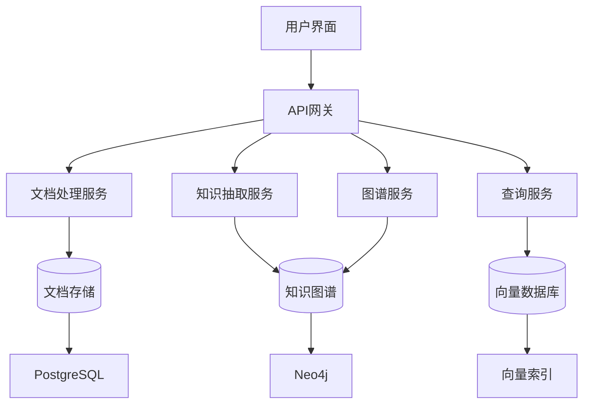
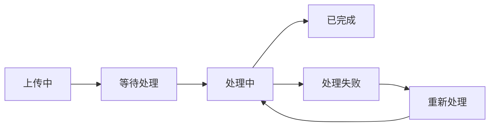
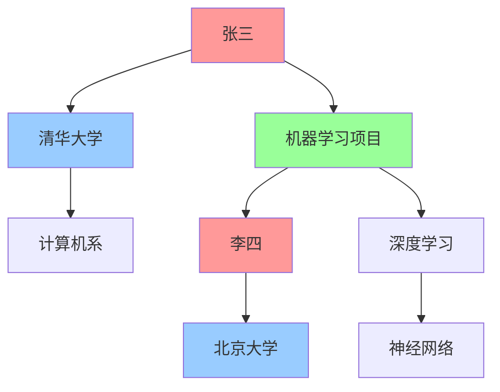
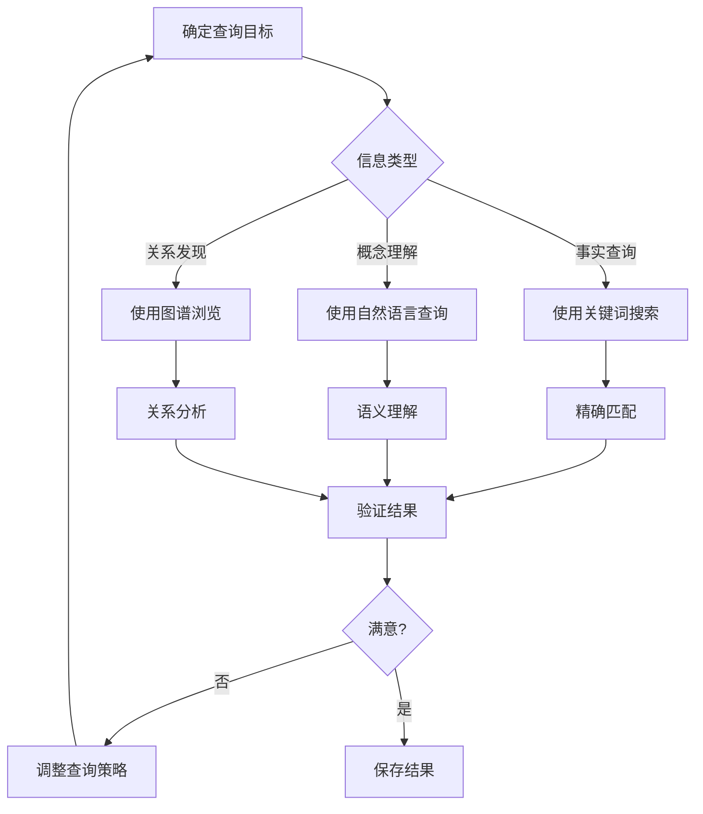

# GraphRAG 系统用户使用指南

## 概述

GraphRAG是一个基于知识图谱的检索增强生成系统，能够从文档中自动抽取实体、关系和断言，构建知识图谱，并提供智能问答和知识查询功能。本指南将帮助您快速上手并充分利用系统的各项功能。

## 目录

1. [快速开始](#1-快速开始)
2. [系统界面介绍](#2-系统界面介绍)
3. [文档管理](#3-文档管理)
4. [知识查询](#4-知识查询)
5. [知识图谱浏览](#5-知识图谱浏览)
6. [高级功能](#6-高级功能)
7. [最佳实践](#7-最佳实践)
8. [常见问题](#8-常见问题)
9. [技巧和窍门](#9-技巧和窍门)

## 1. 快速开始

### 1.1 系统访问

1. **打开浏览器**，访问系统地址：`http://localhost:8000`
2. **登录系统**：
   - 用户名：您的邮箱地址
   - 密码：系统分配的密码
3. **首次登录**建议修改密码并完善个人信息

### 1.2 五分钟快速体验

#### 步骤1：上传第一个文档


1. 点击左侧菜单"文档管理"
2. 点击"上传文档"按钮
3. 选择一个PDF或Word文档（建议选择包含人名、机构名的学术论文或报告）
4. 填写文档标题和描述
5. 点击"上传"按钮
6. 等待系统处理（通常需要1-5分钟）

#### 步骤2：进行第一次查询

1. 文档处理完成后，点击"知识查询"
2. 在搜索框中输入问题，例如：
   - "这篇文档的主要作者是谁？"
   - "文档中提到了哪些机构？"
   - "主要研究内容是什么？"
3. 点击"搜索"按钮查看结果

#### 步骤3：浏览知识图谱

1. 点击"知识图谱"菜单
2. 在搜索框中输入实体名称（如人名或机构名）
3. 查看实体之间的关系网络
4. 点击节点查看详细信息

### 1.3 系统架构概览



## 2. 系统界面介绍

### 2.1 主界面布局

```
┌─────────────────────────────────────────────────────────────┐
│  GraphRAG 知识管理系统                    [用户] [设置] [退出] │
├─────────────┬───────────────────────────────────────────────┤
│             │                                               │
│  导航菜单    │              主内容区域                        │
│             │                                               │
│ • 仪表板     │                                               │
│ • 文档管理   │                                               │
│ • 知识查询   │                                               │
│ • 知识图谱   │                                               │
│ • 实体管理   │                                               │
│ • 系统设置   │                                               │
│             │                                               │
└─────────────┴───────────────────────────────────────────────┘
```

### 2.2 功能模块说明

| 模块 | 功能描述 | 主要操作 |
|------|----------|----------|
| 仪表板 | 系统概览和统计信息 | 查看系统状态、处理进度 |
| 文档管理 | 文档上传、管理、查看 | 上传、删除、重新处理文档 |
| 知识查询 | 智能问答和搜索 | 自然语言查询、关键词搜索 |
| 知识图谱 | 图谱可视化和浏览 | 查看实体关系、图谱导航 |
| 实体管理 | 实体和关系管理 | 编辑实体信息、管理关系 |
| 系统设置 | 系统配置和用户管理 | 修改设置、用户权限管理 |

## 3. 文档管理

### 3.1 支持的文档格式

| 格式 | 扩展名 | 说明 | 推荐使用场景 |
|------|--------|------|-------------|
| PDF | .pdf | 最常用格式 | 学术论文、报告、书籍 |
| Word | .docx, .doc | 微软文档 | 内部文档、草稿 |
| 纯文本 | .txt | 简单文本 | 代码、日志、简单笔记 |
| Markdown | .md | 标记语言 | 技术文档、博客文章 |
| HTML | .html | 网页格式 | 网页内容、在线文档 |
| 图片 | .jpg, .png | OCR识别 | 扫描文档、图片中的文字 |

### 3.2 文档上传流程

#### 单文档上传

1. **选择文档**
   - 点击"选择文件"按钮
   - 支持拖拽上传
   - 文件大小限制：100MB

2. **填写元数据**
   ```
   标题：[必填] 文档的标题
   描述：[可选] 文档的简要描述
   标签：[可选] 用逗号分隔的标签，如：AI,机器学习,深度学习
   来源：[可选] 文档来源信息
   作者：[可选] 文档作者
   发布日期：[可选] 文档发布日期
   ```

3. **上传设置**
   - 处理优先级：高/中/低
   - 抽取选项：
     - ☑ 抽取实体
     - ☑ 抽取关系
     - ☑ 生成摘要
     - ☑ 创建向量索引

#### 批量上传

1. **选择多个文件**
   - 支持同时选择多个文件
   - 最多50个文件
   - 总大小不超过1GB

2. **批量设置**
   - 批次名称：为这批文档命名
   - 统一标签：应用到所有文档的标签
   - 处理策略：并行/串行处理

### 3.3 文档处理状态



| 状态 | 说明 | 可执行操作 |
|------|------|------------|
| 上传中 | 文件正在上传 | 取消上传 |
| 等待处理 | 在处理队列中等待 | 取消处理、修改优先级 |
| 处理中 | 正在进行知识抽取 | 查看进度 |
| 已完成 | 处理成功完成 | 查看结果、重新处理、删除 |
| 处理失败 | 处理过程中出错 | 查看错误信息、重新处理 |

### 3.4 文档查看和管理

#### 文档列表视图

```
┌─────────────────────────────────────────────────────────────┐
│ 文档管理                                    [上传] [批量操作] │
├─────────────────────────────────────────────────────────────┤
│ 🔍 搜索: [________________] 状态:[全部▼] 类型:[全部▼] 排序:[时间▼] │
├─────────────────────────────────────────────────────────────┤
│ ☐ 📄 研究报告.pdf        已完成  2024-01-01  1.2MB  [查看][编辑] │
│ ☐ 📄 技术文档.docx       处理中  2024-01-01  0.8MB  [查看][取消] │
│ ☐ 📄 会议纪要.txt        已完成  2024-01-01  0.1MB  [查看][编辑] │
└─────────────────────────────────────────────────────────────┘
```

#### 文档详情页面

```
┌─────────────────────────────────────────────────────────────┐
│ 📄 研究报告.pdf                              [编辑] [删除] [下载] │
├─────────────────────────────────────────────────────────────┤
│ 基本信息                                                     │
│ • 文件大小: 1.2MB                                           │
│ • 上传时间: 2024-01-01 10:00:00                            │
│ • 处理时间: 2024-01-01 10:05:00                            │
│ • 页数: 25页                                               │
│ • 字数: 8,500字                                            │
│                                                            │
│ 抽取结果                                                     │
│ • 实体数量: 45个                                            │
│ • 关系数量: 28个                                            │
│ • 文本块数量: 120个                                         │
│                                                            │
│ 标签: AI, 机器学习, 深度学习                                  │
└─────────────────────────────────────────────────────────────┘
```

## 4. 知识查询

### 4.1 查询类型

#### 自然语言查询

最智能的查询方式，支持复杂的自然语言问题。

**示例问题：**
- "张三在哪个机构工作？"
- "这篇文档的主要研究内容是什么？"
- "有哪些人参与了AI项目？"
- "深度学习和机器学习有什么关系？"

**查询界面：**
```
┌─────────────────────────────────────────────────────────────┐
│ 🤖 智能问答                                                  │
├─────────────────────────────────────────────────────────────┤
│ 请输入您的问题：                                              │
│ ┌─────────────────────────────────────────────────────────┐ │
│ │ 张三在哪个机构工作？                                      │ │
│ └─────────────────────────────────────────────────────────┘ │
│                                              [🔍 搜索] │
│                                                            │
│ 高级选项：                                                   │
│ • 最大结果数: [10▼]                                         │
│ • 相似度阈值: [0.7____]                                     │
│ • 搜索范围: [全部文档▼]                                      │
└─────────────────────────────────────────────────────────────┘
```

#### 关键词搜索

传统的关键词匹配搜索，适合精确查找。

**使用技巧：**
- 使用引号进行精确匹配：`"机器学习"`
- 使用AND/OR连接词：`深度学习 AND 神经网络`
- 使用通配符：`机器*` 匹配"机器学习"、"机器视觉"等
- 排除关键词：`AI -人工智能`

#### 语义搜索

基于向量相似度的搜索，能找到语义相关的内容。

**适用场景：**
- 查找相似概念
- 发现隐含关系
- 跨语言搜索（如果支持）

### 4.2 搜索结果解读

#### 结果列表

```
┌─────────────────────────────────────────────────────────────┐
│ 搜索结果 (共找到 15 条结果，用时 0.23 秒)                      │
├─────────────────────────────────────────────────────────────┤
│ 📄 研究报告.pdf | 相似度: 95% | 页码: 3                      │
│ 张三教授在清华大学计算机系工作，主要研究方向为机器学习和...     │
│ [查看原文] [相关实体] [添加到收藏]                            │
├─────────────────────────────────────────────────────────────┤
│ 📄 技术文档.docx | 相似度: 87% | 页码: 1                     │
│ 根据最新信息，张三博士已加入清华大学人工智能研究院...          │
│ [查看原文] [相关实体] [添加到收藏]                            │
└─────────────────────────────────────────────────────────────┘
```

#### 结果详情

点击搜索结果可查看详细信息：

```
┌─────────────────────────────────────────────────────────────┐
│ 📄 研究报告.pdf - 第3页                                      │
├─────────────────────────────────────────────────────────────┤
│ 原文内容：                                                   │
│ 张三教授在清华大学计算机系工作，主要研究方向为机器学习和深度   │
│ 学习。他领导的研究团队在图像识别领域取得了重要突破...         │
│                                                            │
│ 相关实体：                                                   │
│ • 👤 张三 (人物) - 置信度: 95%                              │
│ • 🏢 清华大学 (机构) - 置信度: 98%                          │
│ • 💡 机器学习 (概念) - 置信度: 92%                          │
│                                                            │
│ 相关关系：                                                   │
│ • 张三 → 工作于 → 清华大学                                   │
│ • 张三 → 研究 → 机器学习                                     │
└─────────────────────────────────────────────────────────────┘
```

### 4.3 高级查询功能

#### 过滤器

```
文档过滤：
☐ 按文档类型: [PDF] [Word] [文本]
☐ 按上传时间: [最近一周] [最近一月] [自定义]
☐ 按标签: [AI] [机器学习] [深度学习]
☐ 按作者: [张三] [李四]

结果过滤：
☐ 最小相似度: [0.7____]
☐ 实体类型: [人物] [机构] [概念]
☐ 关系类型: [工作于] [研究] [合作]
```

#### 查询历史

系统自动保存查询历史，方便重复使用：

```
┌─────────────────────────────────────────────────────────────┐
│ 📚 查询历史                                                  │
├─────────────────────────────────────────────────────────────┤
│ 🕐 2024-01-01 10:30  "张三在哪个机构工作？"          [重新搜索] │
│ 🕐 2024-01-01 10:25  "深度学习的应用领域"            [重新搜索] │
│ 🕐 2024-01-01 10:20  "AI 研究团队"                  [重新搜索] │
└─────────────────────────────────────────────────────────────┘
```

## 5. 知识图谱浏览

### 5.1 图谱可视化界面



#### 图谱导航工具

```
┌─────────────────────────────────────────────────────────────┐
│ 🕸️ 知识图谱                                [🔍] [⚙️] [📊] [💾] │
├─────────────────────────────────────────────────────────────┤
│ 搜索实体: [张三_______________] [搜索]                        │
│                                                            │
│ 图谱控制:                                                   │
│ • 缩放: [➖] [🎯] [➕]                                      │
│ • 布局: [力导向▼] [层次▼] [圆形▼]                           │
│ • 过滤: [显示全部▼]                                         │
│                                                            │
│ 图例:                                                       │
│ • 🔴 人物  🔵 机构  🟢 概念  🟡 事件                        │
│ • ── 工作于  ⋯⋯ 合作  ═══ 研究                            │
└─────────────────────────────────────────────────────────────┘
```

### 5.2 实体详情查看

点击图谱中的节点查看实体详情：

```
┌─────────────────────────────────────────────────────────────┐
│ 👤 张三                                          [编辑] [删除] │
├─────────────────────────────────────────────────────────────┤
│ 基本信息:                                                    │
│ • 类型: 人物                                                │
│ • 置信度: 95%                                               │
│ • 首次发现: 2024-01-01                                      │
│ • 最后更新: 2024-01-01                                      │
│                                                            │
│ 属性信息:                                                    │
│ • 职位: 教授                                                │
│ • 专业: 计算机科学                                           │
│ • 研究方向: 机器学习, 深度学习                               │
│                                                            │
│ 关系网络: (共 8 个关系)                                      │
│ • 工作于 → 清华大学                                          │
│ • 研究 → 机器学习                                           │
│ • 合作 → 李四                                               │
│                                                            │
│ 出现文档: (共 3 个文档)                                      │
│ • 📄 研究报告.pdf (5次提及)                                  │
│ • 📄 会议纪要.txt (2次提及)                                  │
└─────────────────────────────────────────────────────────────┘
```

### 5.3 图谱分析功能

#### 路径查询

查找两个实体之间的关系路径：

```
┌─────────────────────────────────────────────────────────────┐
│ 🛤️ 路径查询                                                  │
├─────────────────────────────────────────────────────────────┤
│ 起始实体: [张三_____________] [选择]                          │
│ 目标实体: [李四_____________] [选择]                          │
│ 最大深度: [3▼]                                              │
│ 关系类型: [全部▼]                                           │
│                                              [查找路径] │
│                                                            │
│ 查询结果:                                                    │
│ 路径1: 张三 → 合作 → 机器学习项目 → 合作 → 李四                │
│ 路径2: 张三 → 工作于 → 清华大学 → 合作 → 北京大学 → 工作于 → 李四 │
└─────────────────────────────────────────────────────────────┘
```

#### 社区发现

识别图谱中的社区结构：

```
发现的社区:
🟦 学术机构社区 (15个节点)
   • 清华大学、北京大学、中科院...
   
🟩 研究领域社区 (23个节点)  
   • 机器学习、深度学习、神经网络...
   
🟨 研究人员社区 (18个节点)
   • 张三、李四、王五...
```

## 6. 高级功能

### 6.1 实体管理

#### 实体编辑

```
┌─────────────────────────────────────────────────────────────┐
│ ✏️ 编辑实体: 张三                                             │
├─────────────────────────────────────────────────────────────┤
│ 基本信息:                                                    │
│ 名称: [张三________________]                                 │
│ 类型: [人物▼]                                               │
│ 别名: [张教授, Prof. Zhang]                                  │
│                                                            │
│ 属性信息:                                                    │
│ 职位: [教授________________]                                 │
│ 机构: [清华大学_____________]                                │
│ 专业: [计算机科学___________]                                │
│ 邮箱: [zhang@tsinghua.edu.cn]                              │
│                                                            │
│ 描述:                                                       │
│ ┌─────────────────────────────────────────────────────────┐ │
│ │ 张三教授是清华大学计算机系的知名学者，主要研究机器学习...   │ │
│ └─────────────────────────────────────────────────────────┘ │
│                                              [保存] [取消] │
└─────────────────────────────────────────────────────────────┘
```

#### 实体合并

当发现重复实体时，可以进行合并：

```
┌─────────────────────────────────────────────────────────────┐
│ 🔗 实体合并                                                  │
├─────────────────────────────────────────────────────────────┤
│ 主实体: 👤 张三 (ID: entity_123)                             │
│ 待合并: 👤 张教授 (ID: entity_456)                           │
│                                                            │
│ 合并策略:                                                    │
│ ☑ 保留所有属性                                              │
│ ☑ 合并别名列表                                              │
│ ☑ 保留所有关系                                              │
│ ☑ 合并文档引用                                              │
│                                                            │
│ 预览结果:                                                    │
│ • 名称: 张三                                                │
│ • 别名: 张教授, Prof. Zhang                                  │
│ • 关系数: 12 (原8个 + 新4个)                                │
│                                              [确认合并] [取消] │
└─────────────────────────────────────────────────────────────┘
```

### 6.2 关系管理

#### 关系编辑

```
┌─────────────────────────────────────────────────────────────┐
│ ✏️ 编辑关系                                                   │
├─────────────────────────────────────────────────────────────┤
│ 源实体: 👤 张三                                              │
│ 关系类型: [工作于▼]                                          │
│ 目标实体: 🏢 清华大学                                         │
│                                                            │
│ 关系属性:                                                    │
│ 职位: [教授________________]                                 │
│ 部门: [计算机系_____________]                                │
│ 开始时间: [2020-01-01_______]                               │
│ 状态: [在职▼]                                               │
│                                                            │
│ 置信度: [0.95____] (95%)                                   │
│                                                            │
│ 证据文档:                                                    │
│ • 📄 研究报告.pdf - "张三教授在清华大学..."                   │
│ • 📄 个人简历.docx - "清华大学计算机系张三..."                │
│                                              [保存] [取消] │
└─────────────────────────────────────────────────────────────┘
```

### 6.3 批量操作

#### 批量标注

```
┌─────────────────────────────────────────────────────────────┐
│ 📝 批量标注                                                  │
├─────────────────────────────────────────────────────────────┤
│ 选择实体: (已选择 15 个实体)                                  │
│ ☑ 张三  ☑ 李四  ☑ 王五  ☑ 赵六  ...                        │
│                                                            │
│ 批量操作:                                                    │
│ • 添加标签: [AI专家___________] [添加]                       │
│ • 设置属性: [领域] = [机器学习] [设置]                        │
│ • 修改类型: [人物▼] [应用]                                   │
│                                                            │
│ 预览更改:                                                    │
│ • 15个实体将添加标签"AI专家"                                 │
│ • 15个实体将设置属性"领域"="机器学习"                        │
│                                              [执行] [取消] │
└─────────────────────────────────────────────────────────────┘
```

### 6.4 数据导入导出

#### 导出功能

```
┌─────────────────────────────────────────────────────────────┐
│ 📤 数据导出                                                  │
├─────────────────────────────────────────────────────────────┤
│ 导出范围:                                                    │
│ ☑ 实体数据                                                  │
│ ☑ 关系数据                                                  │
│ ☑ 文档元数据                                                │
│ ☐ 原始文档                                                  │
│                                                            │
│ 导出格式:                                                    │
│ ○ JSON  ○ CSV  ○ RDF  ○ GraphML                           │
│                                                            │
│ 过滤条件:                                                    │
│ 实体类型: [全部▼]                                           │
│ 时间范围: [全部▼]                                           │
│ 置信度: [>0.8____]                                         │
│                                              [导出] [取消] │
└─────────────────────────────────────────────────────────────┘
```

#### 导入功能

```
┌─────────────────────────────────────────────────────────────┐
│ 📥 数据导入                                                  │
├─────────────────────────────────────────────────────────────┤
│ 选择文件: [选择文件] knowledge_graph.json                    │
│ 文件格式: [JSON▼]                                           │
│                                                            │
│ 导入选项:                                                    │
│ ☑ 跳过重复实体                                              │
│ ☑ 合并相同关系                                              │
│ ☑ 验证数据完整性                                            │
│ ☑ 创建导入日志                                              │
│                                                            │
│ 预览数据:                                                    │
│ • 实体: 1,250个                                            │
│ • 关系: 3,400个                                            │
│ • 预计导入时间: 5-10分钟                                     │
│                                              [导入] [取消] │
└─────────────────────────────────────────────────────────────┘
```

## 7. 最佳实践

### 7.1 文档准备建议

#### 文档质量要求

1. **文本清晰度**
   - PDF文档应为文字版本，避免扫描版
   - 图片文档确保文字清晰可读
   - 避免过度复杂的排版格式

2. **内容结构化**
   - 使用标准的标题层级
   - 保持段落结构清晰
   - 重要信息使用标准格式（如人名、机构名）

3. **元数据完整性**
   - 填写准确的标题和描述
   - 添加相关标签便于分类
   - 注明文档来源和作者信息

#### 文档分类策略

```
按领域分类:
📚 学术论文/
├── 🤖 人工智能/
├── 🧬 生物医学/
├── 💰 经济管理/
└── 🔬 基础科学/

按类型分类:
📄 文档类型/
├── 📖 研究报告
├── 📋 会议纪要  
├── 📊 数据报告
└── 📝 技术文档
```

### 7.2 查询优化技巧

#### 问题表述技巧

1. **具体明确**
   - ❌ "告诉我关于AI的信息"
   - ✅ "深度学习在图像识别中的应用有哪些？"

2. **使用实体名称**
   - ❌ "那个教授的研究方向"
   - ✅ "张三教授的主要研究方向是什么？"

3. **分步查询**
   - 复杂问题分解为多个简单问题
   - 利用前一个查询的结果进行深入查询

#### 搜索策略



### 7.3 知识图谱维护

#### 定期维护任务

1. **实体清理**
   - 每周检查重复实体
   - 合并相似实体
   - 删除错误实体

2. **关系验证**
   - 验证关系的准确性
   - 更新过时的关系
   - 补充缺失的关系

3. **数据质量监控**
   - 监控置信度分布
   - 检查异常数据
   - 更新实体属性

#### 协作管理

```
角色权限设置:
👑 管理员: 全部权限
👨‍💼 编辑者: 编辑实体和关系
👨‍🎓 审核者: 审核和验证数据  
👤 用户: 查询和浏览
```

## 8. 常见问题

### 8.1 文档处理问题

**Q: 文档上传后一直显示"处理中"状态？**

A: 可能的原因和解决方案：
1. 文档较大，需要更长处理时间（等待）
2. 系统负载较高（稍后重试）
3. 文档格式不支持（检查格式）
4. 系统错误（联系管理员）

**Q: PDF文档抽取的文字有乱码？**

A: 解决方案：
1. 确保PDF为文字版本而非扫描版
2. 检查PDF的字体嵌入情况
3. 尝试重新生成PDF文档
4. 使用OCR功能处理扫描版PDF

**Q: 抽取的实体和关系不准确？**

A: 改进方法：
1. 检查文档质量和格式
2. 添加更多相关文档提高准确性
3. 手动编辑和验证抽取结果
4. 反馈问题帮助改进模型

### 8.2 查询问题

**Q: 搜索结果不相关？**

A: 优化建议：
1. 使用更具体的关键词
2. 调整相似度阈值
3. 使用不同的搜索类型
4. 添加过滤条件

**Q: 找不到明确存在的信息？**

A: 检查方法：
1. 确认文档已成功处理
2. 尝试不同的查询表述
3. 使用关键词搜索验证
4. 检查实体是否被正确抽取

### 8.3 系统使用问题

**Q: 系统响应缓慢？**

A: 可能原因：
1. 网络连接问题
2. 系统负载较高
3. 大量数据处理
4. 浏览器缓存问题

**Q: 无法登录系统？**

A: 解决步骤：
1. 检查用户名和密码
2. 清除浏览器缓存
3. 尝试重置密码
4. 联系系统管理员

## 9. 技巧和窍门

### 9.1 高效使用技巧

#### 快捷键

| 快捷键 | 功能 | 说明 |
|--------|------|------|
| Ctrl+K | 快速搜索 | 在任何页面打开搜索框 |
| Ctrl+U | 上传文档 | 快速打开文档上传界面 |
| Ctrl+G | 图谱浏览 | 快速切换到图谱页面 |
| Ctrl+H | 查询历史 | 查看最近的查询记录 |
| Esc | 关闭弹窗 | 关闭当前打开的对话框 |

#### 浏览器书签

创建常用功能的书签：
```
GraphRAG - 首页: http://localhost:8000/
GraphRAG - 上传: http://localhost:8000/documents/upload
GraphRAG - 查询: http://localhost:8000/query
GraphRAG - 图谱: http://localhost:8000/graph
```

### 9.2 高级查询技巧

#### 组合查询

```
示例1: 多条件查询
"在清华大学工作的AI研究人员有哪些？"

示例2: 时间范围查询  
"2023年发表的关于深度学习的论文"

示例3: 关系链查询
"张三的合作者都在哪些机构工作？"
```

#### 查询模板

保存常用的查询模板：

```
人员信息查询:
"{人名}的基本信息"
"{人名}在哪个机构工作？"
"{人名}的研究方向是什么？"

机构信息查询:
"{机构名}有哪些研究人员？"
"{机构名}的主要研究领域"
"{机构名}与其他机构的合作关系"

概念关系查询:
"{概念A}和{概念B}有什么关系？"
"{概念}的应用领域有哪些？"
"关于{概念}的最新研究进展"
```

### 9.3 数据管理技巧

#### 标签体系设计

```
层次化标签:
学科/
├── 计算机科学/
│   ├── 人工智能
│   ├── 数据库
│   └── 软件工程
├── 数学/
│   ├── 统计学
│   └── 运筹学
└── 物理学/

功能性标签:
• 重要文档
• 待审核
• 已验证
• 需更新
```

#### 版本管理

```
文档版本控制:
原始文档 → 预处理 → 知识抽取 → 人工审核 → 最终版本
     ↓         ↓         ↓         ↓         ↓
   备份1     备份2     备份3     备份4     当前版本
```

---

## 总结

GraphRAG系统是一个强大的知识管理和查询工具，通过本指南的学习，您应该能够：

1. ✅ 熟练上传和管理文档
2. ✅ 有效进行知识查询
3. ✅ 浏览和分析知识图谱
4. ✅ 管理实体和关系数据
5. ✅ 应用最佳实践提高效率

**下一步建议：**
- 开始上传您的第一批文档
- 尝试不同类型的查询
- 探索知识图谱的可视化功能
- 参与实体和关系的维护工作

**获取帮助：**
- 📧 邮箱支持：support@graphrag.com
- 📖 在线文档：https://docs.graphrag.com
- 💬 社区论坛：https://community.graphrag.com
- 🎥 视频教程：https://tutorials.graphrag.com

祝您使用愉快！🎉